# 1.Introduction

Keyestudio Super Starter Kit V2.0 is an Arduino-compatible development kit designed for beginners and electronics enthusiasts. This kit contains multiple sensors and modules to help you get started quickly and practice a variety of basic and intermediate electronics projects.

This kit is based on Arduino, which is an open source electronic prototyping platform known for user-friendly. The core of Arduino is a microcontroller board that can be programmed and connected sensors and modules.

Multiple modules are included: LED, sensors, display, motor, etc. We use these components to create a variety of interesting projects, such as temperature monitoring, lighting control as well as smart homes. Each one comes with detailed instructions and sample codes.

We provide you with a tutorial of this kit, which contains 40 projects. It explains in detail working principles, codes and wiring diagrams, ensuring that newcomers are able to learn and explore step by step. Except these basic knowledge, you can also expand some advanced applications by yourself.

In one word, Keyestudio Super Starter Kit V2.0 is a comprehensive learning tool for anyone who wants to learn electronics and programming, not only for students, teachers or hobbyists. This kit is affordable, simple and educational for you to have a good beginning of electronic world!

# 2.Component List

# 3.Getting started with Arduino

**WHAT IS ARDUINO?**

Arduino is an open-source electronics platform based on easy-to-use hardware and software. It’s intended for anyone making interactive projects.

**ARDUINO SOFTWARE**

You can tell your Arduino what to do by writing code in the Arduino programming language and using the Arduino development environment.

### 1. Download arduino IDE

#### A. Windows System

You could download Arduino IDE from the official website: <https://www.arduino.cc/>

Enter the link and click **SOFTWARE**:


There are various versions of IDE for Arduino. Just download a version compatible with your system.


Here we will show you how to download and install the windows version of Arduino IDE.

There are two versions of IDE for WINDOWS system. You can choose between the installer (.exe) and the Zip file. For installer, it can be directly downloaded, without the need of installing it manually while for Zip package, you will need to install the driver manually.


You just need to click **JUST DOWNLOAD**.

#### B. Mac System

The versions of Arduino IDE vary from operation systems.

For how to download Arduino IDE on Mac, please refer to Windows:


After downloading, double-click to open it and follow the installation instructions.

#### C.Detailed installation steps：

1.Save the .exe file downloaded from the software page to your hard drive and simply run the file .


2.Read the License Agreement and agree it.


3.Choose the installation options.


4.Choose the install location.


5.Click finish and run Arduino IDE


### 2. Install Driver

We need a driver to boot our development board. Or else, the COM port connected to computer will not be found.

#### Install CP2102 Driver on Windows System

Download: <https://fs.keyestudio.com/CP2102-WINDOWS>

Click the link to download , and we unzip it to .

Unzip again and we will get the folder . Please remember the path of this folder for later use.

Right click Computer—– Properties—– Device Manager.


The yellow exclamation mark on the page implies an unsuccessful installation and you should double click , then click “**Update Drive…**”to update the driver.


Click “**Browse my computer for drivers**” to find the downloaded Arduino software.


There is a DRIVERS folder in Arduino software installed package, please open this folder and check the driver of CP210X series chips.

Click “Browse…”, then search the driver of CP2102 and click“Next”.


After a while, the driver is installed successfully.


When opening the device manager, we will find that the yellow exclamation mark disappears, which means the driver of CP2102 is installed successfully.


#### Install CP2102 Driver on MAC System

Connect board we provide to your computer, and open Arduino IDE.


Click “Tools” to select **Board: Arduino Uno** and **Port: /dev/cu.usbserial-0001**.


Tap  to upload code, if burn successfully, you will view Done uploading.


Note: If burn unsuccessfully, you need to install driver of CP2102, please continue to follow the instructions as below:

Download the driver of CP2102:<https://www.silabs.com/products/development-tools/software/usb-to-uart-bridge-vcp-drivers>

1\. Select Mac OSX edition


2\. Unzip the downloaded package


3\. Open folder and double-click SiLabsUSBDriverDisk.dmg file.


4\. You will view the following files as follows:


5\. Double-click Install CP210x VCP Driver, tick Don’t warn me and tap Open.


6\. Tap Continue


7\. Tap Continue and Agree


8\. Click Continue and input your password


9\. Select Open Security Preferences


10\. Click the lock to unlock security & privacy preference.


11\. Then click Allow


12\. Back to installation page, and wait to install.


13\. Successfully installed


14\. Then enter ArduinoIDE, click Tools and select Board: Arduino Uno and /dev/cu.SLAB_USBtoUAPT


15\. Click to upload code and you will see “Done uploading”.


### 3. Arduino IDE Setting

Clickicon to open Arduino IDE.


1.“File”: Including New Sketch, Open…, Sketchbook, Examples, Close, Save(Save as…), Preferences, Advanced…, etc.

2.“Edit”: Including Copy, Paste, Auto Format, Increase/Decrease Font Size, etc. Commonly, you can use shortcuts to do these operations.

3.“Sketch”: Including Verify/Compile, Upload, Include Library, etc.

4.“Tools”: Including Board and Port, which are two of the most important functions.

5.“Help”: Including Check for Updates as well as some official data references.

6.“Serial Plotter”: To display the data from serial port in the way of a line chart.

7.“Serial Monitor”: To prints the data from serial port.

8.Verify code.

9.Verify and upload code.

10.“Sketchbook”: To create a new sketch, or sign in to Arduino Cloud to sync and edit your Cloud Sketches.

11.“Boards Manager”: To install or remove development board.

12.“Library Manager”: To install or remove library.

13.“Debug”: To monitor code and debug breakpoints.

14.Search.

15.Sketch editing area.

16.IDE Output: To report error or successful uploading, and to display data from serial monitor.

### 4. Upload Code via Arduino IED

#### **for Windows**

Upload code: An examples code is provided here: it will print “Hello Keyestudio!” per second.

Copy and paste the following code to Arduino IDE:

/*

keyestudio

Print “Hello Keyestudio!”

http://www.keyestudio.com

*/

void setup() {

// put your setup code here, to run once:

Serial.begin(9600); //Set the serial port baud rate to 9600

}

void loop() {

// put your main code here, to run repeatedly:

Serial.println("Hello Keyestudio!"); //Serial port printing

delay(1000); //Delay of 1 second

}

Click “Tools”——>“Board”——> Arduino AVR Boards, and here we choose Arduino Uno as our development board.


Choose the correct COM port.

If there are so many ports that you have no idea which is the correct one, you may unplug the board to check which one disappears. If there is no COM port, please check whether the driver is installed.


In our demostration, the port is COM3, so we click “Tools”to choose“COM3” in “Port”.


If your board is successfully connected, it will show on the interface.


Click to compile the code. If it succeeds, the following two show up:


Click and set baud rate to 9600, and “Hello Keyestudio!” are being printed!


1.“Toggle Autoscroll”: To set whether to follow the print.

2.“Toggle Timestamp”: To set whether to display printing time.

3.“Clear Output”: To clear the output data

4.Serial Input

5.Serial port sending format

6.Baud rate: To set the baud rate.

7.Printing box.

This is the end of how to upload code!

Now please import libraries for IDE, otherwise an error will occur.

#### **for Mac**

Upload code: An examples code is provided here: it will print “Hello Keyestudio!” per second.

Copy and paste the following code to Arduino IDE:

/*

keyestudio

Print “Hello Keyestudio!”

http://www.keyestudio.com

*/

void setup() {

// put your setup code here, to run once:

Serial.begin(9600); //Set the serial port baud rate to 9600

}

void loop() {

// put your main code here, to run repeatedly:

Serial.println("Hello Keyestudio!"); //Serial port printing

delay(1000); //Delay of 1 second

}

Click “Tools”——>“Board”——> Arduino AVR Boards, and here we choose Arduino Uno as our development board.


Choose the correct COM port.

If there are so many ports that you have no idea which is the correct one, you may unplug the board to check which one disappears. If there is no COM port, please check whether the driver is installed.

In “Tools”, click “Port” to select “/dev/cu.usbderial-0001”.


If your board is successfully connected, it will show on the interface.


Click to compile the code. If it succeeds, the following two show up:


Click and set baud rate to 9600, and “Hello Keyestudio!” are being printed!


1.“Toggle Autoscroll”: To set whether to follow the print.

2.“Toggle Timestamp”: To set whether to display printing time.

3.“Clear Output”: To clear the output data.

4.Serial Input

5.Serial port sending format

6.Baud rate: To set the baud rate.

7.Printing box.

This is the end of how to upload code!

Now please import libraries for IDE, otherwise an error will occur.

### 5. Import Library

First of all, the corresponding Arduino library files are required.

#### A. What are Libraries ?

Libraries are a collection of code that make it easy for you to connect a sensor,display, module, etc.

For example, the built-in LiquidCrystal library helps talk to LCD displays.

There are hundreds of additional libraries available on the Internet for download. The built-in libraries and some of these additional libraries are listed in the reference.

If there is an error ‘No such file or directory’ when compiling or uploading code, it means the library file is missing. As shown in the figure below, the error occurred when uploading LCD1602 module code due to the missing ‘LiquidCrystal_I2C’ library file.


#### B. How to Install a Library ?

**Method 1: Installing Libraries online through the Arduino IDE**

This is the most convenient and recommended method for most users.

**Open Arduino IDE**: Launch the Arduino IDE on your computer.

**Navigate to Library Manager**: Click on the “Tools” menu option, then select “Manage Libraries…”.


**Search for Libraries**:

 In the Library Manager window that pops up, you'll see a search box. Enter the name of the library you wish to install, such as "LiquidCrystal".


 The Library Manager will automatically search and display a list of available libraries.

**Select and Install Libraries**:

 Find the desired library in the search results and click on it.

 An “Install” button will appear on the right side of the window. Click the “Install” button.


**Wait for Installation**: The Arduino IDE will automatically download and install the selected library. Once the installation is complete, the “Install” button will change to “Installed”, indicating a successful installation.

**Method 2: Manually Installing Libraries**

If the library you need is not in the official Arduino library list, you can manually install it.

Click **Skerch > Include Library > Add .Zip Library…** in sequence.


Find files(.zip) you need to add as library and wait. “**Library installed**” will be displayed if library is successfully added.


**Dynamic operation example:**


For how to include a library, the method of the two system is the same.

# 4.Projects

## Project 1 LED Blink


**Description**

LED, also known as a light-emitting diode, is a semiconductor device that can convert electrical energy into visible light. It consists of two different types of semiconductor materials, one with a negative charge and the other with a positive charge. When current flows through the LED, electrons jump from the negative to the positive layer, releasing photons and producing light.

In this project, we will use an Arduino board and an LED to create the classic "Blink" project. Through this project, you will understand the working principle of LEDs and write a simple program to control the blinking of the LED.

**Hardware**

1\. Plus or MEGA Plus development board x1

2\. 5mm LED x1

3\. 220-ohm resistor x1

4\. Breadboard x1

5\. Jumper wires

**Component Knowledge**

**What is resistor?**

Resistor is the electronic component in the circuit, which limits and regulates current flow. Its unit is (Ω).

The units larger than ohms are kiloohms (KΩ) and megaohms (MΩ). When in use, in addition to the size of the resistance, you must also pay attention to its power. In the project, the leads at both ends of the resistor should be bent at a 90° angle to fit the breadboard properly. If the lead is too long, it can be cut to an appropriate length.


**What is breadboard?**

A breadboard is used to build and test circuits quickly before finalizing any circuit design. The breadboard has many holes into which circuit components like ICs and resistors can be inserted. A typical breadboard is shown below:


The bread board has strips of metal which run underneath the board and connect the holes on the top of the board. The metal strips are laid out as shown below. Note that the top and bottom rows of holes are connected horizontally while the remaining holes are connected vertically.


To use the bread board, the legs of components are placed in the holes. Each set of holes connected by a metal a strip underneath forms anode.

**What is LED?**

A light-emitting diode (LED) is a semiconductor device that emits light when an electric current flows through it. When current passes through an LED, the electrons recombine with holes emitting light in the process. LEDs allow the current to flow in the forward direction and blocks the current in the reverse direction.


Light-emitting diodes are heavily doped p-n junctions. Based on the semiconductor material used and the amount of doping, an LED will emit coloured light at a particular spectral wavelength when forward biased. As shown in the figure, an LED is encapsulated with a transparent cover so that emitted light can come out.

**LED Symbol**

The LED symbol is the standard symbol for a diode, with the addition of two small arrows denoting the emission of light.


**Simple LED Circuit**

The figure below shows a simple LED circuit.  
  
The circuit consists of an LED, a voltage supply and a resistor to regulate the current and voltage.

### How does an LED work?

When the diode is forward biased, the minority electrons are sent from p → n while the minority holes are sent from n → p. At the junction boundary, the concentration of minority carriers increases. The excess minority carriers at the junction recombine with the majority charges carriers.


The energy is released in the form of photons on recombination. In standard diodes, the energy is released in the form of heat. But in light-emitting diodes, the energy is released in the form of photons. We call this phenomenon electroluminescence. Electroluminescence is an optical phenomenon, and electrical phenomenon where a material emits light in response to an electric current passed through it. As the forward voltage increases, the intensity of the light increases and reaches a maximum.

### LED Specifications

1.8-2.2VDC forward drop

Max current: 20mA

Suggested using current: 16-18mA

Luminous Intensity: 150-200mcd

### LED Pinout


An LED has a positive (Anode) lead and a negative (Cathode) lead. The schematic symbol of the LED is similar to the diode except for two arrows pointing outwards. The Anode (+) is marked with a triangle, and the Cathode (-) is marked with a line.

The longer lead of an LED is generally the positive (Anode), while the shorter lead is the negative (cathode).

### Wiring Diagram

1.Insert the LED on the breadboard;

2.Connect one end of the 220 ohm resistor to the row of the breadboard where the LED anode is, and connect the other end of the resistor to digital pin 9 of the development board;

3.Connect the GND pin of the board via jump wire to the row of the breadboard where the LED cathode is.

 Wiring Diagram with Plus Board

 Wiring Diagram with MEGA Plus Board

### Sample Code

```cpp

/*

keyestudio super starter kit V2.0

Project 1

LED Blink

http//www.keyestudio.com

*/

void setup() {

pinMode(9, OUTPUT);

}

void loop() {

digitalWrite(9, HIGH);

delay(1000);

digitalWrite(9, LOW);

delay(1000);

}

```

### Code Explanation

First, we need to define a variable to represent the digital pin connected to the LED. In Arduino programming, this can be done with a simple line of code:

```cpp

int ledPin = 9;

```

This line of code defines a variable named `ledPin` and initializes it to 9, indicating that the LED is connected to digital pin number 9 on the Arduino board. In Arduino, each digital pin can be used as either an input or output pin, depending on how we set it up.

Next, we need to set the mode of the `ledPin` so that it can correctly send signals to the LED. This is done using the `pinMode()` function, with the following syntax:

```cpp

pinMode(ledPin, OUTPUT);

```

This line of code sets `ledPin` to output mode (`OUTPUT`). In output mode, the Arduino board can send voltage signals to connected devices. For an LED, this means we can control its on and off states.

Once the pin mode is set, the next step is to control the LED's on and off states by sending high (HIGH) or low (LOW) signals to the LED. This is done using the `digitalWrite()` function, represented by the following two lines of code respectively:

```cpp

digitalWrite(ledPin, HIGH); // Turn on the LED

digitalWrite(ledPin, LOW); // Turn off the LED

```

When the second parameter of the `digitalWrite()` function is `HIGH`, Arduino outputs a high voltage to the `ledPin`, causing the connected LED to light up. Conversely, when the parameter is `LOW`, it outputs a low voltage, and the LED turns off.

To keep the LED state (on or off) for a certain duration, we use the `delay()` function to pause the program execution. For example:

```cpp

delay(1000);

```

This line of code pauses the program for 1000 milliseconds (i.e., 1 second). This means the LED will maintain its current state (either on or off) for one second. By adjusting the number of milliseconds in `delay()`, we can control how long the LED state lasts.

### Project Result

After uploading the code to the development board, the LED connected to digital pin 9 starts blinking and it will be on and off for 1s.


Through this simple project, you have mastered the basic method of how to use the Keyestudio development board and Arduino IDE to control LEDs. You can try modifying the delay value in the code, or connecting multiple LEDs to create more interesting effects.

## Project 2 SOS


### Description

SOS is an internationally accepted distress signal, which consists of three short dot signals, three long dash signals, and three short dot signals(corresponding to "· · · – – – · · ·" in Morse code).

This project will use an LED to simulate the flashing process of the SOS signal. Each dot signal LED flashes for 0.2s, each dash signal flashes for 0.6s, and the interval between two characters is 0.2s.

### Hardware

1\. Plus or MEGA Plus development board x1

2\. USB cable x1

3\. Breadboard x1

4\. LED x1

5\. 220Ω resistor x1

6.Jumper wires

### Working Principle

SOS("Save Our Souls" or "Save Our Ship") is an internationally accepted distress signal. Its working principle is simple but effective.


The SOS signal usually consists of three letters: three short "S" sounds, three long "O" sounds, and three short "S" sounds. This unique rhythm makes it stand out in various noisy environments. Whether in the ticking of the telegraph or the rustling of the radio, SOS can be clearly identified.

Historically, the emergence of the SOS signal changed the fate of countless people. Ships in distress at sea, crashed planes, and anyone in dire straits can seek help from the outside world by sending SOS signals. Once the SOS signal is received, rescue operations begin immediately.

In modern society, the application of SOS has gone far beyond the maritime field. The emergency call function on mobile phones and other communication devices is actually a variant of SOS. As long as you press a specific key combination in an emergency, your location information and help information will be automatically sent to the police, fire and other rescue departments.

### Wiring Diagram

The wiring is the same as Project 1.

 
    Wiring Diagram with Plus Board

 
     Wiring Diagram with MEGA Plus Board

### Sample Code

```cpp

/*

keyestudio super starter kit V2.0

Project 2

SOS

http//www.keyestudio.com

*/

int ledPin = 9; // Define the digital pin to which the LED is connected

// Define the duration of the dot signal '.' and the dash signal '-' in ms

int dotDuration = 200;

int dashDuration = 600;

// Set the pause time between two characters in ms

int pauseDuration = 200;

void setup() {

pinMode(ledPin, OUTPUT); // Set the pin to output mode

}

void loop() {

// S ···

for (int i = 0; i < 3; i++) {

digitalWrite(ledPin, HIGH);

delay(dotDuration);

digitalWrite(ledPin, LOW);

delay(pauseDuration);

}

delay(pauseDuration);

// O ---

for (int i = 0; i < 3; i++) {

digitalWrite(ledPin, HIGH);

delay(dashDuration);

digitalWrite(ledPin, LOW);

delay(pauseDuration);

}

delay(pauseDuration);

// S ···

for (int i = 0; i < 3; i++) {

digitalWrite(ledPin, HIGH);

delay(dotDuration);

digitalWrite(ledPin, LOW);

delay(pauseDuration);

}

delay(3000); // SOS cycle interval is 3 s

}

```

### Code Explanation

First, we need to define the digital port that connects the LED. In Arduino programming, this can be done with a simple line of code:

```cpp

int ledPin = 9;

```

This line of code declares an integer variable named `ledPin` and initializes it to 9. This means the LED is connected to digital port 9 on the Arduino board. In Arduino, each digital port can be configured as either input or output, used for reading sensors or controlling external devices like LEDs.

Next, we need to configure the mode of this port in the program's `setup()` function. The `setup()` function is an essential part of every Arduino program, automatically executed once when the Arduino board is powered up, for initial settings. To control the LED, we need to set port 9 to output mode:

```cpp

void setup() {

pinMode(ledPin, OUTPUT);

}

```

Here, `pinMode()` is an Arduino function that sets the mode of a specified digital port. `ledPin` is the port number we defined earlier, and `OUTPUT` is a predefined constant indicating that the port will be used for outputting electrical signals.

Subsequently, we'll write the `loop()` function, which is the core of an Arduino program, repeatedly executing after the device is powered up. In this function, we'll implement the logic to control the LED to flash an SOS signal. We use the `digitalWrite()` function to turn the LED on and off, and the `delay()` function to control the speed and interval of the flashing:

```cpp

void loop() {

// S ···

for (int i = 0; i < 3; i++) {

digitalWrite(ledPin, HIGH);

delay(dotDuration);

digitalWrite(ledPin, LOW);

delay(pauseDuration);

}

delay(pauseDuration);

// O ---

for (int i = 0; i < 3; i++) {

digitalWrite(ledPin, HIGH);

delay(dashDuration);

digitalWrite(ledPin, LOW);

delay(pauseDuration);

}

delay(pauseDuration);

// S ···

for (int i = 0; i < 3; i++) {

digitalWrite(ledPin, HIGH);

delay(dotDuration);

digitalWrite(ledPin, LOW);

delay(pauseDuration);

}

delay(3000); // SOS cycle interval is 3 s

}

```

In this section of the code, `digitalWrite(ledPin, HIGH)` and `digitalWrite(ledPin, LOW)` are used to turn the LED connected to port 9 on and off. The `delay()` function controls the time intervals in milliseconds. By adjusting the values in `delay()`, you can change the speed and rhythm of the SOS signal's flashing.

### Project Result

After uploading the code and powering on, the LED will flash according to the rhythm of the SOS signal: "· · · – – – · · ·", with 3s between each SOS cycle.


Through this project, you have learned how to use the Keyestudio development board and LED to simulate the Arduino SOS distress signal. This project not only helps you understand the working principle of SOS, but exercises your ability to build circuits and write code. On this basis, you can try to modify the code to change the flashing rhythm and speed of SOS, or add more LEDs to create more complex light effects.

## Project 3 PWM


### Description

PWM (Pulse Width Modulation) is a common electronic control technology that controls the average value of the output voltage or current by changing the pulse width. To put it simply, it controls the output of energy by controlling the time ratio of "on" and "off".

This project will use an Arduino development board and an LED to control the brightness of the LED through PWM. By writing Arduino code, we will realize the gradient effect of LED brightness to understand the working principle and application of PWM.

### Hardware

1\. Plus or MEGA Plus development board x1

2\. LED x1

3\. 220 ohm resistor x1

4\. Breadboard x1

5.Jumper wires

**Working Principle of PWM**

Arduino PWM (Pulse Width Modulation) is used to control LED brightness, motor speed, etc. It can control analog devices by quickly switching digital pins to simulate different voltage levels. This project will explore how Arduino PWM works.

The basic principle of PWM is to adjust the average value of the output voltage by changing the width of the pulse. Arduino's digital pins can only output high level (5V) or low level (0V). But if you quickly switch between high and low levels and control the duration of the high level, you can simulate a voltage between 0V and 5V. The proportion of the high level duration to the entire cycle is called the duty cycle. The larger the duty cycle, the higher the output voltage.


Arduino's analogWrite() function can easily implement PWM. It accepts two parameters: pin number and duty cycle. The value range of the duty cycle is 0-255, which corresponds to 0% to 100%. For example, analogWrite(9, 127) means outputting a PWM waveform with a 50% duty cycle on pin 9.

Arduino's timer/counter module is used to generate PWM signals. Different Arduino boards have different numbers of timers/counters. Each timer/counter has multiple channels, and each channel can independently generate a PWM. Arduino UNO has 3 timers and 6 PWM channels, which are located on pins 3, 5, 6, 9, 10, and 11.


The core of the timer/counter is a counter register (TCNTn). It will automatically increase by one every clock cycle until it reaches the set maximum value (TOP), then it will clear to zero and start again. At the same time, there is a comparison match register (OCRnA/B) used to save the duty cycle value. Whenever the counter value is equal to the compare match register, the PWM output will flip (from high level to low level, or from low level to high level). By setting different TOP values and comparison matching values, the PWM frequency and duty cycle can be changed.

Arduino's analogWrite() function will automatically set the timer's working mode, generally using fast PWM mode (Fast PWM). In this mode, the counter continuously counts at a fixed frequency and compares with the compare match register. Once the count value is equal to TOP, the counter will reset to zero and the PWM output will flip.

For example, if we use a 16MHz clock and an 8-bit counter with a TOP value of 255, and a compare match value of 127, then the PWM frequency is 16MHz/(255+1)=62.5kHz. PWM outputs high level when the count value is less than 127, and outputs low level when it is greater than 127. Since 127/256=50%, the PWM waveform with 50% duty cycle is output, which is equivalent to 2.5V DC.

To sum up, Arduino PWM quickly switches the pin level through the timer and adjusts the duty cycle, thereby simulating a continuously variable analog voltage on the digital pin. This provides a simple and flexible means to control LED brightness, motor speed, etc. Understanding the principle of PWM will help you better apply this technology and allow Arduino to create more magical works.

### Wiring Diagram

The wiring is the same as Project 1.

 Wiring Diagram with Plus Board

 Wiring Diagram with MEGA Plus Board

### Sample Code

```cpp

/*

keyestudio super starter kit V2.0

Project 3

PWM

http//www.keyestudio.com

*/

int ledPin = 9; // Define the pin of the LED

int brightness = 0; // Define the brightness variable of the LED

int fadeAmount = 5; // Define the step size of the brightness change

void setup() {

pinMode(ledPin, OUTPUT); // Set LED pin to output mode

}

void loop() {

analogWrite(ledPin, brightness); // Use analogWrite function to output PWM signal

brightness = brightness + fadeAmount; // Adjust brightness variable

if (brightness <= 0 || brightness >= 255) {

fadeAmount = -fadeAmount; // When the brightness reaches the maximum or minimum value, change the direction of the brightness change

}

delay(30); // Delay 30ms to control the speed of brightness change

}

```

### Code Explanation

The code defines variables and constants to control the LED's behavior:

```cpp

int ledPin = 9; // LED pin

int brightness = 0; // LED brightness

int fadeAmount = 5; // Brightness change step

```

Here, `ledPin` is set to 9, meaning the LED is connected to digital pin 9 on the Arduino board. `brightness` tracks the LED's current brightness, starting at 0 (off). `fadeAmount` is the increment/decrement for brightness changes, set to 5.

The `setup()` function initializes settings:

```cpp

void setup() {

pinMode(ledPin, OUTPUT); // Set LED pin to output mode

}

```

In `setup()`, `pinMode()` sets `ledPin` to output mode (`OUTPUT`), necessary for controlling LED brightness.

The `loop()` function controls LED brightness changes:

```cpp

void loop() {

analogWrite(ledPin, brightness); // Use analogWrite to control LED brightness

brightness = brightness + fadeAmount; // Adjust brightness

if (brightness <= 0 || brightness >= 255) {

fadeAmount = -fadeAmount; // Reverse direction when reaching max/min

}

delay(30); // Delay to control brightness change speed

}

```

In `loop()`, `analogWrite()` outputs a PWM signal to `ledPin`, controlling LED brightness. `brightness` is adjusted by `fadeAmount`, creating a fading effect.

When `brightness` reaches 0 or 255, `fadeAmount` is reversed using `fadeAmount = -fadeAmount;`, making the brightness change direction. This creates a smooth fade between the brightest and darkest states.

Finally, `delay(30);` pauses the program for 30 milliseconds. This delay controls the speed of brightness changes; shorter delays result in faster changes.

### Project Result

After uploading the code, the LED will show a gradient effect. The brightness will gradually increase from 0 to 255, then gradually decrease to 0. By adjusting the `fadeAmount` variable, you can change the speed of the brightness change.


Through this project, we learned how to use the development board and LED to control the brightness of the LED through PWM technology to achieve a gradient effect. PWM is a commonly used control technology, which is widely used in LED lighting, motor speed control and other fields. Mastering the working principle and application of PWM is of great significance for developing various electronic projects.

## Project 4 Traffic Lights


### Description

Traffic lights are important traffic safety facilities on the road. They use different light colors to direct the passage of vehicles and pedestrians to ensure road safety and order.

This project will use a Arduino development board and LEDs to implement a simple traffic light system. By writing Arduino code, you can control the LEDs of red, yellow, and green colors to realize the basic functions of traffic lights.

### Hardware

1\. Plus or MEGA Plus development board x1

2\. Red LED x1

3\. Yellow LED x1

4\. Green LED x1

5\. 220 ohm resistor x3

6\. Breadboard x1

7\. Jumper wires

### Working Principle

Traffic lights are an indispensable part of the modern transportation system, which use red, yellow, and green lights to control the passage of vehicles and pedestrians, thereby ensuring orderly and safe traffic. This project will seek to how traffic lights work.

The traffic lights mainly consist of an electronic controller and a signal light. The electronic controller is the "brain" of the traffic light. It controls the changes of the signal light according to the preset time and logic. Signal lights are usually composed of LEDs or incandescent bulbs, which display three colors: red, yellow, and green.


The working cycle of traffic lights is usually divided into four stages: red light, red and yellow light, green light and yellow light. During the red light phase, the red light lights up and all vehicles and pedestrians must stop and wait. When the red light ends, the red and yellow lights will light up at the same time, prompting drivers and pedestrians to prepare to leave. Next, the green light turns on and vehicles and pedestrians can pass. Finally, the yellow light turns on, reminding drivers and pedestrians that the green light is about to end and they need to prepare to stop or speed up to pass.

### Wiring Diagram

1.Connect the red LED anode to digital pin D10 on the board, and cathode to pin GND with a 220 ohm resistor in serial;

2.Connect the yellow LED anode to digital pin D7 on the board, and cathode to pin GND with a 220 ohm resistor in serial;

3.Connect the green LED anode to digital pin D4 on the board, and cathode to pin GND with a 220 ohm resistor in serial;

**** 
Wiring Diagram with Plus Board

**** 
Wiring Diagram with MEGA Plus Board

### Sample Code

```cpp

/*

keyestudio super starter kit V2.0

Project 4

Traffic light

http//www.keyestudio.com

*/

int redPin = 10; // Red LED is connected to digital pin 10

int yellowPin = 7; // Yellow LED is connected to digital pin 7

int greenPin = 4; // Green LED is connected to digital pin 4

void setup() {

pinMode(redPin, OUTPUT);

pinMode(yellowPin, OUTPUT);

pinMode(greenPin, OUTPUT);

}

void loop() {

// Red LED will be on for 5s

digitalWrite(redPin, HIGH);

delay(5000);

// Red LED will be off and green LED will be on for 3s

digitalWrite(redPin, LOW);

digitalWrite(greenPin, HIGH);

delay(3000);

// Green LED will be off and yellow LED will be on for 1s

digitalWrite(greenPin, LOW);

digitalWrite(yellowPin, HIGH);

delay(1000);

// Yellow LED will be off

digitalWrite(yellowPin, LOW);

}

```

### Code Explanation

The code defines three integer variables, `redPin`, `yellowPin`, and `greenPin`, which store the digital pin numbers connected to the three LEDs on the Arduino board. The red LED is connected to digital pin 10, the yellow LED is connected to digital pin 7, and the green LED is connected to digital pin 4.

```cpp

int redPin = 10; // Red LED connected to digital pin 10

int yellowPin = 7; // Yellow LED connected to digital pin 7

int greenPin = 4; // Green LED connected to digital pin 4

```

In the `setup()` function, these three pins are set to output mode (`OUTPUT`) using the `pinMode()` function. This is because the LEDs need to receive a power signal from the Arduino board to control their on/off state.

```cpp

void setup() {

pinMode(redPin, OUTPUT);

pinMode(yellowPin, OUTPUT);

pinMode(greenPin, OUTPUT);

}

```

The `loop()` function is the core of the Arduino program and is executed repeatedly. In this function, the `digitalWrite()` function controls the on/off state of each LED, while the `delay()` function controls the duration of each state.

1\. First, the red LED is set to high level (`HIGH`), which means it is turned on, for 5 seconds (5000 milliseconds).

```cpp

digitalWrite(redPin, HIGH);

delay(5000);

```

2\. After 5 seconds, the red LED turns off (set to low level, `LOW`), and the green LED turns on for 3 seconds.

```cpp

digitalWrite(redPin, LOW);

digitalWrite(greenPin, HIGH);

delay(3000);

```

3\. Next, the green LED turns off, and the yellow LED turns on for only 1 second.

```cpp

digitalWrite(greenPin, LOW);

digitalWrite(yellowPin, HIGH);

delay(1000);

```

4\. Finally, the yellow LED turns off.

```cpp

digitalWrite(yellowPin, LOW);

```

### Project Result

After uploading the code to the development board, the LEDs will be on and off according to the set time sequence, simulating the working status of a traffic light. The red light is on for 5s and then goes off; the green light is on for 3s and then goes off; the yellow light is on for 1s and then goes off. This cycle will repeat until the development board loses power.


Through this simple traffic light project, you can learn how to use the development board to control LEDs, understand the basic structure and syntax of Arduino programming, and how to use a breadboard and Dupont wires to connect electronic components. This project can be used as an introductory project for learning Arduino, helping you quickly get started with Arduino development.

## Project 5 LED Flowing Light


### Description

A flowing water light flashes continuously like running water. It is a common decorative light that is widely used in various occasions, such as festival celebrations, shopping mall windows, stage performances, etc.

This project will use an Arduino development board and 5 LEDs to make a simple LED flowing water light. By controlling the sequence of LEDs on and off, you can create a visual effect like flowing water.

### Hardware

1\. Plus or MEGA Plus development board x1

2\. LED x5

3\. 220 ohm resistor x5

4\. Breadboard x1

5\. Jumper wires

### Working Principle

The working principle of the LED flowing water light is to control the on and off sequence of the LEDs through the Arduino development board, thereby producing a visual effect like flowing water. The Arduino development board is connected to the positive pin of the LED through the digital output pin, while the negative pin of the LED is connected to the GND (ground) pin of the board through a resistor. By writing Arduino code, we can control the high and low levels of the digital output pins to control the LED on and off.


### Wiring Diagram

1.Connect the 5 LED anode pins to digital pins D2, D3, D4, D5, D6 on the Arduino development board respectively.

2.Connect the cathode pins of each of the five LED to one end of each of the five 220 ohm resistors.

3.Connect the other end of the five 220 ohm resistors to the GND (ground) of the development board.


Wiring Diagram with Plus Board


Wiring Diagram with MEGA Plus Board

### Sample Code

```cpp

/*

keyestudio super starter kit V2.0

Project 5

LED flowing light

http//www.keyestudio.com

*/

int ledPins[] = {2, 3, 4, 5, 6, }; // Define the pin of the LED

int ledCount = 5; // Number of LEDs

int delayTime = 100; // Delay time in ms

void setup() {

for (int i = 0; i < ledCount; i++) {

pinMode(ledPins[i], OUTPUT); // Set the LED pin to output mode

}

}

void loop() {

for (int i = 0; i < ledCount; i++) {

digitalWrite(ledPins[i], HIGH); // Light up the current LED

delay(delayTime); // Delay

digitalWrite(ledPins[i], LOW); // Light off the current LED

}

for (int i = ledCount - 2; i > 0; i--) {

digitalWrite(ledPins[i], HIGH); // Light up the current LED

delay(delayTime); // Delay

digitalWrite(ledPins[i], LOW); // Light off the current LED

}

}

```

### Code Explanation

Variable Definitions

```cpp

int ledPins[] = {2, 3, 4, 5, 6}; // Define the pins for the LEDs

int ledCount = 5; // Number of LEDs

int delayTime = 100; // Delay time in milliseconds

```

 `ledPins[]`: This is an integer array that stores the digital pin numbers to which each LED is connected. In this example, the LEDs are connected to digital pins 2, 3, 4, 5, and 6 on the Arduino board.

 `ledCount`: This variable stores the total number of LEDs, making it convenient to use in for loops.

 `delayTime`: Controls the delay time between each LED turning on or off, in milliseconds.

Setup Function `setup()`

```cpp

void setup() {

for (int i = 0; i < ledCount; i++) {

pinMode(ledPins[i], OUTPUT); // Set the LED pins as output mode

}

}

```

 The `setup()` function is a standard initialization function in Arduino programs, automatically called once at the beginning of the program.

 `pinMode(ledPins[i], OUTPUT)`: This line of code configures each LED pin as output mode. `OUTPUT` is a constant in the Arduino language used to specify the pin as an output.

Main Loop Function `loop()`

```cpp

void loop() {

for (int i = 0; i < ledCount; i++) {

digitalWrite(ledPins[i], HIGH); // Turn on the current LED

delay(delayTime); // Delay

digitalWrite(ledPins[i], LOW); // Turn off the current LED

}

for (int i = ledCount - 2; i > 0; i--) {

digitalWrite(ledPins[i], HIGH); // Turn on the current LED

delay(delayTime); // Delay

digitalWrite(ledPins[i], LOW); // Turn off the current LED

}

}

```

 The `loop()` function is the main loop part of the Arduino program, repeatedly executed after the `setup()` function.

 The first for loop is responsible for turning on each LED in sequence, keeping each LED on for the time specified by `delayTime`, and then turning it off.

 The second for loop turns off the LEDs in reverse order, starting from the second to last LED and ending at the second LED.

 `digitalWrite(pin, value)`: Used to control the high or low level on the specified pin. `HIGH` represents a high level, turning the LED on; `LOW` represents a low level, turning the LED off.

### Project Result

After uploading the sample code to the development board, the s LEDs will light up and turn off in sequence from left to right, and then from right to left, creating a flowing water effect.


This project demonstrates how to create interesting visual effects using basic hardware and programming skills. You can build on this foundation by adding more LEDs, using different colored LEDs, and creating more complex lighting patterns, among other enhancements. This is a great opportunity to unleash your creativity and imagination.

## Project 6 Button-Controlled LED


### Description

Button switch is a common electrical component that controls the on and off of a circuit by pressing a button, which is widely used in various electronic devices, such as mobile phones, computers, televisions, remote controls, etc.

This project will use a button switch and a LED to make a Button-Controlled LED project, which is a simple and interesting Arduino project that controls the LED on and off through a button switch. This project can help beginners understand how button works and how to use digital inputs and outputs in Arduino.

### Hardware

1\. Plus or MEGA Plus development board x1

2\. Breadboard x1

3\. Button x1

4\. LED x1

5\. 220 ohm resistor x1

6\. Jumper wires

### Working Principle

The button switch is a common mechanical switch. When the button is pressed, two contacts will be closed, allowing current to pass; when the button is released, the contacts will be opened and the current stops. In this project, we will use a pull-up resistor so that when the button is not pressed, the digital pin of the Arduino will read high (5V); when pressed, the digital pin will read low level (0V).


Buttons are a common input device that are widely used in various electronic products, such as keyboards, remote controls, and phones. The working principle of the button is based on the switching of the circuit. When the button is pressed, the internal conductive sheets contact each other, closing the circuit and allowing current to flow; when the button is released, the conductive sheets separate, the circuit is disconnected, and the current stops flowing. .

The internal structure of the button usually includes components such as conductive sheets, elastic parts, and shells. The conductive sheet is generally made of metal materials and is used to conduct circuits; elastic parts such as springs or rubber provide a restoring force so that the buttons can automatically return to their original position after being released; the shell plays a role in protection and fixation, and determines the look and feel of the buttons.


Through the switch characteristics and circuit design of the buttons, various functions can be realized, such as digital or character input, device control, parameter adjustment, etc. As one of the important ways of human-computer interaction, buttons are indispensable in modern electronic equipment due to their simple and reliable working principle.

### Specifications

Mode of Operation: Tactile feedback

Power Rating: MAX 50mA 24V DC

Insulation Resistance: 100Mohm at 100v

Operating Force: 2.55±0.69 N

Contact Resistance: MAX 100mOhm

Operating Temperature Range: -20 to +70 ℃

Storage Temperature Range: -20 to +70 ℃

### Pinout


### Wiring Diagram

1\. Connect one pin of the button to GND and the digital pin D5 of the development board via 10K resistor respectively, and the other pin to VCC.

2\. Connect the anode (long pin) of the LED to the digital pin D12 of the Arduino board and the cathode (short pin) to GND via a 220 ohm resistor.

****

Wiring Diagram with Plus Board


Wiring Diagram with MEGA Plus Board

### Sample Code

```cpp

/*

keyestudio super starter kit V2.0

Project 6

Button

http//www.keyestudio.com

*/

const int buttonPin = 5;

const int ledPin = 12;

int buttonState = 0;

void setup() {

pinMode(ledPin, OUTPUT);

pinMode(buttonPin, INPUT);

}

void loop() {

buttonState = digitalRead(buttonPin);

if (buttonState == LOW) {

digitalWrite(ledPin, LOW);

} else {

digitalWrite(ledPin, HIGH);

}

}

```

### Code Explanation

Variable Definitions

```cpp

const int buttonPin = 5; // Constant definition, the pin number of the button

const int ledPin = 12; // Constant definition, the pin number of the LED light

int buttonState = 0; // Variable definition, used to store the state of the button

```

First, we define three variables:

 `buttonPin`: represents the pin number where the button is connected to the Arduino, which is pin 5.

 `ledPin`: represents the pin number where the LED light is connected to the Arduino, which is pin 12.

 `buttonState`: used to store the state value read from the button.

setup Function

```cpp

void setup() {

pinMode(ledPin, OUTPUT); // Set the LED pin as output mode

pinMode(buttonPin, INPUT); // Set the button pin as input mode

}

```

The `setup()` function is executed once when the Arduino starts or resets and is used for initialization settings. In this function:

 `pinMode(ledPin, OUTPUT)`: sets the LED pin as output mode, which means that the current can be controlled through this pin to turn the LED on or off.

 `pinMode(buttonPin, INPUT)`: sets the button pin as input mode, which means that this pin is used to read the state of the button.

loop Function

```cpp

void loop() {

buttonState = digitalRead(buttonPin); // Read the button state and store it in the buttonState variable

if (buttonState == LOW) { // If the button is in the unpressed state (low level)

digitalWrite(ledPin, LOW); // Set the LED light to the off state

} else { // Otherwise (button is in the pressed state, high level)

digitalWrite(ledPin, HIGH); // Set the LED light to the on state

}

}

```

The `loop()` function is repeatedly executed during the program run. In this function:

 `buttonState = digitalRead(buttonPin)`: uses the `digitalRead` function to read the voltage level state of the button pin and stores the result in the `buttonState` variable.

 `if (buttonState == LOW)`: checks if the read button state is low level (button is not pressed).

 `digitalWrite(ledPin, LOW)`: sets the LED light to the off state (low level).

 If the button state is not low level (i.e., high level, indicating the button is pressed),

 `digitalWrite(ledPin, HIGH)`: sets the LED light to the on state (high level).

### Project Result

When the button is not pressed, the LED turns off; when the button is pressed, the LED turns on.


Through this project, you have learned how to use the development board to control buttons and LEDs. You can build on this and explore further, such as using buttons to control LED blinking patterns, or using multiple buttons and LEDs to create more complex interactions.

## Project 7 Active Buzzer

### 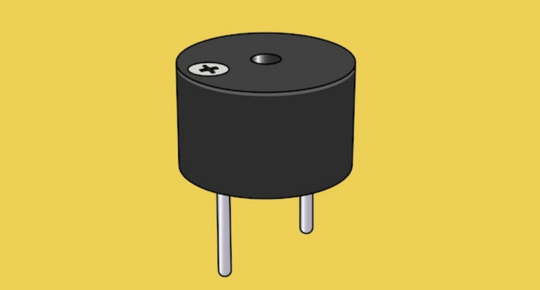Description

An active buzzer is a buzzer with a built-in drive circuit. Compared with traditional passive buzzers, it features small size, adjustable tone, and simple drive. In daily life, we often encounter active buzzers, such as mobile phones, computers as well as household appliances.

In this project, we will make a simple alarm system via an Arduino board and an active buzzer. This system can be used in a variety of situations, such as doorbell prompts and temperature exceeding warnings.

### Hardware

1\. Plus or MEGA Plus development board x1

2\. Active buzzer

3\. Jumper wires

### Working Principle

Active buzzer is a common electronic sound-generating device and is widely used in various electronic equipment. Here's how it works:

1.  Oscillation circuit: The active buzzer contains an oscillation circuit inside, which is usually composed of resistors, capacitors, transistors and other components. When the buzzer is powered on, the oscillation circuit generates an electrical signal of a specific frequency.
1.  Piezoelectric element: The buzzer also contains a piezoelectric element, which is usually made of piezoelectric ceramics or piezoelectric film. Piezoelectric elements have unique properties: when a voltage is applied, they produce mechanical deformation; conversely, when subjected to mechanical stress, they produce a voltage.

3\. Sound generation: The electrical signal generated by the oscillation circuit is applied to the piezoelectric element, causing it to rapidly mechanically deform and push the surrounding air to generate sound waves. The frequency of the sound wave depends on the frequency of the oscillation circuit, so the tone emitted by the buzzer can be controlled by changing the parameters of the oscillation circuit.

4\. Drive circuit: The active buzzer has a simple built-in drive circuit to amplify the signal generated by the oscillation circuit and provide sufficient current to the piezoelectric element to produce a loud enough sound.


In short, the active buzzer generates an electrical signal of a specific frequency through an internal oscillation circuit and uses a piezoelectric element to convert the electrical signal into sound. This simple and effective working principle makes the active buzzer a commonly used electronic sound-generating device.

### Specifications

Min/Max Operating Voltage +3.3V to +5V

Maximum Current: 30mA

Resonance Frequency: 2500Hz ± 300Hz continous

Minimum Sound Output 85Db @ 4in (10cm)

Storage Temperature: -22°F to 221°F (-30°C to 105°C)

Operating Temperature: -4°F to 158°F (-20°C to 70°C)

### Pinout


### Wiring Diagram

1\. Connect the positive pole of the active buzzer (usually "S" or "+") to the digital pin D8 on the development board.

2\. Connect the negative pole of the buzzer (“-”) to GND.


Wiring Diagram with Plus Board


Wiring Diagram with MEGA Plus Board

### Sample Code

```cpp

/*

keyestudio super starter kit V2.0

Project 7

Active buzzer

http//www.keyestudio.com

*/

// Define the digital port to which the buzzer is connected

const int BUZZER_PIN = 8;

void setup() {

// Set the buzzer port to output mode

pinMode(BUZZER_PIN, OUTPUT);

}

void loop() {

// Make the buzzer sound

digitalWrite(BUZZER_PIN, HIGH);

delay(1000); // Sound lasts 1s

// Stop sounding

digitalWrite(BUZZER_PIN, LOW);

delay(1000); // Stop sounding for 1s

}

```

### Code Explanation

Defining the Buzzer Port

```cpp

const int BUZZER_PIN = 8;

```

This line of code defines a constant `BUZZER_PIN` with a value of 8. In Arduino, constants are defined using the `const` keyword, which means that once assigned, the value cannot be changed. The number 8 here refers to the digital I/O pin number on the Arduino board where the buzzer is connected. The choice of which pin to use depends on the specific hardware connections and personal preference.

Setup Function

```cpp

void setup() {

pinMode(BUZZER_PIN, OUTPUT);

}

```

In the `setup()` function, we call the `pinMode()` function, which is used in the Arduino language to set the mode of a specific pin. The `pinMode()` function takes two parameters: the pin number and the mode. In this example, we set `BUZZER_PIN` (pin 8) to `OUTPUT` mode, meaning that this pin will be used to output electrical signals.

Loop Function

```cpp

void loop() {

digitalWrite(BUZZER_PIN, HIGH);

delay(1000); // Sound lasts 1s

digitalWrite(BUZZER_PIN, LOW);

delay(1000); // Stop sounding for 1s

}

```

The `loop()` function is the core of the program, controlling the on/off state of the buzzer and the duration of the sound. `digitalWrite()` is a function used to control the voltage level of a pin, with `HIGH` and `LOW` representing high and low voltage levels, respectively. When we set pin 8 to a high level using `digitalWrite(BUZZER_PIN, HIGH);`, the buzzer will emit a sound. The `delay(1000);` function call causes the program to pause for 1000 milliseconds (1 second), during which the buzzer continues to sound. Subsequently, by setting pin 8 to a low level with `digitalWrite(BUZZER_PIN, LOW);`, the buzzer stops sounding. Another `delay(1000);` is called to pause the program for 1 second, during which the buzzer remains silent.

### Project Result

After uploading the above code to the development board, the active buzzer will emit a sound every second, forming an intermittent sound. Such output can be used as various prompts or warning signals.


By studying this project, you will not only be able to master how to use an active buzzer and the development board to carry out basic sound control projects, but you will understand the basic structure and commands of Arduino programming, laying the foundation for more complex projects.

## Project 8 Passive Buzzer

### Description

Passive buzzer is a common electronic component that is widely used in various electronic devices to issue sound prompts or alarms. Unlike the active buzzer, the passive buzzer itself does not contain an oscillation circuit and requires an external circuit to provide a pulse signal to work.

This project aims to control a passive buzzer to emit sounds of different frequencies through an Arduino development board to play a simple melody.

### Hardware

1\. Plus or MEGA Plus development board x1

2\. Passive buzzer x1

3\. Breadboard x1

4\. Jumper wires

### Working Principle

Passive buzzer is a common electronic component that is widely used in various electronic devices to sound prompts or alarm sounds. Its working principle is based on the piezoelectric effect.

There is a piezoelectric ceramic piece inside the passive buzzer. When a voltage is applied, the piezoelectric ceramic piece will mechanically deform, causing it to vibrate and emit sound. When the frequency of the AC voltage matches the natural frequency of the piezoelectric ceramic piece, the buzzer will produce maximum sound output.


Passive buzzers require an external circuit to provide a driving signal, which usually use a square wave or pulse wave signal. The frequency of the drive signal determines the pitch of the buzzer sound, while the amplitude of the signal affects the volume. By changing the frequency and duty cycle of the driving signal, the buzzer can be controlled to emit different sound effects.

Compared with active buzzers, passive buzzers have simple structure and low cost, but they require external circuits to provide driving signals. In practical applications, it is necessary to select a suitable passive buzzer according to specific needs and design a corresponding drive circuit to achieve the required sound effect.

### Specifications

Min/Max Operating Voltage 1.5V to 5V DC

Current: <25mA

Frequency: <20Hz to >2.5kHz

### Pinout


### Wiring Diagram

1\. Connect the positive pole of the passive buzzer to the digital pin D8 of the development board.

2\. Connect the negative pole of the passive buzzer to GND of the port.


Wiring Diagram with Plus Board


Wiring Diagram with MEGA Plus Board

### Sample Code

```cpp

/*

keyestudio super starter kit V2.0

Project 8

Passive buzzer

http//www.keyestudio.com

*/

const int buzzerPin = 8; // Define the digital pin to which the buzzer is connected

// Define the frequency corresponding to the note

#define NOTE_C4 262

#define NOTE_D4 294

#define NOTE_E4 330

#define NOTE_F4 349

#define NOTE_G4 392

#define NOTE_A4 440

#define NOTE_B4 494

#define NOTE_C5 523

// Define a melody array containing notes and duration

int melody[] = {

NOTE_C4, NOTE_G4, NOTE_G4, NOTE_A4, NOTE_G4, 0, NOTE_B4, NOTE_C5

};

int noteDurations[] = {

4, 8, 8, 4, 4, 4, 4, 4

};

void setup() {

pinMode(buzzerPin, OUTPUT); // Set the buzzer pin to output mode

}

void loop() {

// Play a melody in a loop

for (int thisNote = 0; thisNote < 8; thisNote++) {

int noteDuration = 1000 / noteDurations[thisNote]; // Calculate note duration

tone(buzzerPin, melody[thisNote], noteDuration); // Play notes

int pauseBetweenNotes = noteDuration * 1.30; // Calculate the pause time between notes

delay(pauseBetweenNotes); // Wait for pause time

noTone(buzzerPin); // Stop playing notes

}

}

```

### Code Explanation

1\. Define the buzzer pin

```cpp

const int buzzerPin = 8; // Define the digital pin that the buzzer is connected to

```

This line of code defines a constant `buzzerPin` and sets it to 8. This means that the buzzer is connected to digital I/O pin 8 on the Arduino board. In Arduino programming, using constants can improve code readability and maintainability.

2\. Define note frequencies

```cpp

#define NOTE_C4 262

#define NOTE_D4 294

#define NOTE_E4 330

#define NOTE_F4 349

#define NOTE_G4 392

#define NOTE_A4 440

#define NOTE_B4 494

#define NOTE_C5 523

```

These preprocessor directives define the frequencies (in Hertz) of various musical notes. These values represent the standard frequencies of different notes, such as middle C (C4) at 262Hz. These definitions make it more intuitive and convenient to reference these notes in the code.

3\. Define the melody and rhythm

```cpp

int melody[] = {

NOTE_C4, NOTE_G4, NOTE_G4, NOTE_A4, NOTE_G4, 0, NOTE_B4, NOTE_C5

};

int noteDurations[] = {

4, 8, 8, 4, 4, 4, 4, 4

};

```

These two arrays define the notes in the melody and the duration of each note, respectively. The `melody` array stores a sequence of note frequencies, while the `noteDurations` array defines the relative duration of each note. For example, `4` represents a quarter note, and `8` represents an eighth note.

Setup initialization

```cpp

void setup() {

pinMode(buzzerPin, OUTPUT); // Set the buzzer pin as an output

}

```

In the `setup()` function, we set `buzzerPin` as an output using the `pinMode()` function. This is because the buzzer needs to receive electrical signals from the Arduino to produce sound.

Main loop to play the melody

```cpp

void loop() {

for (int thisNote = 0; thisNote < 8; thisNote++) {

int noteDuration = 1000 / noteDurations[thisNote]; // Calculate the note duration

tone(buzzerPin, melody[thisNote], noteDuration); // Play the note

int pauseBetweenNotes = noteDuration * 1.30; // Calculate the pause between notes

delay(pauseBetweenNotes); // Wait for the pause duration

noTone(buzzerPin); // Stop playing the note

}

}

```

The code in the `loop()` function is the core of the entire program. It iterates through each note in the `melody` array using a loop and plays each note on the buzzer using the `tone()` function. The actual duration of each note is calculated by dividing 1000 milliseconds by the corresponding value in the `noteDurations` array. After playing each note, the program pauses for a certain duration using the `delay()` function. This pause is slightly longer than the duration of the note itself to create a gap between notes. The `noTone()` function is used to stop playing the current note, and then the program proceeds to the next note.

### Project Result

After uploading the code, the passive buzzer will play a simple melody in sequence according to the notes and duration in the melody array.


With this project, you have learned how to use an Arduino to control a passive buzzer to emit sounds of different frequencies and play a simple melody. You can try modifying the `melody` and `noteDurations` arrays to create your own melody. At the same time, you can also explore more note frequencies and enrich the expressiveness of the melody. The passive buzzer is a simple but interesting electronic component. Through the control of Arduino, you can create a variety of interesting sound effects and musical works.

## Project 9 RGB LED


### Description

RGB LED (Red Green Blue Light Emitting Diode) is a light-emitting diode that can emit light in three basic colors of red, green, and blue, and produce various other colors through different combinations of these three colors.

This project will use a RGB LED to achieve color changes and gradient effects of RGB LED through Arduino programming.

### Hardware

1\. Plus or MEGA Plus development board x1

2\. RGB LED x1

3\. Breadboard x1

4\. Jumper wires

### Working Principle

An RGB LED is basically an LED package that can produce almost any color. It can be used in different applications such as outdoor decoration lighting, stage lighting designs, home decoration lighting, LED matrix display, and more.

RGB LEDs have three internal LEDs (Red, Green, and Blue) that can be combined to produce almost any color output. In order to produce different kinds of colors, we need to set the intensity of each internal LED and combine the three color outputs. In this project, we are going to use PWM to adjust the intensity of the red, green, and blue LEDs individually and the trick here is that our eyes will see the combination of the colors, instead of the individual colors because the LEDs are very close to each other inside.

**RGB LED Types and Structure**

As mentioned earlier, RGB LEDs have three LEDs inside them and usually, these three internal LEDs share either a common anode or a common cathode especially in a through-hole package. So basically, we can categorize RGB LEDs as either common anode or common cathode type just like in seven segment displays.


When you look at an RGB LED, you'll see that it has four leads. If you face it so that its longest lead is second from the left, the leads should be in the following order: red, anode or cathode, green, and blue.

**Common Anode RGB LED**

In a common anode RGB LED, the anode of the internal LEDs are all connected to the external anode lead. To control each color, you need to apply a LOW signal or ground to the red, green, and blue leads and connect the anode lead to the positive terminal of the power supply.


**Common Cathode RGB LED**

In a common cathode RGB LED, the cathode of the internal LEDs are all connected to the external cathode lead. To control each color, you need to apply a HIGH signal or VCC to the red, green, and blue leads and connect the anode lead to the negative terminal of the power supply.

### Specifications:

Low Thermal Resistance

No UV rays

Super High flux Output and High luminance

Forward Current for Red, Blue and Green color: 20mA

Forward Voltage

Red: 2v (typical)

Blue: 3.2(typical)

Green: 3.2(typical)

Luminous Intensity

Red: 800 mcd

Blue: 4000 mcd

Green: 900 mcd

Wavelength

Red: 625 nm

Blue: 520 nm

Green: 467.5 nm

Operating Temperature: -25 ℃ to 85 ℃

Storage Temperature: -30 ℃ to 85 ℃

### Wiring Diagram

 Connect the R pin of the RGB LED to digital pin D9 on the board

 Connect the G pin of the RGB LED to digital pin D10 on the board

 Connect the B pin of the RGB LED to digital pin D11 on the board

 Connect the GND pin of the RGB LED to GND on the board


Wiring Diagram with Plus Board


Wiring Diagram with MEGA Plus Board

### Sample Code

```cpp

/*

keyestudio super starter kit V2.0

Project 9

RGB LED

http//www.keyestudio.com

*/

int redPin = 9; // red pin

int greenPin = 10; // green pin

int bluePin = 11; // blue pin

void setup() {

pinMode(redPin, OUTPUT);

pinMode(greenPin, OUTPUT);

pinMode(bluePin, OUTPUT);

}

void loop() {

// red gradient

for (int i = 0; i <= 255; i++) {

analogWrite(redPin, i);

delay(10);

}

for (int i = 255; i >= 0; i--) {

analogWrite(redPin, i);

delay(10);

}

// green gradient

for (int i = 0; i <= 255; i++) {

analogWrite(greenPin, i);

delay(10);

}

for (int i = 255; i >= 0; i--) {

analogWrite(greenPin, i);

delay(10);

}

// blue gradient

for (int i = 0; i <= 255; i++) {

analogWrite(bluePin, i);

delay(10);

}

for (int i = 255; i >= 0; i--) {

analogWrite(bluePin, i);

delay(10);

}

}

```

### Code Explanation

The code defines three integer variables, `redPin`, `greenPin`, and `bluePin`, which are assigned the values 9, 10, and 11, respectively. These numbers represent the corresponding pins on the Arduino board connected to the RGB LED. These pins will be configured in output mode to send analog signals to control the brightness of the LEDs.

```cpp

int redPin = 9; // Pin connected to the red LED

int greenPin = 10; // Pin connected to the green LED

int bluePin = 11; // Pin connected to the blue LED

```

In the `setup()` function, we use the `pinMode()` function to set each color pin to output (OUTPUT). This is necessary because the Arduino pins are set to input mode by default.

```cpp

void setup() {

pinMode(redPin, OUTPUT);

pinMode(greenPin, OUTPUT);

pinMode(bluePin, OUTPUT);

}

```

The `loop()` function contains the main logic for controlling the RGB LED color gradient. Three separate for loops are used to control the brightness of the red, green, and blue LEDs, respectively. Each loop first increases gradually from 0 to 255 and then decreases gradually back to 0. This process creates a fade-in, fade-out effect from completely off to the brightest and then back to off. The `analogWrite()` function is used to set the PWM (Pulse Width Modulation) value of a specific pin, which adjusts the brightness of the LED.

```cpp

void loop() {

// Red fade

for (int i = 0; i <= 255; i++) {

analogWrite(redPin, i);

delay(10);

}

for (int i = 255; i >= 0; i--) {

analogWrite(redPin, i);

delay(10);

}

// Green fade

for (int i = 0; i <= 255; i++) {

analogWrite(greenPin, i);

delay(10);

}

for (int i = 255; i >= 0; i--) {

analogWrite(greenPin, i);

delay(10);

}

// Blue fade

for (int i = 0; i <= 255; i++) {

analogWrite(bluePin, i);

delay(10);

}

for (int i = 255; i >= 0; i--) {

analogWrite(bluePin, i);

delay(10);

}

}

```

### Project Result

After uploading the code to the development board, the RGB LED will display a gradient effect of red, green and blue in sequence. The brightness of each color will gradually increase from 0 to 255, and then gradually decrease to 0.


Through this project, you have learned how to use the development board and RGB LED, and implement RGB LED color changes and gradient effects through Arduino programming. You can try modifying the code to explore more interesting color combinations and variation patterns.

## Project 10 Photoresistor

### Description

Photoresistor is a resistor that is sensitive to light. When light shines on a photoresistor, its resistance changes. The stronger the light, the lower the resistance; the weaker the light, the higher the resistance. This characteristic makes photoresistor an important optoelectronic component and is widely used in various light control circuits.

This project will use a Plus or MEGA Plus development board, and a photoresistor to implement a simple light-controlled LED circuit. When the ambient light becomes dark, the LED will automatically light up; when it becomes brighter, the LED will automatically turn off.

### Hardware

1\. Plus or MEGA Plus development board x 1

2\. Photoresistor x 1

3\. LED x 1

4\. 220Ω resistor x 1

5\. 10kΩ resistor x 1

6\. Breadboard x 1

7\. Jumper wires

### Working Principle

To understand the working principle of a Photoresistor, let’s brush up a little about the valence electrons and the free electrons.

As we know valence electrons are those found in the outermost shell of an atom. Hence, these are loosely attached to the nucleus of the atom. This means that only some small amount of energy is needed to pull it out from the outer orbit.

Free electrons on the other hand are those which are not attached to the nucleus and hence free to move when an external energy like an electric field is applied. Thus when some energy makes the valence electron pull out from the outer orbit, it acts as a free electron; ready to move whenever an electric field is applied. The light energy is used to make valence electron a free electron.

This very basic principle is used in the Photoresistor. The light that falls on a photoconductive material is absorbed by it which in turn makes lots of free electrons from the valence electrons.

**The figure below shows a pictorial representation of the same:**

**Photoresistor Working Priciple**

As the light energy falling on the photoconductive material increases, number of valence electrons that gain energy and leave the bonding with the nucleus increases. This leads to a large number of valence electrons jump to the conduction band, ready to move with an application of any external force like an electric field.

*Thus, as the light intensity increases, the number of free electrons increases. This means the photoconductivity increases that imply a decrease in photo resistivity of the material.*

Now that we have covered the working mechanism, we got an idea that a photoconductive material is used for the construction of a Photoresistor. According to the type of photoconductive material the Photoresistors are of two types. A brief introduction is given in the next section

### Specifications

Resistance:10kΩ

Working voltage:3.3-5V

Working current:20MA

Maximum power :0.1W

Operating temperature: -10 degrees Celsius to +50 degrees Celsius

### Pinout


### Wiring Diagram

1\. Connect one end of the photoresistor to 5V pin of the development board, and the other end of the pin to 10kΩ resistor,

2\. connect that 10kΩ resistor to GND of the board.

3\. Connect the joint of the photoresistor and the 10kΩ resistor to the analog input pin A0 of the development board.

4\. Connect the anode of the LED (long pin) to the digital pin 13 on the board via a 220Ω resistor, and the cathode (short pin) to the GND.


Wiring Diagram with Plus Board


Wiring Diagram with MEGA Plus Board

### Sample Code

```cpp

/*

keyestudio super starter kit V2.0

Project 10

Photoresistor

http//www.keyestudio.com

*/

const int lightSensorPin = A0; // Photoresistor connected to analog pin A0

const int ledPin = 11; // LED connected to digital pin 11

const int threshold = 500; // Light intensity threshold, it can be adjusted according to actual situation

void setup() {

pinMode(ledPin, OUTPUT); // Set the LED pin to output mode

Serial.begin(9600); // initialize serial port

}

void loop() {

int lightValue = analogRead(lightSensorPin); // Read the analog value of the photoresistor

Serial.println(lightValue); // print the light sensor value on the serial monitor

if (lightValue < threshold) {

digitalWrite(ledPin, HIGH); // If the light intensity is less than the threshold, the LED will light up

} else {

digitalWrite(ledPin, LOW); // If the light intensity is greater than the threshold, the LED will light off

}

delay(100); // delay 100ms

}

```

### Code Explanation

**1. Define constants and variables**

```cpp

const int lightSensorPin = A0; // Light sensor is connected to analog pin A0

const int ledPin = 11; // LED is connected to digital pin 11

const int threshold = 500; // Light intensity threshold, can be adjusted according to actual conditions

```

 `lightSensorPin` defines the pin to which the light sensor is connected, which is analog pin A0.

 `ledPin` defines the pin to which the LED is connected, which is digital pin 11.

 `threshold` sets the threshold for light intensity. When the ambient light is below this value, the LED will light up; otherwise, the LED will turn off. This threshold can be adjusted according to actual needs.

**2. Initialization setup**

```cpp

void setup() {

pinMode(ledPin, OUTPUT); // Set the LED pin as an output mode

Serial.begin(9600); // Initialize serial communication with a baud rate of 9600

}

```

 `pinMode(ledPin, OUTPUT)` sets the LED pin to output mode, so that the LED can be controlled to turn on or off.

 `Serial.begin(9600)` initializes serial communication for debugging and viewing the light sensor readings. The baud rate is set to 9600.

**3. Loop reading and control**

```cpp

void loop() {

int lightValue = analogRead(lightSensorPin); // Read the analog value of the light sensor

Serial.println(lightValue); // Print the value of the light sensor on the serial monitor

if (lightValue < threshold) {

digitalWrite(ledPin, HIGH); // If the light intensity is less than the threshold, turn on the LED

} else {

digitalWrite(ledPin, LOW); // If the light intensity is greater than or equal to the threshold, turn off the LED

}

delay(100); // Delay for 100 milliseconds

}

```

 `analogRead(lightSensorPin)` reads the analog value of the light sensor. This returns an integer between 0 and 1023, representing the light intensity detected by the light sensor.

 `Serial.println(lightValue)` prints the light sensor reading to the serial monitor for debugging and observing real-time light intensity changes.

 `if (lightValue < threshold)` checks if the reading is less than the preset threshold:

 If it is less than the threshold, `digitalWrite(ledPin, HIGH)` is executed to turn on the LED.

 If it is not less than the threshold, `digitalWrite(ledPin, LOW)` is executed to turn off the LED.

 `delay(100)` sets a delay time of 100 milliseconds to prevent the program from running too quickly and causing the LED to flicker.

### Project Result

After uploading the code to the development board, the LED will automatically turn on when the ambient light becomes dark; when the ambient light becomes brighter, the LED will automatically turn off. You can observe changes in the LED by blocking or illuminating the photoresistor.


Through this project, we have learned how to use a photoresistor to measure ambient light intensity and control the LED to turn on and off based on changes in light intensity. You can try adjusting the value of `threshold` to adapt to different ambient lighting conditions. At the same time, this project also lays the foundation for you to further learn and develop other light controlled applications.

## Project 11 Flame Detection


### Description

An IR flame sensor is a device that uses infrared technology to detect flames. It can sense the infrared radiation generated by the flame and convert it into electrical signals to achieve flame alarm and control.

This project aims to use the Plus or MEGA Plus development board and a Flame Sensor to implement the flame detection function through Arduino programming. When the Flame Sensor detects a flame, the LED will light up and the buzzer will sound an alarm. This project can be used in fire warning systems to improve the safety of homes and industrial sites.

### Hardware

1\. Plus or MEGA Plus development board x1

2\. Flame Sensor x1

3\. LED x1

4\. Buzzer x1

5\. Breadboard x1

6\. Jumper wires

### Working Principle

A flame sensor is an electronic device used to detect the presence of flame. Its working principle is based on the infrared radiation produced by the flame.

Flame sensors usually contain an infrared receiver inside, such as a thermopile or photodiode. When a flame appears, it emits a large amount of infrared radiation. The sensor receives these radiations and converts them into electrical signals.


The strength of the electrical signal output by the sensor depends on the size and distance of the flame. This signal can be amplified and processed and used to trigger alarms or activate automatic fire extinguishing systems.

Flame sensors are very sensitive to infrared light, but they can also produce false alarms to other infrared sources, such as sunlight or hot objects. In order to reduce false alarms, some flame sensors also use technologies such as ultraviolet detection or flicker frequency analysis.

In summary, flame sensors utilize the infrared radiation of flames to achieve reliable fire detection, which are widely used in industrial and civil fields, providing an important guarantee for fire safety.

### Specifications

Photosensitivity is high

Response time is fast

Sensitivity is adjustable

Detection angle is 600,

It is responsive to the flame range.

Operating voltage of this sensor is 3.3V to 5V

### Pinout


### Wiring Diagram

1\. Connect the Flame Sensor pin to analog pin A1 on the board,

2\. Connect the positive pin of the buzzer to the digital pin D12 on the board and the negative pin to GND.


Wiring Diagram with Plus Board


Wiring Diagram with MEGA Plus Board

### Sample Code

```cpp

/*

keyestudio super starter kit V2.0

Project 11

Flame detection

http//www.keyestudio.com

*/

int flamePin = A1; // connect flame sensor pin to Arduino analog pin

int buzzerPin = 12; // set the buzzer pin

int flameValue = 0; // store the values read by the sensor

void setup() {

pinMode(buzzerPin, OUTPUT); // set buzzer pin to output

pinMode(flamePin, INPUT); // set flame sensor pin to input

Serial.begin(9600); // initialize serial port for debugging

}

void loop() {

flameValue = analogRead(flamePin); // read flame sensor value

Serial.println(flameValue); // print the flame sensor value on the serial monitor

if (flameValue > 100) { // determine whether there is flame

digitalWrite(buzzerPin, HIGH); // flame is detected, and buzzer alarms.

} else {

digitalWrite(buzzerPin, LOW); // no flame is detected, and buzzer stays quiet.

}

delay(100); // delay 100ms

}

```

### Code Explanation

```cpp

int flamePin = A1; // Connect the flame sensor pin to Arduino's analog pin A1

int buzzerPin = 12; // Set the buzzer pin to digital pin 12

int flameValue = 0; // Used to store the value read from the flame sensor

```

First, we define two pin variables `flamePin` and `buzzerPin`, used for the flame sensor and buzzer respectively. `flameValue` is used to store the analog value read from the sensor.

```cpp

void setup() {

pinMode(buzzerPin, OUTPUT); // Set the buzzer pin as output mode

pinMode(flamePin, INPUT); // Set the flame sensor pin as input mode

Serial.begin(9600); // Initialize serial communication with a baud rate of 9600

}

```

In the `setup` function, we set the buzzer pin to output mode and the flame sensor pin to input mode. Then, we initialize serial communication using `Serial.begin(9600)` for debugging purposes.

```cpp

void loop() {

flameValue = analogRead(flamePin); // Read the value from the flame sensor

Serial.println(flameValue); // Print the flame sensor value on the serial monitor

if (flameValue > 100) { // Check if there is a flame

digitalWrite(buzzerPin, HIGH); // Flame detected, buzzer sounds the alarm

} else {

digitalWrite(buzzerPin, LOW); // No flame detected, buzzer remains silent

}

delay(100); // Delay for 100 milliseconds

}

```

In the `loop` function, we first read the value from the flame sensor using `analogRead(flamePin)` and store it in the `flameValue` variable. Next, we print the read value to the serial monitor using `Serial.println(flameValue)` for observation. Then, the program determines whether a flame is detected by checking if `flameValue` is greater than 100. If a flame is detected (`flameValue` is greater than 100), the buzzer is set to high level, and it sounds an alarm; otherwise, the buzzer is set to low level and remains silent. Finally, there is a delay of 100 milliseconds.

### Project Result

During the project, the Arduino serial monitor can monitor the readings of the flame sensor in real-time. When a flame approaches the sensor, its reading increases significantly, usually exceeding the set threshold of 100. At this point, the buzzer emits an alarm sound, indicating that a flame has been detected. If the flame moves away, the reading decreases below the threshold, and the buzzer stops sounding the alarm.


## Project 12 Tilt Switch


### Description

The ball tilt switch is a sensor that uses the principle of gravity to detect the tilt angle through the movement of internal balls. When the switch is tilted, the ball rolls onto the contacts, closing the circuit and triggering the signal.

This project will guide you to create a simple Arduino project via a Plus or MEGA Plus development board and a Tilt Switch.

### Hardware

1\. Plus or MEGA Plus development board x1

2\. Tilt Switch x1

3\. Breadboard x1

4\. Jumper wires

### Working Principle

A ball tilt sensor is typically made up of a metal tube with a little metal ball that rolls around in it. One end of the cavity has two conductive elements (poles). The sensor is designed in such a way that a sufficient level of tilt allows the ball to roll, making or breaking an electrical connection.


When the sensor is upright the ball touches the poles and makes an electrical connection. And when the sensor is tilted the ball rolls off the poles and the connection is broken.

### Specifications

Detect orientation or inclination

Small and inexpensive

Low-power and easy-to-use

If used properly, they will not wear out.

Sensitivity range: > +-15 degrees

Lifetime: 50,000+ cycles (switches)

Power supply: Up to 24V, switching less than 5mA

### Pinout


### Wiring Diagram

1\. Connect one pin of the tilt switch to digital pin D4 on the board;

2\. connect the other pin of the tilt switch to GND(ground).


Wiring Diagram with Plus Board


Wiring Diagram with MEGA Plus Board

### Sample Code

```cpp

/*

keyestudio super starter kit V2.0

Project 12

Tilt

http//www.keyestudio.com

*/

const int tiltPin = 4; // Define the digital pin of the tilt switch

void setup() {

pinMode(tiltPin,INPUT); // Set the tilt switch pin to input mode

Serial.begin(9600); // Initialize serial communication, and set baud rate to 9600

}

void loop() {

int tiltState = digitalRead(tiltPin); // Read tilt switch status

if (tiltState == LOW) { // If the tilt switch is closed (tilt)

Serial.println("Tilt switch is triggered！");

} else { // If the tilt switch is disconnected (vertical)

Serial.println("Tilt switch is not triggered");

}

delay(500); // delay 500ms

}

```

### Code Explanation

Variable Definitions

```cpp

const int tiltPin = 4; // Define the digital pin for the tilt switch

```

This line of code defines a constant named `tiltPin` with a value of 4. This means that the tilt switch is connected to digital pin 4 on the Arduino board. The `const` keyword indicates that this pin number will not change during the program execution.

setup() Function

```cpp

void setup() {

pinMode(tiltPin, INPUT); // Set the tilt switch pin as an input

Serial.begin(9600); // Initialize serial communication with a baud rate of 9600

}

```

The `setup()` function is called once when the Arduino board is powered on. It is used to set pin modes and perform initial setup.

 `pinMode(tiltPin, INPUT);` This line sets the `tiltPin` as an input mode, which is necessary because we need to read the state (open or closed) of the tilt switch from this pin.

 `Serial.begin(9600);` This line starts serial communication and sets the communication baud rate to 9600. This allows the Arduino to send data to a computer or other serial devices via USB.

loop() Function

```cpp

void loop() {

int tiltState = digitalRead(tiltPin); // Read the state of the tilt switch

if (tiltState == LOW) { // If the tilt switch is closed (tilted)

Serial.println("Tilt switch is triggered!");

} else { // If the tilt switch is open (vertical)

Serial.println("Tilt switch is not triggered");

}

delay(500); // Delay for 500 milliseconds

}

```

The `loop()` function is repeatedly executed after the `setup()` function. It is the core part of the program, used to continuously monitor and respond to the state of the tilt switch.

 `int tiltState = digitalRead(tiltPin);` This line reads the voltage state (high or low) of the `tiltPin` and stores it in the `tiltState` variable.

 `if (tiltState == LOW)` checks if `tiltState` is `LOW` (low voltage), which typically indicates that the tilt switch is triggered (closed state). If so, it sends a message via the serial port: "Tilt switch is triggered!".

 If `tiltState` is not `LOW`, it means the tilt switch is not triggered (open state), and it sends "Tilt switch is not triggered" via the serial port.

 `delay(500);` This line pauses the program for 500 milliseconds. This reduces the reading frequency, avoiding continuous rapid reactions to the tilt state, thereby conserving processing resources and power.

### Project Result

After uploading the code to the development board, open the serial monitor of the Arduino IDE and set the baud rate to 9600. When the tilt switch is in the vertical position, the serial monitor will display "Tilt switch is not triggered."; when the tilt switch is tilted to a certain angle, the serial monitor will display "Tilt switch has been triggered!".

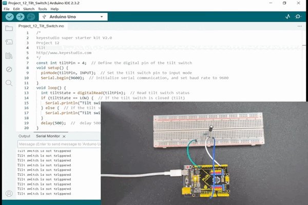

With this simple project, you have learned how to create an Arduino project using a Plus or MEGA Plus board and a tilt switch. You can apply this knowledge to more complex projects, such as creating a tilt-sensing alarm or game controller.

## Project 13 Temperature Sensor

### Description

The LM35 is a widely used temperature sensor that directly converts Celsius temperature into a proportional voltage output. This means that, without complicated calculations, you can simply measure the voltage to get a temperature reading.

This project aims to create a temperature monitoring system using the Plus or MEGA Plus development board and a LM35 temperature sensor.

### Hardware

1\. Plus or MEGA Plus development board x1

2\. LM35 temperature sensor x1

3\. Breadboard x1

4\. Jumper wires

### Working Principle

The LM35 uses a solid-state technique to measure the temperature. It makes use of the fact that the voltage drop between the base and emitter (forward voltage – Vbe) of the [Diode-connected transistor](https://en.wikipedia.org/wiki/Diode-connected_transistor) decreases at a known rate as the temperature increases. By precisely amplifying this voltage change, it is easy to generate an analog signal that is directly proportional to temperature.


This linear relationship between forward voltage and temperature is the reason why diode-connected transistors are used as temperature measurement devices. Essentially this is how temperature is measured, although there have been some improvements in this technique over the years. More information about this technique can be found [here](https://www.ti.com/lit/an/sboa277a/sboa277a.pdf).

The good news is that all these complex calculations are done inside the LM35. It just outputs a voltage that is linearly proportional to temperature.

**How to Measure Temperature**

The LM35 is easy to use; just connect the left pin to power (4V to 30V) and the right pin to ground (assuming the flat side of the sensor is facing you). Then the middle pin will have an analog voltage that is directly proportional (linear) to the temperature in °C. This can be easily seen in the output voltage vs temperature characteristic. Note that the analog output voltage is independent of the power supply.


To convert the voltage to temperature, simply use the basic formula:

Temperature (°C) = Vout \* 100

For example, if the voltage out is 0.5V that means that the temperature is 0.5 \* 100 = 50 °C

**Specifications**

Minimum and Maximum Input Voltage is 35V and -2V respectively. Typically 5V.

Can measure temperature ranging from -55°C to 150°C

Output voltage is directly proportional (Linear) to temperature (i.e.) there will be a rise of 10mV (0.01V) for every 1°C rise in temperature.

±0.5°C Accuracy

Drain current is less than 60uA

Low cost temperature sensor

Small and hence suitable for remote applications

Available in TO-92, TO-220, TO-CAN and SOIC package

### Pinout


### Wiring Diagram

1\. Connect pin VCC of LM35 to 5V power on the board;

2\. Connect pin GND of LM35 to GND on the board;

3\. Connect pin Vout of LM35 to analog pin A0 on the board.


Wiring Diagram with Plus Board


Wiring Diagram with MEGA Plus Board

### Sample Code

```cpp

/*

keyestudio super starter kit V2.0

Project 13

LM35 temperature

http//www.keyestudio.com

*/

// Define the pin of LM35

const int sensorPin = A0;

void setup() {

// Initialize serial communication, and baud rate is 9600

Serial.begin(9600);

}

void loop() {

// Read the analog value of the LM35 output

int sensorValue = analogRead(sensorPin);

// Convert analog value to voltage value (unit: mV)

float voltage = sensorValue * (5000.0 / 1023.0);

// Convert voltage value to temperature value (unit: ℃)

float temperature = voltage / 10.0;

// Display temperature value on serial monitor

Serial.print("Temperature: ");

Serial.print(temperature);

Serial.println(" °C");

// delay 1s

delay(1000);

}

```

### Code Explanation

Defining the LM35 Pin

```cpp

const int sensorPin = A0;

```

This line of code defines a constant `sensorPin` with a value of `A0`. `A0` is an analog input pin on the Arduino board used to receive the analog output signal from the LM35 temperature sensor.

Initialization Setup

```cpp

void setup() {

// Initialize serial communication, and baud rate is 9600

Serial.begin(9600);

}

```

The `setup()` function is a special function in an Arduino program that is executed only once after the Arduino board is powered on or reset. In this function, we initialize serial communication using `Serial.begin(9600);` and set the baud rate to 9600. This allows the Arduino to connect to the computer via USB and send data to the computer's serial monitor.

Main Loop

```cpp

void loop() {

// Read the analog value of the LM35 output

int sensorValue = analogRead(sensorPin);

// Convert analog value to voltage value (unit: mV)

float voltage = sensorValue * (5000.0 / 1023.0);

// Convert voltage value to temperature value (unit: ℃)

float temperature = voltage / 10.0;

// Display temperature value on serial monitor

Serial.print("Temperature: ");

Serial.print(temperature);

Serial.println(" °C");

// delay 1s

delay(1000);

}

```

The `loop()` function is another special function that continuously executes in a loop after the `setup()` function is completed. Here is an explanation of each line of code in this function:

**Reading the Analog Value**:

```cpp

int sensorValue = analogRead(sensorPin);

```

The `analogRead(sensorPin)` function is used to read the analog value output by the LM35 sensor connected to pin `A0`. This value is an integer between 0 and 1023, representing a voltage from 0V to 5V.

**Converting Analog Value to Voltage Value**:

```cpp

float voltage = sensorValue * (5000.0 / 1023.0);

```

The analog value is converted to the actual voltage value (unit: millivolts). Since the Arduino's analog input range is 0-1023, representing 0V to 5V, each unit of analog value is approximately equal to 4.887 millivolts (5000/1023 ≈ 4.887).

**Converting Voltage Value to Temperature Value**:

```cpp

float temperature = voltage / 10.0;

```

The LM35's output characteristic is 10 millivolts per degree Celsius, so dividing the voltage value by 10 yields the temperature value (unit: degrees Celsius).

**Displaying Temperature on Serial Monitor**:

```cpp

Serial.print("Temperature: ");

Serial.print(temperature);

Serial.println(" °C");

```

The `Serial.print()` and `Serial.println()` functions are used to display the temperature value on the serial monitor.

**Delaying for 1 Second**:

```cpp

delay(1000);

```

The `delay(1000)` function pauses the program for 1000 milliseconds (i.e., 1 second). This is done to provide sufficient time intervals between consecutive readings, making the output easy to read.

### Project Result

After uploading the code to the development board, open the serial monitor of the Arduino IDE and set the baud rate to 9600. Then the current ambient temperature will be printed every second in degrees Celsius (℃).


Through this project, we have learned how to measure the ambient temperature using a Plus or MEGA Plus development board and a LM35 temperature sensor, and write code in Arduino IDE for temperature monitoring.

This project can be used as the basis of a temperature monitoring system, and you can further expand it, such as adding temperature threshold alarms, data logging and other functions to meet different application needs.

## Project 14 Soil Humidity Sensor


### Description

A soil humidity sensor is used to measure the moisture content of soil, so it is widely applied in agriculture, horticulture as well as environmental humidity monitoring.

In this project, we adopt the Keyestudio Plus/MEGA Plus development board and the Soil Humidity Sensor to real-time monitor soil humidity in the growing environment.

Through this experiment, we may understand the working principle of the sensor and learn how to collect and process sensor data via Arduino programming, so as to provide data support for further optimization of plant growth environment.

### Hardware

1\. Plus or MEGA Plus development board x1

2\. Soil Humidity Sensor x1

3\. DuPont wires

### Working Principle

The soil moisture sensor operates in a straightforward manner.

The fork-shaped probe with two exposed conductors acts as a variable resistor (similar to a potentiometer) whose resistance varies with the soil’s moisture content.


This resistance varies inversely with soil moisture:

The more water in the soil, the better the conductivity and the lower the resistance.

The less water in the soil, the lower the conductivity and thus the higher the resistance.

The sensor produces an output voltage according to the resistance, which by measuring we can determine the soil moisture level.

### Specifications:

Power Supply Voltage: 3.3V or 5V

Working Current: ≤ 20mA

Output Voltage: 0-2.3V (When the sensor is totally immersed in water, the voltage will be 2.3V) the higher humidity, the higher the output voltage

Sensor type: Analog output

Interface definition: Pin1- signal, Pin2- GND, Pin3 - VCC

Packaging : Electrostatic bag sealing

### Pinout


V is the power supply pin of the soil moisture sensor that can be connected to 3.3V or 5V of the supply.

G is the ground pin of the board and it should be connected to the ground pin of the Arduino

S is the **Analog output pin** of the board that will give us an analog signal in between vcc and ground.

### Wiring Diagram

1\. Connect the VCC pin of the soil humidity sensor to 5V port on the board.

2\. Connect GND pin of the soil humidity sensor to GND on the board.

3\. Connect S pin of the soil humidity sensor to analog input pin A0 on the board.


Wiring Diagram with Plus Board


Wiring Diagram with MEGA Plus Board

### Sample Code

```cpp

/*

keyestudio super starter kit V2.0

Project 14

Soil humidity

http//www.keyestudio.com

*/

// Define the analog pin of the sensor

const int soilPin = A0;

void setup() {

// Initialize the serial port and set baud rate to 9600

Serial.begin(9600);

}

void loop() {

// Read the soil humidity sensor analog value

int soilValue = analogRead(soilPin);

// Map analog value to range of 0-100, which represents relative humidity

int soilHumidity = map(soilValue, 0, 1023, 0, 100);

// Print the humidity value on the serial monitor

Serial.print("Soil Humidity: ");

Serial.print(soilHumidity);

Serial.println("%");

// Delay 1s

delay(1000);

}

```

### Code Explanation

First, let's start with the first part of the code, which defines the analog pin for the sensor connection:

```cpp

const int soilPin = A0;

```

This line of code defines a constant `soilPin` with a value of `A0`. On the Arduino board, `A0` represents analog input pin 0, which is where the soil humidity sensor is connected. By connecting the sensor output to this pin, the Arduino can read the analog voltage value measured by the sensor.

Next, we see the `setup()` function:

```cpp

void setup() {

// Initialize the serial port and set baud rate to 9600

Serial.begin(9600);

}

```

The `setup()` function is used for initializing settings in Arduino code. Here, we initialize serial communication using `Serial.begin(9600);` and set the baud rate to 9600. This is the rate at which data is communicated between the Arduino and the connected computer. After initializing the serial port, we can send data to the connected computer to be displayed on the serial monitor.

Then, the code enters the main `loop()` function, which is the core part of the Arduino program that executes repeatedly:

```cpp

void loop() {

// Read the soil humidity sensor analog value

int soilValue = analogRead(soilPin);

// Map analog value to range of 0-100, which represents relative humidity

int soilHumidity = map(soilValue, 0, 1023, 0, 100);

// Print the humidity value on the serial monitor

Serial.print("Soil Humidity: ");

Serial.print(soilHumidity);

Serial.println("%");

// Delay 1s

delay(1000);

}

```

Inside the `loop()` function, the analog value from the soil humidity sensor connected to pin `A0` is read using `analogRead(soilPin);`. The `analogRead` function returns an integer between 0 and 1023, representing the voltage level read from the sensor.

The read analog value is then converted to a percentage of relative humidity using the `map()` function. The `map()` function maps a value from one range to another range, in this case, mapping the 0-1023 value to 0-100, which represents the humidity percentage.

The converted humidity value is output through the serial port using the `Serial.print()` and `Serial.println()` functions, sending the humidity value to the serial monitor in the format "Soil Humidity: X%".

Finally, the `delay(1000);` function call pauses the program for 1000 milliseconds (1 second). This is done to avoid continuously reading and sending data, giving the sensor and Arduino enough response time and making the output easy to read.

### Project Result

After uploading the code to the development board, open the serial monitor of the Arduino IDE and set the baud rate to 9600. The soil humidity value will show up on the monitor in percentage(%). These values will change in different environment, so according to these values, we can clearly know the moisture in the plant environment.

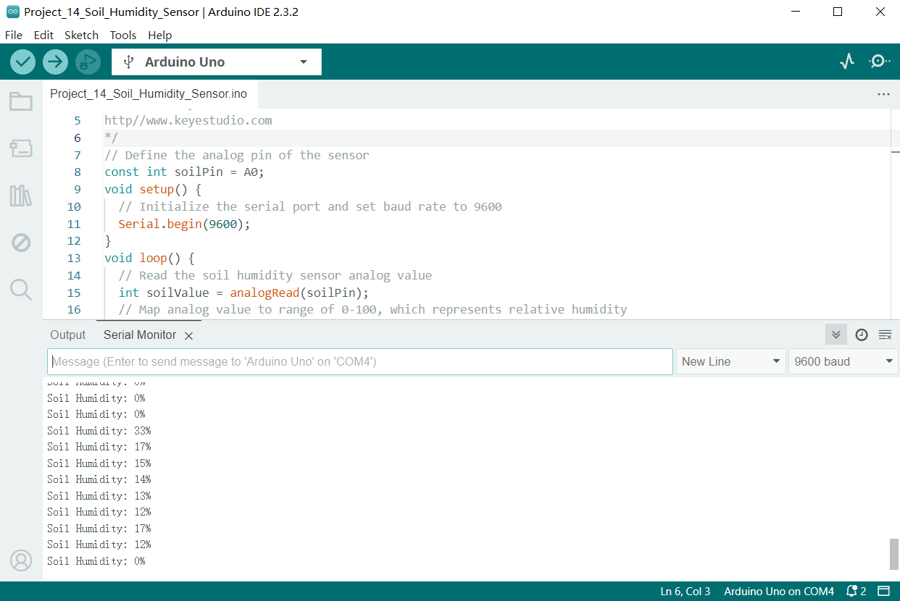

Through this project, we have learned how to measure soil humidity by Keyestudio Plus/MEGA Plus development board and soil humidity sensor.

This project can be used as the basis of a soil humidity monitoring system, and you can further expand it, such as adding humidity threshold: When humidity is lower than a value, the system alarms or starts to watering.

## Project 15 Potentiometer

### Description

A potentiometer consists of a rotatable knob and a resistor, whose resistance value is changed by rotating the knob, thus controlling current in the circuit.

In this project, we create a circuit in which the LED brightness can be adjusted by programming on the Keyestudio development board and rotating the potentiometer. So we can understand how the potentiometer works and how to use analog inputs in the Arduino.

### Hardware

1\. Plus or MEGA Plus development board x1

2\. Breadboard x1

3\. Potentiometer(10kΩ) x1

4\. LED x1

5\. 220Ω resistor x1

6\. Jumper wires

### Working Principle

A potentiometer has 3 pins. Two terminals (the blue and green) are connected to a resistive element and the third terminal (the black one) is connected to an adjustable wiper.


The potentiometer can work as a **rheostat** (variable resistor) or as a **voltage divider**.

**Rheostat**

To use the potentiometer as a rheostat, only two pins are used: one outside pin and the center pin. The position of the wiper determines how much resistance the potentiometer is imposing to the circuit, as the figure demonstrates:


If we have a 10kΩ potentiometer, it means that the maximum resistance of the variable resistor is 10kΩ and the minimum is 0Ω. This means that by changing the wiper position, you get a value between 0Ω and 10kΩ.

### Specifications

Standard Resistance Range：10 to 2 megohms

Resistance Tolerance：±10 % std.

Absolute Minimum Resistance:2 ohm max

Contact Resistance Variation:2 % or 3 ohms max.(whichever is greater)

Voltage:±0.05 %

Resistance:±0.15 %

Resolution:Infinite

Insulation Resistance“500 vdc. 1,000 megohms min.

Power Rating(300 volts max.)

85 °C：0.5 watt

150 °C：0 watt

Temperature Range：-55 °C to +125 °C

Temperature Coefficient：±100 ppm/°C

Torque：5.0 oz-in. max.

### Pinout:


### Wiring Diagram

1\. Insert the three pins of the potentiometer to the breadboard holes.

2\. Connect one outside pin of the potentiometer to the 5V pin of the development board.

3\. Connect another outside pin of the potentiometer to the GND pin of the development board.

4\. Connect the middle pin of the potentiometer to the analog input pin A1 of the development board.

5\. Connect the anode of LED (long pin) to the digital pin 11 on the board via 220Ωresistor.

6\. Connect the cathode of LED (short pin) to the GND on the board.


Wiring Diagram with Plus Board


Wiring Diagram with MEGA Plus Board

### Sample Code

```cpp

/*

keyestudio super starter kit V2.0

Project 15

potentiometer

http//www.keyestudio.com

*/

int potPin = A1; // Connect the potentiometer to analog pin A1

int ledPin = 11; // Connect LED to digital pin 11

int potValue = 0; // store the read values of potentiometer

int ledValue = 0; // store the brightness values of LED

void setup() {

pinMode(ledPin, OUTPUT); // set LED pin to output

}

void loop() {

potValue = analogRead(potPin); // Read the potentiometer value (range 0-1023)

ledValue = map(potValue, 0, 1023, 0, 255); // map the potentiometer value to the LED brightness(0-255)

analogWrite(ledPin, ledValue); // set LED brightness

delay(10); // delay

}

```

### Code Explanation

First, let's start with the definition and initialization part of the code:

```cpp

int potPin = A1; // Connect the potentiometer to analog pin A1

int ledPin = 11; // Connect LED to digital pin 11

int potValue = 0; // store the read values of potentiometer

int ledValue = 0; // store the brightness values of LED

```

Here, we define four variables:

 `potPin`: defines the analog input pin A1 on the Arduino board where the potentiometer is connected.

 `ledPin`: defines the digital pin 11 to which the LED is connected.

 `potValue`: used to store the values read from the potentiometer.

 `ledValue`: used to store the brightness values mapped to the LED.

Next is the `setup()` function:

```cpp

void setup() {

pinMode(ledPin, OUTPUT); // set LED pin to output

}

```

The `setup()` function is executed only once in Arduino code and is used to set pin modes or initialize serial communication. Here, we set `ledPin` to output mode because the LED needs to receive power signals from the Arduino.

Then, we enter the main loop `loop()` function:

```cpp

void loop() {

potValue = analogRead(potPin); // Read the potentiometer value (range 0-1023)

ledValue = map(potValue, 0, 1023, 0, 255); // map the potentiometer value to the LED brightness(0-255)

analogWrite(ledPin, ledValue); // set LED brightness

delay(10); // delay

}

```

The `loop()` function runs continuously on the Arduino after uploading, performing the following operations:

1\. Read the value of the potentiometer from `potPin` using the `analogRead()` function. The potentiometer values range from 0 to 1023, representing the position of the potentiometer knob.

2\. Map the read potentiometer value (0-1023) to the brightness value (0-255) that the LED can accept using the `map()` function. This is because the `analogWrite()` function used for PWM output can only accept values from 0 to 255.

3\. Send the mapped brightness value to `ledPin` using the `analogWrite()` function, adjusting the LED brightness accordingly.

4\. The `delay(10)` call pauses the loop for 10 milliseconds after each execution. This reduces the reading frequency and prevents unnecessary flickering caused by adjusting the brightness too quickly.

### Project Result

After uploading the code to the development board, rotate the potentiometer and you will see the LED brightness changes. Rotate clockwise to make it brighter, and rotate counterclockwise to make it darker.


Through this project, we have learned how to make a variable resistance by a potentiometer to control the brightness of LED. It is widely used in dimmer lights, volume control.

## Project 16 74HC595


### Description

The 74HC595 is a common IO chip that controls multiple outputs with a small number of control pins, making it ideal for scenarios where multiple LEDs or output devices need to be controlled.

In this project, we control 7 LEDs on and off via 74HC595 chip to achieve the effect of water flow lights.

### Hardware

1\. Plus or MEGA Plus development board x1

2\. 74HC595 chip x1

3\. LED x7

4\. 220 resistor x7

5\. Breadboard x1

6\. Jumper wires

### Working Principle

The 74HC595 has two 8-bit registers (which can be thought of as “memory containers”). The first is referred to as the Shift Register, and the second as the Storage/Latch Register.

Every time the 74HC595 receives a clock pulse, two things happen:

The bits contained in the shift register are shifted to the left by one position. Bit 0’s value is pushed into bit 1, while bit 1’s value is pushed into bit 2, and so on.

Bit 0 in the shift register accepts the current value on the DATA pin. On the rising edge of the clock pulse, if the DATA pin is high, 1 is pushed into the shift register, otherwise 0.

This process will continue as long as 74HC595 is clocked.

When the latch pin is enabled, the contents of the shift register are copied to the storage/latch register. Each bit of the storage register is linked to one of the IC’s output pins QA-QH. As a result, whenever the value in the storage register changes, the output changes.

The animation below will help you understand it better.


### Specifications:

8-bit serial input

8-bit serial or parallel output

Storage register with 3-state outputs

Shift register with direct clear

100 MHz (typical) shift out frequency

### Pinout：

It is important to note that several companies manufacture the same 74HC595 chip. In this article, we will discuss the ubiquitous [SN74HC595N](http://www.ti.com/lit/ds/symlink/sn74hc595.pdf) from Texas Instruments. If you happen to have a different one, carefully read the datasheet and make note of any differences.

Let’s take a look at its pinout.


GND is the ground pin.

VCC is the power supply for the 74HC595 shift register, which must be connected to 5V.

SER (Serial Input) pin is used to send data into the shift register one bit at a time.

SRCLK (Shift Register Clock) is the clock for the shift-register and is positive-edge triggered. This means that the bits are pushed in on the rising edge of the clock.

RCLK (Register Clock / Latch) is a very important pin. When this pin is pulled HIGH, the contents of the Shift Register are copied into the Storage/Latch Register, which eventually appears at the output. So, the latch pin can be seen as the last step before we see our results at the output.

SRCLR (Shift Register Clear) pin allows us to reset the entire Shift Register, setting all the bits to zero. Because this is an active-low pin, we must pull the SRCLR pin LOW to perform the reset.

OE (Output Enable) is also an active-low pin: when pulled HIGH, the output pins are disabled (set to high impedance state). When it is pulled LOW, the output pins function normally.

QA–QH (Output Enable) are the output pins.

QH’ pin outputs bit 7 of the shift register. This allows you to daisy-chain the 74HC595s. If you connect this pin to the SER pin of another 74HC595, and feed both ICs the same clock signal, they will behave as if they were a single IC with 16 outputs. Of course, with this technique, you can daisy-chain as many ICs as you want.

### Wiring Diagram

1\. Connect pin VCC of the 74HC595 chip to 5V on the board, and pin GND to GND on the board.

2\. Connect DS(pin 14) of 74HC595 chip to D11 on the board, SHCP(pin 11) to D12, and STCP(pin 12) to D13.

3\. Connect Q0-Q7(pin 15, pin 1-6) of 74HC595 to the anodes of 7 LED via 220 ohm resistor, connect cathodes of LED to GND.


Wiring Diagram with Plus Board


Wiring Diagram with MEGA Plus Board

### Sample Code

```cpp

/*

keyestudio super starter kit V2.0

Project 16

74HC595

http//www.keyestudio.com

*/

const int DS = 11; // serial data input

const int SHCP = 12; // Shift register clock input

const int STCP = 13; // Latch clock input

void setup() {

pinMode(DS, OUTPUT);

pinMode(SHCP, OUTPUT);

pinMode(STCP, OUTPUT);

}

void loop() {

for (int i = 0; i < 7; i++) {

digitalWrite(STCP, LOW);

shiftOut(DS, SHCP, MSBFIRST, 1 << i); // Move data into the shift register by serial

digitalWrite(STCP, HIGH); // Output shift register data to the latch in parallel

delay(200);

}

}

```

### Code Explanation

First, the code defines three pin variables: DS, SHCP, and STCP, which are used for serial data input, shift register clock input, and latch register clock input, respectively. These pins are mapped to specific pins on the Arduino board through digital definitions.

```cpp

const int DS = 11; // Serial data input

const int SHCP = 12; // Shift register clock input

const int STCP = 13; // Latch register clock input

```

Next, in the `setup()` function, all three pins are set to output mode because they will be used to send signals to the shift register.

```cpp

void setup() {

pinMode(DS, OUTPUT);

pinMode(SHCP, OUTPUT);

pinMode(STCP, OUTPUT);

}

```

Main loop logic

In the `loop()` function, the code controls the sequential lighting of the LEDs through a loop. The loop iterates seven times, and each iteration controls the state of one LED through the shift register and latch register.

```cpp

void loop() {

for (int i = 0; i < 7; i++) {

digitalWrite(STCP, LOW);

shiftOut(DS, SHCP, MSBFIRST, 1 << i);

digitalWrite(STCP, HIGH);

delay(200);

}

}

```

**Setting STCP to low level**: Before sending data, the STCP pin is set to low level to prepare the shift register to receive data.

```cpp

digitalWrite(STCP, LOW);

```

**Shifting out the data**: The `shiftOut()` function is used to send data bit by bit from the DS pin to the shift register. The `MSBFIRST` parameter indicates that the data is sent starting from the most significant bit. `1 << i` is a bitwise operation that represents only one bit being high level (1) while the other bits are low level (0). This operation effectively controls which LED is lit.

```cpp

shiftOut(DS, SHCP, MSBFIRST, 1 << i);

```

**Setting STCP to high level**: After the data is sent, the STCP pin is set to high level. This action triggers the contents of the shift register to be copied to the latch register, updating the display state of the LEDs.

```cpp

digitalWrite(STCP, HIGH);

```

**Delay**: The `delay(200)` function call keeps each lit LED on for 200 milliseconds, allowing users to clearly see the LED lighting sequence.

### Project Result

After uploading code, 7LED will light up in sequence which looks like a water flow. With 74HC595 chip, we control 7 outputs only through three Arduino pins, which largely saves pins.


Through this project, we achieve a water flow light with development board and 74HC595 chip. You may have a clear understanding of hardware connection, working principle, Arduino codes and the method of controlling multiple outputs by 74HC595. They are very practical. You can control many output devices according to your needs.

## Project 17 1-digit LED Segment Display


### Description

A digital tube is a common electronic display that shows numbers, letters, and symbols by emitting light. 1-digit tubes are the simplest kind, which can only display one number or symbol.

This project will guide to create a simple Arduino project through Keyestudio Plus/MEGA Plus development board and 1-digit tube display. Through this project, you will learn how to control this tube to display numbers from 0 to 9.

### Hardware

1\. Plus or MEGA Plus development board x1

2\. 1-digit LED Segment Display x1

3\. 220Ω resistor x8

4\. Breadboard x1

5\. Jumper wires

### Working Principle

The 7-segment display, also written as “seven segment display”, consists of seven LEDs arranged in a ‘8’-shaped pattern. Each LED is referred to as a segment, because when illuminated, it forms part of a digit. An eighth LED is sometimes used to indicate a decimal point.


Each segment LED has one of its connection pins brought directly out of the rectangular plastic package. These pins are labeled with the letters ‘a’ through ‘g’. The remaining LED pins are wired together to form a single common pin.

Each segment can be individually turned on or off by setting the corresponding pin to HIGH or LOW, just like a regular LED. By lighting up individual segments, you can create any numerical character and even some basic representations of letters.

### Specifications

Available in two modes Common Cathode (CC) and Common Anode (CA)

Available in many different sizes like 9.14mm,14.20mm,20.40mm,38.10mm,57.0mm and 100mm (Commonly used/available size is 14.20mm)

Available colours: White, Blue, Red, Yellow and Green (Res is commonly used)

Low current operation

Better, brighter and larger display than conventional LCD displays.

Current consumption : 30mA / segment

Peak current : 70mA

### Pinout

Now, let’s review the segment configuration so you know which pin corresponds to which segment. The 7-segment display pinout is as follows.


a, b, c, d, e, f, g, and DP are connected to the digital pins on an Arduino to operate the display’s individual segments. By lighting up individual segments, you can create any numeric character.

COM The pins 3 and 8 are connected internally to form a common pin. Depending on the type of display, this pin must be connected to either GND (common cathode) or 5V (common anode).

Common Cathode(CC) vs Common Anode(CA)

There are two types of seven segment displays: common cathode (CC) and common anode (CA).

The internal structure of both types is nearly identical. The difference is the polarity of the LEDs and the common terminal. As the name implies, in common cathode displays, all of the cathodes (or negative terminals) of the segment LEDs are tied together, whereas in common anode displays, all of the anodes (or positive terminals) of the segment LEDs are tied together.

In a common cathode display, the com pin is connected to GND, and a positive voltage is applied to each segment (a-g) to illuminate it.


Common Cathode 7 Segment Working

In a common anode display, the com pin is connected to VCC, and each segment (a-g) is individually grounded to illuminate it.


Common Anode 7 Segment Working

### Wiring Diagram


 Connect pin a to digital pin D6

 Connect pin b to digital pin D7

 Connect pin c to digital pin D5

 Connect pin d to digital pin D10

 Connect pin e to digital pin D11

 Connect pin f to digital pin D8

 Connect pin g to digital pin D9

 Connect pin DP to digital pin D4

 Connect pin COM to GND pin with a 220Ω resistor

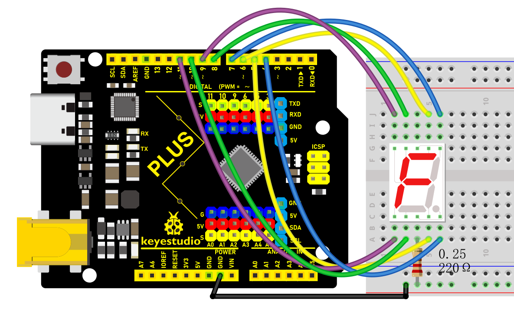

Wiring Diagram with Plus Board


Wiring Diagram with MEGA Plus Board

### Sample Code

```cpp

/*

keyestudio super starter kit V2.0

Project 17

1-digit LED Segment Display

http//www.keyestudio.com

*/

// define the pins of each segments

const int a = 6;

const int b = 7;

const int c = 5;

const int d = 10;

const int e = 11;

const int f = 8;

const int g = 9;

const int dp = 4;

// Define the segment combination of number 0 to 9

const int num[10][7] = {

{1, 1, 1, 1, 1, 1, 0}, // 0

{0, 1, 1, 0, 0, 0, 0}, // 1

{1, 1, 0, 1, 1, 0, 1}, // 2

{1, 1, 1, 1, 0, 0, 1}, // 3

{0, 1, 1, 0, 0, 1, 1}, // 4

{1, 0, 1, 1, 0, 1, 1}, // 5

{1, 0, 1, 1, 1, 1, 1}, // 6

{1, 1, 1, 0, 0, 0, 0}, // 7

{1, 1, 1, 1, 1, 1, 1}, // 8

{1, 1, 1, 1, 0, 1, 1} // 9

};

void setup() {

// set pins to output

pinMode(a, OUTPUT);

pinMode(b, OUTPUT);

pinMode(c, OUTPUT);

pinMode(d, OUTPUT);

pinMode(e, OUTPUT);

pinMode(f, OUTPUT);

pinMode(g, OUTPUT);

pinMode(dp, OUTPUT);

}

void loop() {

// show number 0 to 9 in loop

for (int i = 0; i < 10; i++) {

displayNumber(i);

delay(1000);

}

}

// show numbers

void displayNumber(int n) {

// set the on and off of each segment

digitalWrite(a, num[n][0]);

digitalWrite(b, num[n][1]);

digitalWrite(c, num[n][2]);

digitalWrite(d, num[n][3]);

digitalWrite(e, num[n][4]);

digitalWrite(f, num[n][5]);

digitalWrite(g, num[n][6]);

digitalWrite(dp, LOW); // Decimal point is off

}

```

### Code Explanation

Pin Definitions

The beginning of the code defines the Arduino pins connected to each segment of the seven-segment display:

```cpp

const int a = 6;

const int b = 7;

const int c = 5;

const int d = 10;

const int e = 11;

const int f = 8;

const int g = 9;

const int dp = 4;

```

Here, variables `a` to `g` correspond to the seven segments of the display, while `dp` represents the decimal point. Each variable is assigned a number indicating the specific pin number they are connected to on the Arduino.

Number Definitions

Next, an array `num` is defined to represent how each number is displayed on the seven-segment display:

```cpp

const int num[10][7] = {

{1, 1, 1, 1, 1, 1, 0}, // 0

{0, 1, 1, 0, 0, 0, 0}, // 1

...

{1, 1, 1, 1, 0, 1, 1} // 9

};

```

Each row in the array represents a number (from 0 to 9), and the seven values (0 or 1) in each row indicate whether the corresponding segment (`a` to `g`) should be lit. 1 means the segment is lit, while 0 means it is off.

Setup Function

In the `setup()` function, all pins are configured as output mode:

```cpp

void setup() {

pinMode(a, OUTPUT);

pinMode(b, OUTPUT);

...

pinMode(dp, OUTPUT);

}

```

This function runs once when the Arduino starts up, ensuring that all pins controlling the seven-segment display are set as outputs.

Main Loop

The `loop()` function contains a loop that continuously displays numbers 0 to 9:

```cpp

void loop() {

for (int i = 0; i < 10; i++) {

displayNumber(i);

delay(1000);

}

}

```

Here, the `displayNumber()` function is responsible for controlling the seven-segment display to show a specific number, while `delay(1000)` makes each number display for 1 second.

Displaying Numbers

Finally, the `displayNumber()` function controls the lighting of each segment based on the input number parameter `n` using the `digitalWrite()` function:

```cpp

void displayNumber(int n) {

digitalWrite(a, num[n][0]);

...

digitalWrite(g, num[n][6]);

digitalWrite(dp, LOW); // Decimal point off

}

```

Each `digitalWrite()` call sets a specific segment to high or low, controlling whether the segment is lit or off. The decimal point remains off in this project.

### Project Result

Upload code and you will see the digital tube shows number from 0 to 9 in sequence, with each lighting up for 1s.


Through this project, you may know how to control the 1-digit LED Segment Display to show numbers by programming on Keyestudio Plus/MEGA Plus development board. Or you can have an extension: output numbers or letters you want, connect to other sensors to have a more complex application.

## Project 18 4-digit LED Segment Display


### Description

The four-digit tube consists of four separate seven-segment digital tubes that can show four numbers or characters.

In this project, we will introduce how to create an Arduino project that shows numbers you want by the Plus or MEGA Plus development board and 4-digit LED Segment Display.

### Hardware

1\. Plus or MEGA Plus development board x1

2\. 4-digit LED Segment Display x1

3\. Breadboard x1

4.Jumper wires

### Working Principle

The four-digit tube consists of four separate seven-segment digital tubes that can show four numbers or characters.


This reduces the number of pins of a multi-digit display but increases the complexity of controlling it. For example, with this wiring, if we apply voltage to the A pin of the 4-digit display, the A segments of all LED blocks will be turned on. In order to control which LED block will let that signal to pass, we have another pin for each of the LED blocks, the digit pin. Therefore, in a 4-digit display we will also have 4 digit pins that control the LED blocks individually. Below we show the 4 digit LED display with the additional 4 control input pins, one for each of the LED block.

4-digit *7-segment* LED display internal connectivity showing the segment pins and the digit control pins that control whether or not the signal from the segment pins will be displayed in the corresponding LED block.

As a result if we want to display the number 1111, we have to apply voltage to the D1, D2, D3 and D4 because all displays will show a digit. We also need to apply voltage to inputs B and C as shown below:

Image showing with red color the wires that should be activated for displaying the number ‘1111’

### Specifications

Function: SDK

Segment color: Milky white or same as emitting color

Digit height: 0.28 inch

Face color: Black, grey or red

Digit number: 4

Feature: Energy saving & high stability

### Pinout

A typical 4-digit 7-segment LED display has 12 pins, with six pins on each side, as shown in the figure below.


4-digit *7-segment* LED display pinout

Four of these pins (D1, D2, D3, and D4) are used to control the individual digits and determine which signals pass through the LED blocks. The remaining pins correspond to the individual segments.

### Wiring Diagram

 Connect the cathode pins (D1, D2, D3, D4) of the digital tube to digital pins (D2, D3, D4, D5) on the board.

 Connect the anode pins (a, b, c, d, e, f, g, dp) of the digital tube to digital pins (D6, D7, D8, D9, D10, D11, D12, D13) on the board.


Wiring Diagram with Plus Board

 Wiring Diagram with MEGA Plus Board

### Install Library

Before starting to code, we need to install the **TimerOne** library file first.

**Navigate to Library Manager**: Click on the “Tools” menu option, then select “Manage Libraries…”.


**Search for Libraries**:

 In the Library Manager window that pops up, you'll see a search box. Enter the name of the"**TimerOne**" library .


**Select and Install Libraries**:

 Find the desired library in the search results and click on it.

 An “Install” button will appear on the right side of the window. Click the “Install” button.


**Wait for Installation**: The Arduino IDE will automatically download and install the selected library. Once the installation is complete, the “Install” button will change to “Installed”, indicating a successful installation.

### Sample Code

```cpp

/*

keyestudio super starter kit V2.0

Project 18

4-digit LED Segment Display

http//www.keyestudio.com

*/

#include <TimerOne.h>

//the pins of 4-digit 7-segment display attach to pin2-13 respectively

int a = 6;

int b = 7;

int c = 8;

int d = 9;

int e = 10;

int f = 11;

int g = 12;

int p = 13;

int d4 = 5;

int d3 = 4;

int d2 = 3;

int d1 = 2;

long n = 0;// n represents the value displayed on the LED display. For example, when n=0, 0000 is displayed. The maximum value is 9999.

int x = 100;

int del = 5;//Set del as 5; the value is the degree of fine tuning for the clock

int count = 0;//Set count=0. Here count is a count value that increases by 1 every 0.1 second, which means 1 second is counted when the value is 10

void setup()

{

//set all the pins of the LED display as output

pinMode(d1, OUTPUT);

pinMode(d2, OUTPUT);

pinMode(d3, OUTPUT);

pinMode(d4, OUTPUT);

pinMode(a, OUTPUT);

pinMode(b, OUTPUT);

pinMode(c, OUTPUT);

pinMode(d, OUTPUT);

pinMode(e, OUTPUT);

pinMode(f, OUTPUT);

pinMode(g, OUTPUT);

pinMode(p, OUTPUT);

Timer1.initialize(100000); // set a timer of length 100000 microseconds (or 0.1 sec - or 10Hz => the led will blink 5 times, 5 cycles of on-and-off, per second)

Timer1.attachInterrupt( add ); // attach the service routine here

}

/*************************************\**/

void loop()

{

clearLEDs();//clear the 7-segment display screen

pickDigit(0);//Light up 7-segment display d1

pickNumber((n/1000));// get the value of thousand

delay(del);//delay 5ms

clearLEDs();//clear the 7-segment display screen

pickDigit(1);//Light up 7-segment display d2

pickNumber((n%1000)/100);// get the value of hundred

delay(del);//delay 5ms

clearLEDs();//clear the 7-segment display screen

pickDigit(2);//Light up 7-segment display d3

pickNumber(n%100/10);//get the value of ten

delay(del);//delay 5ms

clearLEDs();//clear the 7-segment display screen

pickDigit(3);//Light up 7-segment display d4

pickNumber(n%10);//Get the value of single digit

delay(del);//delay 5ms

}

/**************************************/

void pickDigit(int x) //light up a 7-segment display

{

//The 7-segment LED display is a common-cathode one. So also use digitalWrite to set d1 as high and the LED will go out

digitalWrite(d1, HIGH);

digitalWrite(d2, HIGH);

digitalWrite(d3, HIGH);

digitalWrite(d4, HIGH);

switch(x)

{

case 0:

digitalWrite(d1, LOW);//Light d1 up

break;

case 1:

digitalWrite(d2, LOW); //Light d2 up

break;

case 2:

digitalWrite(d3, LOW); //Light d3 up

break;

default:

digitalWrite(d4, LOW); //Light d4 up

break;

}

}

//The function is to control the 7-segment LED display to display numbers. Here x is the number to be displayed. It is an integer from 0 to 9

void pickNumber(int x)

{

switch(x)

{

default:

zero();

break;

case 1:

one();

break;

case 2:

two();

break;

case 3:

three();

break;

case 4:

four();

break;

case 5:

five();

break;

case 6:

six();

break;

case 7:

seven();

break;

case 8:

eight();

break;

case 9:

nine();

break;

}

}

void clearLEDs() //clear the 7-segment display screen

{

digitalWrite(a, LOW);

digitalWrite(b, LOW);

digitalWrite(c, LOW);

digitalWrite(d, LOW);

digitalWrite(e, LOW);

digitalWrite(f, LOW);

digitalWrite(g, LOW);

digitalWrite(p, LOW);

}

void zero() //the 7-segment led display 0

{

digitalWrite(a, HIGH);

digitalWrite(b, HIGH);

digitalWrite(c, HIGH);

digitalWrite(d, HIGH);

digitalWrite(e, HIGH);

digitalWrite(f, HIGH);

digitalWrite(g, LOW);

}

void one() //the 7-segment led display 1

{

digitalWrite(a, LOW);

digitalWrite(b, HIGH);

digitalWrite(c, HIGH);

digitalWrite(d, LOW);

digitalWrite(e, LOW);

digitalWrite(f, LOW);

digitalWrite(g, LOW);

}

void two() //the 7-segment led display 2

{

digitalWrite(a, HIGH);

digitalWrite(b, HIGH);

digitalWrite(c, LOW);

digitalWrite(d, HIGH);

digitalWrite(e, HIGH);

digitalWrite(f, LOW);

digitalWrite(g, HIGH);

}

void three() //the 7-segment led display 3

{

digitalWrite(a, HIGH);

digitalWrite(b, HIGH);

digitalWrite(c, HIGH);

digitalWrite(d, HIGH);

digitalWrite(e, LOW);

digitalWrite(f, LOW);

digitalWrite(g, HIGH);

}

void four() //the 7-segment led display 4

{

digitalWrite(a, LOW);

digitalWrite(b, HIGH);

digitalWrite(c, HIGH);

digitalWrite(d, LOW);

digitalWrite(e, LOW);

digitalWrite(f, HIGH);

digitalWrite(g, HIGH);

}

void five() //the 7-segment led display 5

{

digitalWrite(a, HIGH);

digitalWrite(b, LOW);

digitalWrite(c, HIGH);

digitalWrite(d, HIGH);

digitalWrite(e, LOW);

digitalWrite(f, HIGH);

digitalWrite(g, HIGH);

}

void six() //the 7-segment led display 6

{

digitalWrite(a, HIGH);

digitalWrite(b, LOW);

digitalWrite(c, HIGH);

digitalWrite(d, HIGH);

digitalWrite(e, HIGH);

digitalWrite(f, HIGH);

digitalWrite(g, HIGH);

}

void seven() //the 7-segment led display 7

{

digitalWrite(a, HIGH);

digitalWrite(b, HIGH);

digitalWrite(c, HIGH);

digitalWrite(d, LOW);

digitalWrite(e, LOW);

digitalWrite(f, LOW);

digitalWrite(g, LOW);

}

void eight() //the 7-segment led display 8

{

digitalWrite(a, HIGH);

digitalWrite(b, HIGH);

digitalWrite(c, HIGH);

digitalWrite(d, HIGH);

digitalWrite(e, HIGH);

digitalWrite(f, HIGH);

digitalWrite(g, HIGH);

}

void nine() //the 7-segment led display 9

{

digitalWrite(a, HIGH);

digitalWrite(b, HIGH);

digitalWrite(c, HIGH);

digitalWrite(d, HIGH);

digitalWrite(e, LOW);

digitalWrite(f, HIGH);

digitalWrite(g, HIGH);

}

/*****************************************\**/

void add()

{

// Toggle LED

count ++;

if(count == 10)

{

count = 0;

n++;

if(n == 10000)

{

n = 0;

}

}

}

```

### Code Explanation

```cpp

#include <TimerOne.h>

```

This line includes a library named `TimerOne`, which is used to create timers and interrupts.

```cpp

int a = 6;

int b = 7;

int c = 8;

int d = 9;

int e = 10;

int f = 11;

int g = 12;

int p = 13;

int d4 = 5;

int d3 = 4;

int d2 = 3;

int d1 = 2;

long n = 0;

int x = 100;

int del = 5;

int count = 0;

```

These lines define a series of variables and constants:

 `a` through `g` and `p` are pins used to connect the 7-segment LED.

 `d1` through `d4` are pins used to select the digit to display.

 `n` stores the number to be displayed.

 `x` defines the frequency of LED blinking, set to 100 times per second.

 `del` is the delay between each digit refresh, measured in milliseconds.

 `count` is used to count intervals of 0.1 seconds for updating the display.

```cpp

void setup() {

pinMode(d1, OUTPUT);

pinMode(d2, OUTPUT);

pinMode(d3, OUTPUT);

pinMode(d4, OUTPUT);

pinMode(a, OUTPUT);

pinMode(b, OUTPUT);

pinMode(c, OUTPUT);

pinMode(d, OUTPUT);

pinMode(e, OUTPUT);

pinMode(f, OUTPUT);

pinMode(g, OUTPUT);

pinMode(p, OUTPUT);

Timer1.initialize(100000);

Timer1.attachInterrupt( add );

}

```

In the `setup()` function:

 All LED and digit pins are set as output pins.

 The timer is initialized with an interval of 100,000 microseconds (0.1 second).

 The interrupt service function `add` is attached to the timer.

```cpp

void loop() {

clearLEDs();

pickDigit(0);

pickNumber((n/1000));

delay(del);

clearLEDs();

pickDigit(1);

pickNumber((n%1000)/100);

delay(del);

clearLEDs();

pickDigit(2);

pickNumber(n%100/10);

delay(del);

clearLEDs();

pickDigit(3);

pickNumber(n%10);

delay(del);

}

```

In the `loop()` function, the following steps are repeated to display the digits:

 Clear the LED display.

 Select each digit sequentially and display the corresponding number.

```cpp

void pickDigit(int x) {

digitalWrite(d1, HIGH);

digitalWrite(d2, HIGH);

digitalWrite(d3, HIGH);

digitalWrite(d4, HIGH);

switch(x) {

case 0:

digitalWrite(d1, LOW);

break;

case 1:

digitalWrite(d2, LOW);

break;

case 2:

digitalWrite(d3, LOW);

break;

default:

digitalWrite(d4, LOW);

break;

}

}

```

The `pickDigit(int x)` function is used to illuminate a specific digit:

 First, turn off all digit LEDs.

 Based on the value of the parameter `x`, select the digit to illuminate.

```cpp

void pickNumber(int x) {

switch(x) {

default:

zero();

break;

case 1:

one();

break;

case 2:

two();

break;

case 3:

three();

break;

case 4:

four();

break;

case 5:

five();

break;

case 6:

six();

break;

case 7:

seven();

break;

case 8:

eight();

break;

case 9:

nine();

break;

}

}

```

The `pickNumber(int x)` function is used to select the number to be displayed based on the parameter `x`, and it calls the corresponding number display function.

```cpp

void clearLEDs() {

digitalWrite(a, LOW);

digitalWrite(b, LOW);

digitalWrite(c, LOW);

digitalWrite(d, LOW);

digitalWrite(e, LOW);

digitalWrite(f, LOW);

digitalWrite(g, LOW);

digitalWrite(p, LOW);

}

```

The `clearLEDs()` function is used to turn off all LEDs to clear the display.

```cpp

void add() {

count ++;

if(count == 10) {

count = 0;

n++;

if(n == 10000) {

n = 0;

}

}

}

```

The `add()` function is the interrupt service routine for the timer, used to update the displayed number:

 Increment `count` every 0.1 seconds.

 When `count` reaches 10, reset it to 0 and increment `n`.

 If `n` reaches 10,000, reset it to 0 to cycle the display.

### Project Result

After uploading the code to the Arduino board, you will see a four-digit 7-segment LED display start flashing numbers at specified intervals. The displayed numbers will gradually increase from 0 to 9999 and then restart from 0. The LED will flash 5 times per second, updating the number every 0.1 seconds.


Through this project, you can learn how to make a 4-digit 7-segment LED display show numbers, and how to control different LEDs to display various digits. You can further expand on this by adding more features such as an alarm clock, timer, and temperature display. This can help you gain a deeper understanding of Arduino programming and digital display technology, while also fostering your creativity and problem-solving skills.

## Project 19 8x8 LED Matrix


### Description

8*8 LED dot matrix consists of 8 rows and 8 columns of LED, a total of 64 LEDs. Each one can be independently controlled, turned on or off, thus forming different patterns and characters.

In this project, you will learn how to program on the Plus or MEGA Plus development boards to control an 8×8 LED matrix display, showcasing patterns of a large heart and a small heart.

### Hardware

1\. Plus or MEGA Plus development board x 1

2\. 8*8 LED Matrix x 1

3\. Breadboard x 1

4\. Jumper wires

### Working Principle

The external view of a dot-matrix is shown as follows


The 8*8 dot-matrix is made up of sixty-four LEDs, and each LED is placed at the cross point of a row and a column.

When the electrical level of a certain row is 1 and the electrical level of a certain column is 0, the corresponding LED will lighten. If you want to light the LED on the first dot, you should set pin 9 to high level and pin 13 to low level.

If you want to light LEDs on the first row, you should set pin 9 to high level and pins 13, 3, 4, 10, 6, 11, 15 and 16 to low level.

If you want to light the LEDs on the first column, set pin 13 to low level and pins 9, 14, 8, 12, 1, 7, 2 and 5 to high level.

The internal view of a dot-matrix is shown as follows


If we have an 8x8 dot matrix, And how do we know where pin 1 is? As in IC Chips near Pin 1, a dot mentioned at IC/Microcontroller Chip. But here, how do we know?


Pins Starts at knob side

At the led matrix module, the manufacturer writes the tag or mark at pin 1 side, as shown in the figure. We definitely find it. And also a curve mentioned at pin number 1 side.


Battery connection

Row = + Positive Supply

Column = - Negative Supply

The testing power supply should be 1.5V DC required. So the only one battery cell enough or uses one 130 ohm resistance in series at a positive/negative side.


Led matrix Testing with Battery cell

After that attached led to the power supply. We found that the 8th column and 5th rows led become ON as Connection shown in the figure. How to connect the battery cell with a matrix display.


Column and Row Pin connection

### Specifications

1.2 inch height 8x8 LED dot matrix

1.2 inch Matrix Height(31.00mm)

Dot size 3.00mm, circle dot

Column: 8 Row: 8

Widthxheight: 32.00x32.00mm

Bi-color selected

Low current operation

High contrast and light output

Compatible with ASCII and EBCDIC code

Stackable horizontally

Column cathode and column anode available

Easy mounting on P.C.Boards or Sockets

Categorized for luminous intensity

Technically rugged

Standard: Gary surface and White dot

RoHs Compliance

### Pin Test of led dot matrix

As shown in fig pin \# 1 and pin \# 16 got Energize and 8th Column and 5th-row led become ON. We should verify the Dot-matrix before using it because if any led found blown we can replace it with a good one.


Led matrix light up

if you want to display a happy face, here’s what you need to do:


### Wiring Diagram


Row 1--8> digital pins D2--D9

Column 1--8> digital pins D10--D17


Wiring Diagram with Plus Board


Wiring Diagram with MEGA Plus Board

### Sample Code

```cpp

/*

keyestudio super starter kit V2.0

Project 19

8*8 LED Matrix

http//www.keyestudio.com

*/

// 2-dimensional array of row pin numbers:

int R[] = {2,7,A5,5,13,A4,12,A2};

// 2-dimensional array of column pin numbers:

int C[] = {6,11,10,3,A3,4,8,9};

unsigned char biglove[8][8] = //the big "heart"

{

0,0,0,0,0,0,0,0,

0,1,1,0,0,1,1,0,

1,1,1,1,1,1,1,1,

1,1,1,1,1,1,1,1,

1,1,1,1,1,1,1,1,

0,1,1,1,1,1,1,0,

0,0,1,1,1,1,0,0,

0,0,0,1,1,0,0,0,

};

unsigned char smalllove[8][8] = //the small "heart"

{

0,0,0,0,0,0,0,0,

0,0,0,0,0,0,0,0,

0,0,1,0,0,1,0,0,

0,1,1,1,1,1,1,0,

0,1,1,1,1,1,1,0,

0,0,1,1,1,1,0,0,

0,0,0,1,1,0,0,0,

0,0,0,0,0,0,0,0,

};

void setup()

{

// iterate over the pins:

for(int i = 0;i<8;i++)

// initialize the output pins:

{

pinMode(R[i],OUTPUT);

pinMode(C[i],OUTPUT);

}

}

void loop()

{

for(int i = 0 ; i < 100 ; i++) //Loop display 100 times

{

Display(biglove); //Display the "Big Heart"

}

for(int i = 0 ; i < 50 ; i++) //Loop display 50 times

{

Display(smalllove); //Display the "small Heart"

}

}

void Display(unsigned char dat[8][8])

{

for(int c = 0; c<8;c++)

{

digitalWrite(C[c],LOW);//use thr column

//loop

for(int r = 0;r<8;r++)

{

digitalWrite(R[r],dat[r][c]);

}

delay(1);

Clear(); //Remove empty display light

}

}

void Clear() //clear the display

{

for(int i = 0;i<8;i++)

{

digitalWrite(R[i],LOW);

digitalWrite(C[i],HIGH);

}

}

```

### Code Explanation

**1\. Pin Configuration**

First, we need to configure the row and column pins:

```cpp

// 2-dimensional array of row pin numbers:

int R[] = {2, 7, A5, 5, 13, A4, 12, A2};

// 2-dimensional array of column pin numbers:

int C[] = {6, 11, 10, 3, A3, 4, 8, 9};

```

In the code, two arrays `R[]` and `C[]` are defined to represent the pin numbers for the rows and columns of the LED matrix respectively. The arrays `R[]` and `C[]` each contain 8 pins, which are used to control an 8x8 LED matrix.

**2\. Pattern Definition**

Next, we define two 2-dimensional arrays, `biglove` and `smalllove`, which represent the patterns for a large heart and a small heart:

```cpp

unsigned char biglove[8][8] = {

0,0,0,0,0,0,0,0,

0,1,1,0,0,1,1,0,

1,1,1,1,1,1,1,1,

1,1,1,1,1,1,1,1,

1,1,1,1,1,1,1,1,

0,1,1,1,1,1,1,0,

0,0,1,1,1,1,0,0,

0,0,0,1,1,0,0,0,

};

unsigned char smalllove[8][8] = {

0,0,0,0,0,0,0,0,

0,0,0,0,0,0,0,0,

0,0,1,0,0,1,0,0,

0,1,1,1,1,1,1,0,

0,1,1,1,1,1,1,0,

0,0,1,1,1,1,0,0,

0,0,0,1,1,0,0,0,

0,0,0,0,0,0,0,0,

};

```

In these arrays, `1` indicates that the LED is on, and `0` indicates that the LED is off. Using these arrays, the LEDs on the matrix can be manipulated to form heart patterns.

**3\. Initialization Settings**

In the `setup()` function, all the pins are initialized as output pins:

```cpp

void setup() {

for (int i = 0; i < 8; i++) {

pinMode(R[i], OUTPUT);

pinMode(C[i], OUTPUT);

}

}

```

**4\. Main Loop Function**

In the `loop()` function, the primary operations are to sequentially display the large heart pattern and the small heart pattern:

```cpp

void loop() {

for (int i = 0; i < 100; i++) {

Display(biglove);

}

for (int i = 0; i < 50; i++) {

Display(smalllove);

}

}

```

Using `for` loops, the large heart pattern is displayed 100 times and the small heart pattern 50 times.

**5\. Display Function**

The `Display(unsigned char dat[8][8])` function is responsible for the specific display operations:

```cpp

void Display(unsigned char dat[8][8]) {

for (int c = 0; c < 8; c++) {

digitalWrite(C[c], LOW);

for (int r = 0; r < 8; r++) {

digitalWrite(R[r], dat[r][c]);

}

delay(1);

Clear();

}

}

```

This function scans each column one by one, using `dat[r][c]` to determine whether each LED should be on or off. The `Clear()` function is then called to clear the display to prevent ghosting effects.

**6\. Clear Display Function**

The `Clear()` function is used to clear the current display content:

```cpp

void Clear() {

for (int i = 0; i < 8; i++) {

digitalWrite(R[i], LOW);

digitalWrite(C[i], HIGH);

}

}

```

All row pins are set to low voltage and column pins to high voltage, thus turning off all the LEDs.

### Project Result

After uploading the code to the Arduino board, the LED matrix can clearly display patterns of both large and small hearts. As the patterns switch, there is a noticeable change in the lighting, making the effect very intuitive.


Through the above experiment, we have successfully achieved the goal of displaying large and small heart patterns on an 8x8 LED matrix. This experiment not only helped us understand the control principles and scanning methods of matrix LEDs but also enhanced our capability in electronic creation using Arduino.

## Project 20 1602 LCD


### Description

1602 LCD boasts 16 columns and 2 rows that can display a total of 32 characters. It is easy to use and features low cost, so it is widely used in various electronic equipment.

In this project, we will write programs on the Arduino development board to control the 1602 LCD to display what we want to show.

### Hardware

1\. Plus or MEGA Plus development board x1

2\. 1602 LCD display x1

3\. 10K potentiometer x1

4\. Breadboard x1

5\. Jumper wires

### Working Principle

An LCD screen is an electronic display module that uses liquid crystal to produce a visible image. The 16×2 LCD display is a very basic module commonly used in DIYs and circuits. The 16×2 translates a display of 16 characters per line in 2 such lines. In this LCD, each character is displayed in a 5×7 pixel matrix.


### Specifications

Display Type: Alphanumeric character display

Character Format: 5x8 dots matrix format

Display Size: 16 characters x 2 lines

Display Color: Blue or Green

Backlight: LED backlight

Voltage Supply: 5V DC

Operating Temperature: -20°C to +70°C

Interface: 4-bit or 8-bit mode

### Pinout


| **No.** | **Mark** | **Pin description**       | **No.** | **Mark** | **Pin description**       |
|---------|----------|---------------------------|---------|----------|---------------------------|
| 1       | VSS      | Power GND                 | 9       | D2       | Date I/O                  |
| 2       | VDD      | Power positive            | 10      | D3       | Date I/O                  |
| 3       | V0       | LCD voltage bias signal   | 11      | D4       | Date I/O                  |
| 4       | RS       | Select data/command (V/L) | 12      | D5       | Date I/O                  |
| 5       | R/W      | Select read/write(H/L)    | 13      | D6       | Date I/O                  |
| 6       | E        | Enable signal             | 14      | D7       | Date I/O                  |
| 7       | D0       | Date I/O                  | 15      | A        | Back light power positive |
| 8       | D1       | Date I/O                  | 16      | K        | Back light power negative |

Two power pins, one for module power, another one for back light, generally use 5V. In this project, we use 3.3V for backlight.

**V0** is the pin for adjusting contrast ratio. It usually connects a potentiometer(no more than 5KΩ) in series for its adjustment. In this experiment, we use a 1KΩ resistor. For its connection, it has two methods, namely high potential and low potential. Here, we use low potential method; connect the resistor and then the GND.

**RS** is a very common pin in LCD. It’s a selecting pin for command/data. When the pin is in high level, it’s in data mode; when it’s in low level, it’s in command mode.

**RW** pin is also very common in LCD. It’s a selecting pin for read/write. When the pin is in high level, it’s in read operation; if in low level, it’s in write operation.

**E** pin is also very common in LCD. Usually, when the signal in the bus is stabilized, it sends out a positive pulse requiring read operation. When this pin is in high level, the bus is not allowed to have any change.

**D0-D7** is 8-bit bidirectional parallel bus, used for command and data transmission.

**BLA** is anode for back light; BLK, cathode for back light.

### Wiring Diagram

 Connect 1602 LCD pin VSS to GND

 Connect 1602 LCD pin VDD to 5V

 Connect 1602 LCD pin V0 to the middle pin of the 10K potentiometer, and the two ends of the potentiometer are connected to 5V and GND respectively.

 Connect 1602 LCD pin RS to Arduino digital pin D12

 Connect 1602 LCD pin RW to GND

 Connect 1602 LCD pin E to Arduino digital pin D11

 Connect 1602 LCD pin D4 to Arduino digital pin D5

 Connect 1602 LCD pin D5 to Arduino digital pin D4

 Connect 1602 LCD pin D6 to Arduino digital pin D3

 Connect 1602 LCD pin D7 to Arduino digital pin D2

 Connect 1602 LCD pin A to 5V, K to GND


Wiring Diagram with Plus Board


Wiring Diagram with MEGA Plus Board

### Sample Code

```cpp

/*

keyestudio super starter kit V2.0

Project 20

1602 LCD

http//www.keyestudio.com

*/

#include <LiquidCrystal.h>

// Initialize 1602 LCD and set the Arduino pin

LiquidCrystal lcd(12, 11, 5, 4, 3, 2);

void setup() {

// set the numbers of row and column of 1602 LCD

lcd.begin(16, 2);

// Print character strings on 1602 LCD

lcd.print("Hello, world!");

}

void loop() {

// set the the cursor to row 2 column 0

lcd.setCursor(0, 1);

// Print the current operating time in ms

lcd.print(millis() / 1000);

}

```

### Code Explanation

Introduction to the LiquidCrystal Library

```cpp

#include <LiquidCrystal.h>

```

This line of code is the beginning of the program. It includes the LiquidCrystal library using the `#include` directive. This library provides functions and methods for controlling liquid crystal displays (LCDs), particularly those compatible with the HD44780 controller. This type of LCD is very common and widely used for displaying text output on various devices.

Initializing the LCD

```cpp

LiquidCrystal lcd(12, 11, 5, 4, 3, 2);

```

This line of code creates a `LiquidCrystal` object named `lcd`. The numbers inside the parentheses represent the Arduino pins connected to the LCD. These pins are RS, E, D4, D5, D6, and D7, respectively. This connection method is known as 4-bit mode, where only four data lines (D4 to D7) are used to transmit data.

Setup Function

```cpp

void setup() {

lcd.begin(16, 2);

lcd.print("Hello, world!");

}

```

The `setup()` function is a mandatory part of every Arduino program. It is executed only once after the Arduino board is reset. In this function, `lcd.begin(16, 2);` is called first to set the number of columns and rows of the LCD. In this example, it is set to 16 columns and 2 rows.

Immediately after that, `lcd.print("Hello, world!");` displays the text "Hello, world!" on the LCD. This demonstrates how to print a string on the LCD.

Loop Function

```cpp

void loop() {

lcd.setCursor(0, 1);

lcd.print(millis() / 1000);

}

```

The `loop()` function is another core part of Arduino code. It runs indefinitely after the device is reset. In this function, `lcd.setCursor(0, 1);` sets the cursor position to the beginning of the second row (note that row and column numbering starts from 0).

Then, `lcd.print(millis() / 1000);` calculates the number of seconds since the program started running and displays it on the LCD. Here, the `millis()` function returns the number of milliseconds since the program began, and dividing it by 1000 converts it to seconds.

### Project Result

After uploading code, the 1602 LCD will displays two rows of contents: "Hello, world!" on the first line and the current operating time (ms) of Arduino development board on the second line.


Through this project, you learned how to use 1602 LCD via Keyestudio Plus/MEGA Plus development board. You may modify codes to try complex functions, such as showing different messages and adding other modules like button or temperature.

## Project 21 Servo


### Description

Servo is an actuator that converts electrical signals into mechanical displacement. It plays an important role in life and is widely used in robotics, drones, smart homes as well we industrial control.

In this project, we write Arduino code to control the servo by Keyestudio Plus/MEGA Plus development board.

### Hardware

1\. Plus or MEGA Plus development board x1

2\. Servo x1

3\. DuPont wires

### Working Principle

There are four main components inside of a hobby servo, a DC motor, a gearbox, a potentiometer and a control circuit. The DC motor is high speed and low torque but the gearbox reduces the speed to around 60 RPM and at the same time increases the torque.


The potentiometer is attached on the final gear or the output shaft, so as the motor rotates the potentiometer rotates as well, thus producing a voltage that is related to the absolute angle of the output shaft. In the control circuit, this potentiometer voltage is compared to the voltage coming from the signal line. If needed, the controller activates an integrated H-Bridge which enables the motor to rotate in either direction until the two signals reach a difference of zero.

A servo motor is controlled by sending a series of pulses through the signal line. The frequency of the control signal should be 50Hz or a pulse should occur every 20ms. The width of pulse determines angular position of the servo and these type of servos can usually rotate 180 degrees (they have a physical limits of travel).


Generally pulses with 1ms duration correspond to 0 degrees position, 1.5ms duration to 90 degrees and 2ms to 180 degrees. Though the minimum and maximum duration of the pulses can sometimes vary with different brands and they can be 0.5ms for 0 degrees and 2.5ms for 180 degrees position.

### Specifications

T-pro Mini Servo Motor SG-90 9g Servo

Best choice for RC aircraft

Accessories attached

ROHS compliance

Torque: 0.5kg/cm

Stall torque: 1.5kg/cm at 5V

Operating speed: 0.3sec/60degree at 4.8V

Operating voltage: 4.2-6V

Temperature range: 0-55 °C

Dead band width: 10us

Gear medium: Nylon

### Pinout


GND Ground (Brown Wire) – This is the ground pin.

VCC +5V (Red Wire) – Voltage is supplied to the servo motor through this Pin.

Control (Orange Wire) – Through this wire, Position control signals are received via PWM.

### Wiring Diagram

1\. Connect the red wire (positive) of the servo to 5V pin on the board

2\. Connect the black wire (negative) of the servo to GND on the board

3\. Connect the orange wire (signal) of the servo to digital pin D9 on the board


Wiring Diagram with Plus Board


Wiring Diagram with MEGA Plus Board

### Sample Code

```cpp

/*

keyestudio super starter kit V2.0

Project 21

Servo

http//www.keyestudio.com

*/

#include <Servo.h>

Servo myservo; // create a Servo object

void setup() {

myservo.attach(9); // connect servo to digital pin 9

}

void loop() {

myservo.write(0); // rotate servo to 0 degree

delay(1000); // delay 1s

myservo.write(90); // rotate servo to 90 degree

delay(1000); // delay 1s

myservo.write(180); // rotate servo to 180 degree

delay(1000); // delay 1s

}

```

### Code Explanation

**Importing Libraries and Creating a Servo Object**

First, at the top of the Arduino program, we need to include the `Servo.h` library, which can be done using the preprocessor directive `#include <Servo.h>`. Next, we create an object of the `Servo` class, named `myservo` in this example. This object will be used for all subsequent operations related to the servo motor.

```cpp

#include <Servo.h>

Servo myservo; // Create a servo object

```

**Setup Function**

In the `setup()` function, we connect the servo motor to a specific digital pin on the Arduino board. In this example, we use digital pin 9. The line `myservo.attach(9);` binds the servo object to digital pin 9, allowing the output signal from that pin to control the servo motor.

```cpp

void setup() {

myservo.attach(9); // Connect the servo motor to digital pin 9

}

```

**Loop Function**

In the `loop()` function, we write the specific logic to control the servo motor. This function will repeat continuously, forming an infinite loop. In this example, we make the servo motor rotate to 0 degrees, 90 degrees, and 180 degrees, respectively. After each rotation, the program pauses for one second (1000 milliseconds), which is achieved using the `delay(1000);` function.

```cpp

void loop() {

myservo.write(0); // Rotate servo to 0 degrees

delay(1000); // Delay for 1 second

myservo.write(90); // Rotate servo to 90 degrees

delay(1000); // Delay for 1 second

myservo.write(180); // Rotate servo to 180 degrees

delay(1000); // Delay for 1 second

}

```

In this process, the `myservo.write(angle);` function is used to specify the target angle for the servo motor. The parameter `angle` is an integer representing the angle to which the motor should rotate. The Servo library handles the generation of signals to ensure the motor moves to the specified position.

### Project Result

After uploading code, the servo rotates to 0°, 90° and 180°, with each position for 1s. These actions repeat.


Through this project, you will know how to control the rotation of servo by Plus or MEGA Plus development board. It can be further extended to more complex applications, such as robotic arms and automation devices.

## Project 22 Water Pump


### Description

This mini water pump can be powered by only 3-6V. it becomes the first choice of many makers and DIY enthusiasts for its small size and low cost.

In this project, we build a water pumping system with Keyestudio Plus/MEGA Plus development board.

### Hardware

1\. Plus or MEGA Plus development board x1

2\. Water pump x1

3\. TIP120 power transistor x1

4\. 1N4007 diode x1

5\. 220Ω resistor x1

6\. Breadboard x1

7\. Jumper wires

### Working Principle

This mini water pump works with the help of electromotor located in the waterproof housing. When we bring voltage to the immersed pump, the rotating part begins to rotate and thus draws the water from the front side of the pump and drains it through a tube above. We connect a hose to the tube and direct it towards wherever we want to, and the pump is able to expel 120 litres in an hour.


### Specifications

Operating Voltage : 3 \~ 6V

Operating Current : 130 \~ 220mA

Flow Rate : 80 \~ 120 L/H

Maximum Lift : 40 \~ 110 mm

Continuous Working Life : 500 hours

Driving Mode : DC, Magnetic Driving

Material : Engineering Plastic

Outlet Outside Diameter : 7.5 mm

Outlet Inside Diameter : 5 mm

### Pinout


### Wiring Diagram

1\. Connect the positive pole of the motor to the collector pin of TIP120 power transistor.

2\. Connect the emitter pin of TIP120 to GND on the board.

3\. Connect the cathode (with white ring) of the 1N4007 diode to the positive pole of the motor and the anode to the power positive.

4\. Connect one end of the 220Ω resistor to the digital pin D3 on the development board and the other end to the base pin of TIP120.

5\. Connect board GND to power negative.


### Sample Code

```cpp

/*

keyestudio super starter kit V2.0

Project 22

Water Pump

http//www.keyestudio.com

*/

const int pumpPin = 3; // define the water pump pin

void setup() {

pinMode(pumpPin, OUTPUT); // set the pin to output

}

void loop() {

digitalWrite(pumpPin, HIGH); // turn on pump

delay(2000); // delay 2s

digitalWrite(pumpPin, LOW); // turn off pump

delay(2000); // delay 2s

}

```

### Code Explanation

1\. Defining the Pin

```cpp

const int pumpPin = 3;

```

This line of code defines a constant `pumpPin` with a value of 3. This means that the water pump is connected to digital pin 3 on the Arduino board. The `const` keyword indicates that this pin number will not change during the program's execution.

2\. Setup Function

```cpp

void setup() {

pinMode(pumpPin, OUTPUT);

}

```

In the `setup()` function, we call the `pinMode()` function to set `pumpPin` as an output mode (`OUTPUT`). `pinMode()` is a basic function in the Arduino language used to specify the mode of a pin: input (`INPUT`), output (`OUTPUT`), or others. Here, we set it to output because we need to send signals from this pin to the water pump.

3\. Main Loop

```cpp

void loop() {

digitalWrite(pumpPin, HIGH);

delay(2000);

digitalWrite(pumpPin, LOW);

delay(2000);

}

```

The `loop()` function is the core of an Arduino program, and it repeatedly executes as long as the Arduino board is powered on. In this function, we use the `digitalWrite()` function to control the high and low states of the pin:

 `digitalWrite(pumpPin, HIGH);` sets the `pumpPin` to a high level (usually 5V), which causes the water pump to turn on.

 `delay(2000);` pauses the program for 2000 milliseconds (i.e., 2 seconds), during which the water pump continues to run.

 `digitalWrite(pumpPin, LOW);` sets the `pumpPin` to a low level (0V), which causes the water pump to turn off.

 Another `delay(2000);` pauses the program for 2000 milliseconds, during which the water pump remains off.

In this way, the water pump turns on every 2 seconds, runs for 2 seconds, and then turns off, repeating this cycle continuously.

### Project Result

After uploading code, the pump turns on and off every 2 seconds. It stimulates the process of pumping water.


Through this project, you have learned how to build a simple water pumping system with Plus or MEGA Plus development board. The delay in the code can be modified according to needs. Or you can design additional functions such as temperature sensing and water level detection.

## Project 23 Stepper Motor


### Description

Stepper motor can convert electrical signals into precise angular displacement to realize precise positioning control. 5V stepper motor only requires a voltage of 5 volts, so it features small size, light weight and simple operation, and is widely used in many electronic equipment and automation system.

In this project, we precisely control the stepper motor by Plus or MEGA Plus development board. Through this project, you will understand the Working Principle of the stepper motor, learn how to control the stepper motor and adjust its speed, rotation direction and rotation Angle as needed.

### Hardware

1\. Plus or MEGA Plus development board x1

2\. Stepper Motor 28BYJ-48 x1

3\. ULN2003 stepper motor drive board x1

4\. Breadboard x1

5\. DuPont wires

### Working Principle

The 28BYJ-48 is a 5-wire unipolar stepper motor that runs on 5V. It’s perfect for projects that require precise positioning, like opening and closing a vent.


Because the motor does not use contact brushes, it has a relatively precise movement and is quite reliable.

Despite its small size, the motor delivers a decent torque of 34.3 mN.m at a speed of around 15 RPM. It provides good torque even at a standstill and maintains it as long as the motor receives power.

The only drawback is that it is somewhat power-hungry and consumes energy even when it is stationary.

### Stepper motor Pinout

The 28BYJ-48 stepper motor has five wires. The pinout is as follows:


The 28BYJ-48 has two coils, each of which has a center tap. These two center taps are connected internally and brought out as the 5th wire (red wire).

Together, one end of the coil and the center tap form a **Phase**. Thus, 28BYJ-48 has a total of four phases.

The red wire is always pulled HIGH, so when the other lead is pulled LOW, the phase is energized.

The stepper motor rotates only when the phases are energized in a logical sequence known as a **step sequence**.

**The ULN2003 Driver Board**

Because the 28BYJ-48 stepper motor consumes a significant amount of power, it cannot be controlled directly by a microcontroller such as Arduino. To control the motor, a driver IC such as the ULN2003 is required; therefore, this motor typically comes with a ULN2003-based driver board.

The ULN2003, known for its high current and high voltage capability, provides a higher current gain than a single transistor and allows a microcontroller’s low voltage low current output to drive a high current stepper motor.

The ULN2003 consists of an array of seven Darlington transistor pairs, each of which can drive a load of up to 500mA and 50V. This board utilizes four of the seven pairs.


The board has four control inputs and a power supply connection.

Additionally, there is a Molex connector that is compatible with the connector on the motor, allowing you to plug the motor directly into it.

The board includes four LEDs that indicate activity on the four control input lines. They provide a good visual indication while stepping.

There is an ON/OFF jumper on the board for disabling the stepper motor if needed.

### Stepper Driver Pinout

The ULN2003 stepper driver board has the following pinout:


IN1 – IN4 are motor control input pins. Connect them to the Arduino’s digital output pins.

GND is the ground pin.

VCC pin powers the motor. Because the motor consumes a significant amount of power, it is preferable to use an external 5V power supply rather than from the Arduino.

out1-out4 This is where the motor plugs in. The connector is keyed, so it will only go in one way.

### Wiring Diagram

1.Connect the stepper motor to pins out1, out2, out3 out4 on the ULN2003 drive board.

2.connect ULN2003 drive board + and - to 5V and GND on the development board respectively.

3.Connect digital pins D8, D9, D10, D11 on the development board to pins IN1, IN2, IN3, IN4 on the drive board.


### Sample Code

```cpp

/*

keyestudio super starter kit V2.0

Project 23

Stepper Motor

http//www.keyestudio.com

*/

#include <Stepper.h>

const int stepsPerRevolution = 2048; // the steps of a cycle

// initialization

Stepper myStepper(stepsPerRevolution, 8, 10, 9, 11);

void setup() {

// Set motor speed(rpm)

myStepper.setSpeed(5);

// initialize serial port

Serial.begin(9600);

}

void loop() {

// rotate a cycle clockwise

Serial.println("clockwise");

myStepper.step(stepsPerRevolution);

delay(500);

// rotate half a cycle counterclockwise

Serial.println("counterclockwise");

myStepper.step(-stepsPerRevolution / 2);

delay(500);

}

```

### Code Explanation

Importing the Library

```cpp

#include <Stepper.h>

```

This line of code imports the Stepper library in Arduino, which provides functions and methods for controlling stepper motors, simplifying the programming complexity.

Defining Constants and Creating a Stepper Object

```cpp

const int stepsPerRevolution = 2048; // Number of steps per revolution

Stepper myStepper(stepsPerRevolution, 8, 10, 9, 11);

```

Here, a constant `stepsPerRevolution` is defined, representing the number of steps required for the motor to complete one revolution. This value depends on the specific model and configuration of the motor. Next, an object `myStepper` of the `Stepper` class is created, initialized with the number of steps and the four pin numbers (8, 10, 9, 11) that control the motor. These four pins are connected to the control interface of the stepper motor driver.

Setup Function

```cpp

void setup() {

myStepper.setSpeed(5); // Set the motor speed (rpm)

Serial.begin(9600); // Initialize the serial port

}

```

In the `setup()` function, the code first calls `myStepper.setSpeed(5);` to set the motor's rotation speed to 5 revolutions per minute (rpm). Then, it initializes the serial communication port using `Serial.begin(9600);`, setting the baud rate to 9600 for data transmission and debugging information output.

Main Loop Function

```cpp

void loop() {

Serial.println("clockwise"); // Output clockwise rotation information

myStepper.step(stepsPerRevolution); // Rotate the motor clockwise by one revolution

delay(500); // Delay for 500 milliseconds

Serial.println("counterclockwise"); // Output counterclockwise rotation information

myStepper.step(-stepsPerRevolution / 2);// Rotate the motor counterclockwise by half a revolution

delay(500); // Delay for 500 milliseconds

}

```

In the `loop()` function, the code first outputs the message "clockwise" using `Serial.println("clockwise");`, then calls `myStepper.step(stepsPerRevolution);` to rotate the motor clockwise by one full revolution. The `delay(500);` function pauses the program for 500 milliseconds.

Next, it outputs the message "counterclockwise" and uses `myStepper.step(-stepsPerRevolution / 2);` to rotate the motor counterclockwise by half a revolution. The negative sign indicates the rotation direction is counterclockwise. After that, it delays for another 500 milliseconds.

### Project Result

After uploading code, the stepper motor will rotates a cycle clockwise and then half a cycle counterclockwise, in a loop. Meanwhile, the real-time rotation direction can be checked on the monitor.


Through this project, you learn how to control the motor with Plus or MEGA Plus development board. You may try more complex projects by modifying rotation speed, direction and angle. Stepper motors are widely used in various fields, such as robots, 3D printers, CNC machine tools and so on.

## Project 24 PIR Motion Sensor


### Description

PIR motion sensor detects the presence of human body by human infrared radiation. It is widely used in automatic doors, security systems and human body indicators, which has brought a lot of convenience to our lives.

In this project, we create a simple motion detection system with Plus or MEGA Plus development board and PIR motion sensor. When the sensor detects movement, the LED on the board will light up; It goes off when no movement is detected. This project can be applied to security systems and automatic lighting.

### Hardware

1\. Plus or MEGA Plus development board x1

2\. PIR motion sensor x1

3\. DuPont wires

### Working Principle

All objects, including the human body, at temperatures above absolute zero (0 Kelvin / -273.15 °C) emit heat energy in the form of infrared radiation. The hotter an object is, the more radiation it emits. This radiation is not visible to the human eye because it is emitted at infrared wavelengths. The PIR sensor is specifically designed to detect such levels of infrared radiation.

**A PIR sensor consists of two main parts:**

1.  **A pyroelectric sensor**, which you can see in the image below as a round metal with a rectangular crystal in the center.
2.  A special lens called a **fresnel lens** which Focuses the infrared signals on the pyroelectric sensor.


**The Pyroelectric Sensor**

A pyroelectric sensor consists of a window with two rectangular slots and is made of a material (typically coated silicon) that allows infrared radiation to pass through. Behind the window, there are two separate infrared sensor electrodes, one responsible for producing the positive output and the other for producing the negative output.

The two electrodes are wired such that they cancel each other out. This is because we are looking for changes in IR levels and not ambient IR levels. That’s why when one half sees more or less IR radiation than the other, we get the output.


**When there is no movement around the sensor**, both slots detect the same amount of infrared radiation, resulting in a zero output signal.

**But when a warm body like a human or an animal passes by**, it first intercepts half of the sensor. This causes a positive differential change between the two halves. When the warm body intercepts the other half of the sensor (leaves the sensing region), the opposite happens, and the sensor produces a negative differential change. By reading this change in voltage, motion is detected.


The Fresnel Lens

You may feel that the Fresnel lens used here is not really doing anything. In fact, this is what increases the range and field of view of the PIR sensor. Its slim, lightweight construction and excellent light gathering capability make it extremely useful for making PIRs small in size yet powerful.

A Fresnel lens consists of a series of concentric grooves carved into the plastic. These contours act as individual refracting surfaces, gathering parallel light rays at a focal point. As a result a Fresnel lens, although smaller in size, is able to focus light similarly to a conventional optical lens.


In reality, to increase the range and field of view of the PIR sensor, the lens is divided into several facet-sections, each section of which is a separate Fresnel lens.


The different faceting and sub-lenses create a range of detection areas/zones, interleaved with each other. That’s why the centers of the lenses are ‘inconsistent’ in the image above – every other one points to a different half of the PIR sensing element.


### Specifications

Input Voltage 3.3 \~ 5V (6V Maximum)

Working Current 15uA

Working Temperature -20 \~ 85 ℃

Output Voltage High 3V, Low 0V

Output Delay Time (High Level) About 2.3 to 3 Seconds

Detection Angle 100 °

Detection Distance 7 meters

Output Indicator LED (When output HIGH, it will be ON)

Pin limit Current 100mA

### Pinout


VCC is the power supply for the sensor. You can connect an input voltage anywhere between 3.3 to 5V to this pin, although 5V is commonly used.

S pin is the 3.3V TTL logic output. It goes HIGH when motion is detected and goes LOW when idle (no motion detected).

GND is the ground pin.

### Wiring Diagram

1.  Connect VCC of the PIR sensor to 5V on the board
2.  Connect GND of the PIR sensor to GND on the board
3.  Connect Sof the PIR sensor to digital pin D3 on the board


### Sample Code

```cpp

/*

keyestudio super starter kit V2.0

Project 24

PIR Motion Sensor

http//www.keyestudio.com

*/

int pirPin = 3; // connect PIR motion sensor to digital pin 3

int ledPin = 13; // connect LED to digital pin 13

void setup() {

pinMode(pirPin, INPUT); // set sensor pin to input

pinMode(ledPin, OUTPUT); // set LED pin to output

}

void loop() {

int pirValue = digitalRead(pirPin); // read PIR motion sensor value

if (pirValue == HIGH) { // if a movement is detected

digitalWrite(ledPin, HIGH); // light up LED

} else { // if no movement is detected

digitalWrite(ledPin, LOW); // turn off LED

}

delay(100); // delay 100ms

}

```

### Code Explanation

First, the code defines two integer variables `pirPin` and `ledPin` to identify the digital pins connected to the PIR sensor and LED light, respectively. In this code, the PIR sensor is connected to digital pin 3, and the LED is connected to digital pin 13.

```cpp

int pirPin = 3; // Connect the PIR motion sensor to digital pin 3

int ledPin = 13; // Connect the LED to digital pin 13

```

Setup Function

The `setup()` function is a standard function in Arduino code that runs once at the beginning of the program and is used for initialization.

```cpp

void setup() {

pinMode(pirPin, INPUT); // Set the sensor pin as an input

pinMode(ledPin, OUTPUT); // Set the LED pin as an output

}

```

In the `setup()` function, the `pinMode()` function is used to set `pirPin` as an input mode (INPUT), meaning Arduino will read data from this pin. Similarly, `ledPin` is set as an output mode (OUTPUT), and Arduino will send data to this pin to control the LED's on/off state.

Loop Function

The `loop()` function is another standard function in Arduino code that repeatedly executes after the `setup()` function. This is where sensor data is processed and the LED is controlled.

```cpp

void loop() {

int pirValue = digitalRead(pirPin); // Read the value of the PIR motion sensor

if (pirValue == HIGH) { // If motion is detected

digitalWrite(ledPin, HIGH); // Turn on the LED

} else { // If no motion is detected

digitalWrite(ledPin, LOW); // Turn off the LED

}

delay(100); // Delay for 100 milliseconds

}

```

In the `loop()` function, the value on `pirPin` is first read using the `digitalRead()` function and stored in the `pirValue` variable. When the PIR sensor detects motion, it sets the level of `pirPin` to HIGH; otherwise, it remains LOW.

Next, an `if` statement is used to check `pirValue`. If `pirValue` is HIGH, indicating motion detection, the level of `ledPin` is set to HIGH using the `digitalWrite()` function, turning on the LED. If no motion is detected, `ledPin` is set to LOW, turning off the LED.

Finally, the `delay(100);` statement pauses the program for 100 milliseconds. This is done to avoid reading the sensor values too frequently and helps reduce false positives.

### Project Result

When the sensor detects a movement, the LED on the board will light up. When no movement is detected, LED goes off. The state change of the LED indicates that the PIR sensor is effectively detecting motion.


Through this project, you have learned how to build a simple motion setection system by Keyestudio Plus/MEGA Plus development board and a PIR motion sensor. Also you can expand other sensors like buzzers and displays to achieve more functions.

## Project 25 Gas Sensor


### Description

MQ2 sensor contains a metal oxide semiconductor, also called **chemical resistor**, whose resistance changes as the sensing material is exposed to gas.

The working voltage of MQ2 sensor is only 5V DC and power consumption is about 800mW. It is able to detect liquefied petroleum gas, smoke, alcohol, propane, hydrogen, methane and carbon monoxide within 200 to 10000 ppm.

In this project, we build a simple gas detection system by Plus or MEGA Plus development board and the Gas Sensor.

### Hardware

1\. Plus or MEGA Plus development board x 1

2\. Gas Sensor (MQ-2) x 1

3\. DuPont wires

### Working Principle

When a SnO2 semiconductor layer is heated to a high temperature, oxygen is adsorbed on the surface. When the air is clean, electrons from the conduction band of tin dioxide are attracted to oxygen molecules. This creates an electron depletion layer just beneath the surface of the SnO2 particles, forming a potential barrier. As a result, the SnO2 film becomes highly resistive and prevents electric current flow.

In the presence of reducing gasses, however, the surface density of adsorbed oxygen decreases as it reacts with the reducing gasses, lowering the potential barrier. As a result, electrons are released into the tin dioxide, allowing current to freely flow through the sensor.


### Specifications

Operating Voltage is +5V

Can be used to Measure or detect LPG, Alcohol, Propane, Hydrogen, CO and even methane

Analog output voltage: 0V to 5V

Digital Output Voltage: 0V or 5V (TTL Logic)

Preheat duration 20 seconds

Can be used as a Digital or analog sensor

The Sensitivity of Digital pin can be varied using the potentiometer

### Pinout


VCC is the power supply pin of the Gas Detection Sensor that can be connected to 5V of the supply.

GND is the ground pin of the board and it should be connected to the ground pin of the Arduino.

D is the Digital output pin of the board, output low indicates gas or smoke is not present in the atmosphere and output high indicates gas or smoke is present in the atmosphere.

A is the Analog output pin of the board that will give us an analog signal which will vary between vcc and ground based on the gas level detected

### Wiring Diagram

1\. Connect VCC pin of Gas Sensor to 5V on the board

2\. Connect GND pin of Gas Sensor to GND on the board

3\. Connect A0 pin of Gas Sensor to A0 on the board

Wiring Diagram with Plus Board

Wiring Diagram with MEGA Plus Board

### Sample Code

```cpp

/*

keyestudio super starter kit V2.0

Project 25

Gas Sensor

http//www.keyestudio.com

*/

// define the analog pin of Gas Sensor

const int gasSensorPin = A0;

// set the Gas concentration threshold

const int gasThreshold = 400;

void setup() {

// Initialize serial port and set baud rate to 9600

Serial.begin(9600);

}

void loop() {

// read the analog value of Gas Sensor

int gasValue = analogRead(gasSensorPin);

// print the sensor value

Serial.print("Gas Value: ");

Serial.println(gasValue);

// Check whether the gas concentration exceeds the threshold

if (gasValue > gasThreshold) {

Serial.println("Gas concentration is high!");

} else {

Serial.println("Gas concentration is normal.");

}

// delay 1s

delay(1000);

}

```

### Code Explanation

The main function of the code is to read the analog value from a gas sensor and determine if the value exceeds a predefined threshold, thereby determining whether the gas concentration is within a safe range.

```cpp

// Define the analog pin connected to the gas sensor

const int gasSensorPin = A0;

// Set the threshold for gas concentration

const int gasThreshold = 400;

```

Here, we define the analog pin connected to the gas sensor on the Arduino as A0. We also set a threshold value of 400, which will be used later to determine if the gas concentration is too high.

```cpp

void setup() {

// Initialize the serial port and set the baud rate to 9600

Serial.begin(9600);

}

```

The `setup()` function is the initialization function in Arduino code, and it runs only once. We initialize serial communication here and set the baud rate to 9600 to facilitate viewing the sensor readings through the serial monitor later.

```cpp

void loop() {

// Read the analog value from the gas sensor

int gasValue = analogRead(gasSensorPin);

// Print the sensor value

Serial.print("Gas Value: ");

Serial.println(gasValue);

// Check if the gas concentration exceeds the threshold

if (gasValue > gasThreshold) {

Serial.println("Gas concentration is high!");

} else {

Serial.println("Gas concentration is normal.");

}

// Delay for 1 second

delay(1000);

}

```

The `loop()` function is the core of the Arduino program, and it repeatedly executes after the device starts up. In this function, we first read the analog value from the gas sensor. Then, we output this value through the serial port for debugging and monitoring purposes. Next, the program checks if the reading exceeds the predefined threshold (400). If it does, a warning message is output through the serial port. Finally, the program waits for 1 second before detecting again to avoid data fluctuations caused by continuous readings.

### Project Result

After uploading code, open Arduino IDE serial monitor and set baud rate to 9600. The gas concentration value will print on the monitor. If the value exceeds the threshold, "Gas concentration is high!" will output. Or else, it shows "Gas concentration is normal.".


Through this project, you have learned how to build a simple gas detection system by Plus or MEGA Plus development board and Gas Sensor. In the code, the threshold can be modified according to needs, or you can add other modules such as LED and buzzers.

## Project 26 Joystick Module


### Description

Lots of robot projects need joystick. This module provides an affordable solution. By simply connecting to two analog inputs, the robot is at your commands with X, Y control. It also has a switch that is connected to a digital pin.

### Hardware

1\. Plus or MEGA Plus development board x1

2\. Joystick Module x1

3\. DuPont wires

### Working Principle

It is truly remarkable how a joystick can translate every tiny motion of your fingertips. This is made possible by the joystick’s design, which consists of two potentiometers and a gimbal mechanism.

**Gimbal Mechanism**

When you move the joystick, a thin rod that sits between two rotatable-slotted-shafts (Gimbal) moves. One of the shafts allows movement along the X-axis (left and right), while the other allows movement along the Y-axis (up and down).


When you move the joystick back and forth, the Y-axis shaft pivots. When you move it left to right, the X-axis shaft pivots. And when you move it diagonally, both shafts pivot.


Each shaft is connected to a potentiometer so that moving the shaft rotates the corresponding potentiometer’s wiper. In other words, pushing the knob all the way forward will cause the potentiometer wiper to move to one end of the resistive track, and pulling it back will cause it to move to the opposite end.


By reading these potentiometers, the knob position can be determined.

**Reading analog values from Joystick**

The joystick outputs an analog signal whose voltage varies between 0 and 5V. When you move the joystick along the X axis from one extreme to the other, the X output changes from 0 to 5V, and the same thing happens when you move it along the Y axis. And, when the joystick is centered (rest position), the output voltage is approximately half of VCC, or 2.5V.

This output voltage can be fed to an ADC on a microcontroller to determine the physical position of the joystick.

Because the Arduino board has a 10-bit ADC resolution, the values on each analog channel (axis) can range from 0 to 1023. Therefore, when the joystick is moved from one extreme to the other, it will read a value between 0 and 1023 for the corresponding channel. When the joystick is centered, the vertical and horizontal channels will both read 512.

The figure below depicts the X and Y axes as well as how the outputs will respond when the joystick is moved in different directions.

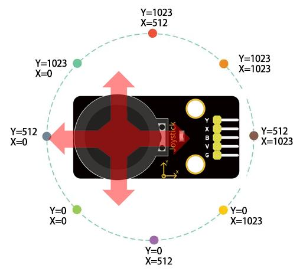

### Specifications

Operating Voltage: 5V

Internal Potentiometer value: 10k

2.54mm pin interface leads


Operating temperature: 0 to 70 °C

### Pinout

The Joystick module has a total of 5 pins. Two are for power, two are for X and Y potentiometers, and one is for the middle switch. The pinout of the module is as follows:


VCC - Provides power for the module, Connect to the 5V pin of the Arduino.

GND - Ground Connected to Ground pin of the Arduino.

X/Y – x/y outputs from the potentiometer.

B – Button output. The output will be pulled low when pressed.

### Wiring Diagram

1\. Connect VCC pin of Joystick Module to the 5V on the board

2\. Connect GND pin of Joystick Module to the GND on the board

3\. Connect X-axis output pin of Joystick Module to the analog input pin A0 on the board

4\. Connect Y-axis output pin of Joystick Module to the analog input pin A1 on the board

5\. Connect button output pin of Joystick Module to the digital input pin D3 on the board

Wiring Diagram with Plus Board

Wiring Diagram with MEGA Plus Board

### Sample Code

```cpp

/*

keyestudio super starter kit V2.0

Project 26

Joystick Module

http//www.keyestudio.com

*/

const int xPin = A0; // X axis pin

const int yPin = A1; // Y axis pin

const int buttonPin = 3; // z axis (button) pin

void setup() {

Serial.begin(9600); // initialize serial port

pinMode(buttonPin, INPUT_PULLUP); // Set the button pin to input and enable the internal pull-up resistor

}

void loop() {

int xValue = analogRead(xPin); // read the potentiometer value in X axis

int yValue = analogRead(yPin); // read the potentiometer value in Y axis

int buttonState = digitalRead(buttonPin); // read the button state

Serial.print("X: ");

Serial.print(xValue);

Serial.print(" Y: ");

Serial.print(yValue);

Serial.print(" Button: ");

Serial.println(buttonState);

delay(100); // delay 100ms

}

```

### Code Explanation

First, the code defines three constants to specify the pins connected to the Arduino board:

```cpp

const int xPin = A0; // Pin for X-axis

const int yPin = A1; // Pin for Y-axis

const int buttonPin = 3; // Pin for Z-axis (button)

```

Here, `xPin` and `yPin` are defined as analog input pins A0 and A1, used to read the analog values of the two axes. `buttonPin` is defined as digital pin 3, used to read the state of the button.

Setup Function

In the `setup()` function, some basic setup is performed:

```cpp

void setup() {

Serial.begin(9600); // Initialize serial port

pinMode(buttonPin, INPUT_PULLUP); // Set button pin as input and enable internal pull-up resistor

}

```

Here, `Serial.begin(9600);` initializes serial communication, setting the baud rate to 9600, which allows the Arduino to exchange data with a computer or other serial devices via USB. `pinMode(buttonPin, INPUT_PULLUP);` sets the button pin as an input and enables the internal pull-up resistor, which is a common way to ensure that the pin reads a high level (HIGH) when the button is not pressed.

Main Loop Function

The `loop()` function contains the main logic of the program, which continuously executes, reading inputs and sending data to the serial port:

```cpp

void loop() {

int xValue = analogRead(xPin); // Read the potentiometer value of X-axis

int yValue = analogRead(yPin); // Read the potentiometer value of Y-axis

int buttonState = digitalRead(buttonPin); // Read the button state

Serial.print("X: ");

Serial.print(xValue);

Serial.print(" Y: ");

Serial.print(yValue);

Serial.print(" Button: ");

Serial.println(buttonState);

delay(100); // Delay for 100 milliseconds

}

```

This code first uses the `analogRead()` function to read the analog values of the X-axis and Y-axis, respectively. These values typically range from 0 to 1023, depending on the variation of the input voltage. Then, it uses the `digitalRead()` function to read the state of the button, which is either HIGH (not pressed) or LOW (pressed). Afterward, these values are output through the serial port in the format "X: [xValue] Y: [yValue] Button: [buttonState]". Finally, the `delay(100);` function call makes the loop execute every 100 milliseconds to avoid reading inputs or sending data too frequently.

### Project Result

After uploading code, open Arduino IDE serial monitor and set baud rate to 9600. When you rotate Joystick Module, the serial monitor prints the value in X and Y axis. Press Joystick Module, the monitor shows 0(pressed) or 1(released).


Through this project, you can make a simple game console by Plus or MEGA Plus development board and a Joystick Module. You may modify codes at will to map the input from the Joystick Module to the corresponding action in the game.

## Project 27 5V Relay

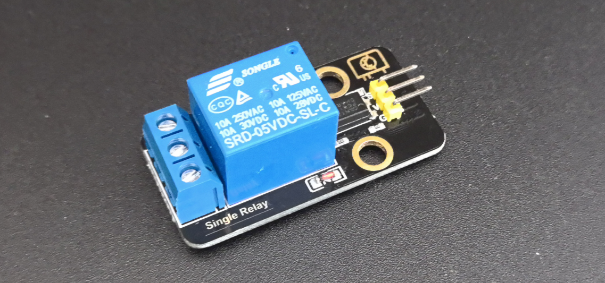

### Description

Relay module is used to control high current or voltage in a circuit. It consists of a coil and a contact. When the coil is energized, the contacts close, and then the circuit is connected. When the coil is powered off, the contact and is disconnected, thus breaking the circuit.

In this project, we control the 5V relay module through the Arduino development board, so as to realize the switch control of the external circuit or equipment. When the Arduino outputs high, the relay will be triggered, and the normally open contact is closed, so then connect the external circuit; When the Arduino outputs low, the relay will return to its initial state and disconnect the external circuit.

### Hardware

1\. Plus or MEGA Plus development board x1

2\. 5V relay x1

3\. DuPont wires

### Working Principle

At the core of a relay is an electromagnet (a wire coil that becomes a temporary magnet when electricity is passed through it). A relay can be thought of as an electric lever; you turn it on with a relatively small current, and it turns on another device with a much larger current.

**Relay Basics**

Here’s a small animation showing how a relay links two circuits together.


To illustrate, think about two simple circuits: one with an electromagnet and a switch or sensor, and the other with a magnetic switch and a light bulb.

Initially, both circuits are open, with no current flowing through them.

When a small current flows through the first circuit, the electromagnet is energized, creating a magnetic field around it. The energized electromagnet attracts the second circuit’s contact, closing the switch and allowing a large current to flow.

When the current in the first circuit stops flowing, the contact returns to its original position, reopening the second circuit.

### Specifications

Supply voltage – 3.3V to 5V

Quiescent current: 2mA

Current when the relay is active: \~70mA

Relay maximum contact voltage – 250VAC or 30VDC

Relay maximum current – 10A

### Pinout


GND is the common ground pin.

VCC pin provides power to the module.

S pin is used to control the relay. This is an active low pin, which means that pulling it LOW activates the relay and pulling it HIGH deactivates it.

Output Terminals:

COM terminal connects to the device you intend to control.

NC terminal is normally connected to the COM terminal, unless you activate the relay, which breaks the connection.

NO terminal is normally open, unless you activate the relay that connects it to the COM terminal.

### Wiring Diagram

1\. Connect VCC pin of the relay to Arduino 5V

2\. Connect GND pin of the relay to Arduino GND

3\. Connect S pin of the relay to Arduino Digital pin D3

4\. Connect an external circuit or device to the normally open and common contacts of the relay


High voltage connections can be made to this screw terminal. For example: Bulb, ceiling fan etc., But in this project we are just using an LED.

When you make the connection between a) and b), the connected LED is always ON until it receives a signal from the Arduino to turn it OFF.

When you make the connection between b) and c), the connected LED is OFF until it receives a signal from the Arduino to turn it ON.

Wiring Diagram with Plus Board

Wiring Diagram with MEGA Plus Board

### Sample Code

```cpp

/*

keyestudio super starter kit V2.0

Project 27

5V Relay

http//www.keyestudio.com

*/

const int relayPin = 3; // set relay pin

void setup() {

pinMode(relayPin, OUTPUT); // set pin to output

}

void loop() {

digitalWrite(relayPin, HIGH); // output high to trigger the relay

delay(1000); // delay 1s

digitalWrite(relayPin, LOW); //output low to disable the relay

delay(1000); // delay 1s

}

```

### Code Explanation

First, let's start with the first line of the code:

```cpp

const int relayPin = 3; // set relay pin

```

This line defines a constant named `relayPin` and assigns it a value of 3. In Arduino, `const int` is used to define an integer constant, which means that once assigned, `relayPin` cannot be changed during program execution. The number 3 here indicates that the relay is connected to digital I/O pin 3 on the Arduino board.

Next is the `setup()` function:

```cpp

void setup() {

pinMode(relayPin, OUTPUT); // set pin to output

}

```

The `setup()` function is a mandatory part of every Arduino program. It runs only once and is used for initialization. In this function, we call `pinMode()`, which is a built-in function in the Arduino language used to set the mode of a specific pin. The `pinMode()` function takes two parameters: the pin number and the mode. Here, we set the mode of `relayPin` (i.e., digital pin 3) to `OUTPUT`, meaning this pin will be used as an output to send voltage.

Then comes the `loop()` function:

```cpp

void loop() {

digitalWrite(relayPin, HIGH); // output high to trigger the relay

delay(1000); // delay 1s

digitalWrite(relayPin, LOW); //output low to disable the relay

delay(1000); // delay 1s

}

```

The `loop()` function is the core of the Arduino program. It repeatedly executes after the Arduino board is powered on. In this function, we use the `digitalWrite()` function to control the relay. The `digitalWrite()` function also takes two parameters: the pin number and the state (HIGH or LOW). First, we set `relayPin` to `HIGH`, which sends a 5V voltage to the relay, triggering it to close. Then, the program pauses for 1000 milliseconds (i.e., 1 second) using `delay(1000);`, so the relay stays closed for a while.

After that, `digitalWrite(relayPin, LOW);` sets the pin state to `LOW`, cutting off the voltage supply to the relay, causing it to return to the open state. The `delay(1000);` function is called again to pause the program for 1 second, and then this loop starts over.

### Project Result

After uploading code, the relay changes its state (on or off) per second. When the relay is turned on, NO is connected to COM and external circuit is closed. When the relay is turned off, NO is disconnected to COM and the circuits is opened.


Through the project, you can control the circuit by Plus or MEGA Plus development board and 5V relay.

## Project 28 DS1307 Clock Module


### Description

The DS1307 is a low-power, high-precision real-time clock (RTC) chip with serial I2C interface. It can be used to record the time and date, keeping the data even when power outage. DS1307 is widely used in embedded systems, microcontroller projects and data acquisition systems.

In this project, we create an Arduino clock project by Keyestudio Plus/MEGA Plus development board and DS1307 clock module. Through this project, you will learn how to get and display the current time.

### Hardware

1\. Plus or MEGA Plus development board x1

2\. DS1307 clock module x1

3\. DuPont wires

### Working Principle

DS1307 clock module is a high-precision quartz crystal oscillator with an oscillation frequency of 32.768kHz. This frequency is processed by the internal partial frequency circuit, and an accurate 1Hz square wave signal can be obtained as the reference clock of the clock module. DS1307 integrates a real-time clock and calendar circuit. The module counts the reference clock signal to achieve the year, month, day, hour, minute, second timing.

DS1307 clock module uses I2C bus to communicate with MCU. I2C bus is a simple and efficient bidirectional two-wire synchronous serial bus, which only needs two signal lines (SCL and SDA) to realize data transmission. The I2C bus interface circuit of DS1307 is responsible for the communication with the MCU, and can read and write the real-time clock and calendar circuit according to the instructions sent by the MCU.

In order to ensure that the clock module can continue to time in the case of power failure, the DS1307 is designed a trickle charging circuit and an external button battery. When the external power supply is supplied, the trickle charging circuit will charge the button battery; When the external power supply is disconnected, the button battery automatically supplies power to the clock module to ensure that the timing function is not affected.

The DS1307 clock module can also output square wave signals at frequencies of 1Hz, 4.096kHz, 8.192kHz, and 32.768kHz. You can set the frequency of square wave output by programming according to their needs.

### Specifications

DS1307 I2C real-time clock chip (RTC)

AT24C32 32K I2C EEPROM memory

Two wire I2C interface.

Hour : Minutes : Seconds AM/PM.

Day Month, Date – Year.

DS1307 based RTC.

1Hz output pin.

56 Bytes of Non-volatile memory available to user.

The DS1307 is accessed via the I2C protocol.

### Pinout


1.  VCC: Power supply pin, usually connected to 5V or 3.3V
2.  GND: Ground pin
3.  SDA: I2C data pin, connected to the development board's SDA pin.
4.  SCL: I2C clock pin, connected to the development board's SCL pin.

### Wiring Diagram

1\. Connect VCC pin of DS1307 to 5V on the board

2\. Connect GND pin of DS1307 to GND on the boar

3\. Connect SDA pin of DS1307 to A4(SDA) on the Puls development board or D20(SDA) on the MEGA Plus board.

4\. Connect SCL pin of DS1307 to A5(SCL) on the Puls development board or D21(SCL) on the MEGA Plus board.

Wiring Diagram with Plus Board

Wiring Diagram with MEGA Plus Board

### Install Library

Before starting to code, we need to install the RTClib library file first.

**Navigate to Library Manager**: Click on the “Tools” menu option, then select “Manage Libraries…”.


**Search for Libraries**:

 In the Library Manager window that pops up, you'll see a search box. Enter the name of the"RTClib" library .


**Select and Install Libraries**:

 Find the desired library in the search results and click on it.

 An “Install” button will appear on the right side of the window. Click the “Install” button.

After clicking to install the library file, an interface will pop up. You also need to install another BusIO library file. Click the button to install all.


**Wait for Installation**: The Arduino IDE will automatically download and install the selected library. Once the installation is complete, the “Install” button will change to “Installed”, indicating a successful installation.


### Sample Code

```cpp

/*

keyestudio super starter kit V2.0

Project 28

DS1307 Clock Module

http//www.keyestudio.com

*/

#include <Wire.h>

#include "RTClib.h"

RTC_DS1307 rtc;

void setup () {

Serial.begin(9600); // Initialize serial port

if (! rtc.begin()) { // Initialize RTC

Serial.println("Couldn't find RTC");

while (1);

}

if (! rtc.isrunning()) { // check whether RTC is work

Serial.println("RTC is NOT running!");

// If RTC is not running, you can set the time by uncommenting the following line

// rtc.adjust(DateTime(F(__DATE__), F(__TIME__)));

}

}

void loop () {

DateTime now = rtc.now(); // Get current time

Serial.print(now.year(), DEC); // output year

Serial.print('/');

Serial.print(now.month(), DEC); // output month

Serial.print('/');

Serial.print(now.day(), DEC); // output date

Serial.print(" (");

Serial.print(daysOfTheWeek[now.dayOfTheWeek()]); // output week

Serial.print(") ");

Serial.print(now.hour(), DEC); // output hour

Serial.print(':');

Serial.print(now.minute(), DEC); // output minute

Serial.print(':');

Serial.print(now.second(), DEC); // output second

Serial.println();

delay(1000); // delay 1s

}

```

### Code Explanation

1\. Import Libraries

```cpp

#include <Wire.h>

#include "RTClib.h"

```

The code first includes the `Wire.h` library, which is provided by Arduino for I2C communication. The RTC_DS1307 module communicates with Arduino via the I2C interface. Next, it includes `RTClib.h`, a library provided by Adafruit for easy operation of various real-time clock modules, including DS1307.

2\. Define Global Variables

```cpp

RTC_DS1307 rtc;

```

This line of code creates an object `rtc` of the `RTC_DS1307` class, which is used for all subsequent operations related to the real-time clock.

3\. setup() Function

```cpp

void setup () {

Serial.begin(9600); // Initialize serial port

if (!rtc.begin()) { // Initialize RTC

Serial.println("Couldn't find RTC");

while (1);

}

if (!rtc.isrunning()) { // Check if RTC is running

Serial.println("RTC is NOT running!");

// If RTC is not running, you can set the time by uncommenting the line below

// rtc.adjust(DateTime(F(__DATE__), F(__TIME__)));

}

}

```

 `Serial.begin(9600);`: This line initializes Arduino's serial communication with a baud rate of 9600. This allows Arduino to communicate with the computer's serial monitor via USB.

 `rtc.begin()`: This method attempts to initialize the RTC module. If the module is not detected, it outputs an error message and enters an infinite loop.

 `rtc.isrunning()`: This method checks if the RTC module is running. If the RTC stops running, you may need to set the current time. The code here comments out the part that sets the time because it is usually only needed during the first setup or after a battery replacement.

4\. loop() Function

```cpp

void loop () {

DateTime now = rtc.now(); // Get current time

Serial.print(now.year(), DEC); // Output year

Serial.print('/');

Serial.print(now.month(), DEC); // Output month

Serial.print('/');

Serial.print(now.day(), DEC); // Output day

Serial.print(" (");

Serial.print(daysOfTheWeek[now.dayOfTheWeek()]); // Output day of the week

Serial.print(") ");

Serial.print(now.hour(), DEC); // Output hour

Serial.print(':');

Serial.print(now.minute(), DEC); // Output minute

Serial.print(':');

Serial.print(now.second(), DEC); // Output second

Serial.println();

delay(1000); // Delay for 1 second

}

```

 `DateTime now = rtc.now();`: Retrieves the current date and time from the RTC and stores it in the `now` variable.

 The next few lines of code output the current date and time through the serial port. Using the `Serial.print()` method, you can output the year, month, day, day of the week, hour, minute, and second to the serial monitor.

 `delay(1000);`: At the end of each loop, the code pauses for 1000 milliseconds (i.e., 1 second), so the time updates at a frequency of once per second.

### Project Result

After uploading code, open Arduino IDE serial monitor and set baud rate to 9600. The current date, time, and week are printed on the monitor and updated per second.


Through this project, you can make an Arduino clock project by Plus or MEGA Plus development board and DS1307 clock module. Or you can add other module like displays and alarm clock.

## Project 29 AHT20 Temperature and Humidity Sensor


### Description

The AHT20 is a digital temperature and humidity sensor that integrates temperature and humidity sensors and communicates via an I2C or SPI interface. The sensor features high precision, low power consumption and small size, which is suitable for various application scenarios, such as smart home, weather monitoring, medical equipment and so on.

In this project, we can monitor ambient temperature and humidity in real time by Plus or MEGA Plus development board and AHT20 temperature and humidity sensor.

Through this project, you will learn how to connect the AHT20 module and display temperature and humidity value on a serial monitor.

### Hardware

1\. Plus or MEGA Plus development board x1

2\. AHT20 temperature and humidity x1

3\. DuPont wires

### Working Principle

The AHT20 module features high-precision, low-power temperature and humidity sensor, which is widely used in ambient temperature and humidity measurement. The AHT20 module uses advanced MEMS technology with integrated temperature and humidity sensors.

TIt is based on the capacitive measurement. When the ambient temperature changes, the capacitance value of the temperature sensor will change accordingly. Similarly, when the ambient humidity changes, the capacitance value of the humidity sensor will also change accordingly. The circuit inside the AHT20 module converts these capacitance changes into a digital signal output, enabling accurate measurement of temperature and humidity.

### Specifications

Temperature measurement range: -40 to 85 ℃

Humidity measurement range: 0 to 100% RH

Temperature measurement accuracy: ± 0.3 ℃

Accuracy of humidity measurement: ± 2% RH

Resolution: 0.01 ℃, 0.024% RH

I2C interface

I2C address: 0x38

Supply voltage: 2 V to 5.5 V


### Pinout


1.  VCC: Power supply pin, usually connected to 5V or 3.3V
2.  GND: Ground pin
3.  SDA: I2C data pin, connected to the development board's SDA pin.
4.  SCL: I2C clock pin, connected to the development board's SCL pin.

### Wiring Diagram

1\. Connect VCC of AHT20 to 5V on the board

2\. Connect GND of AHT20 to GND on the board

3.Connect SDA of AHT20 to A4(SDA) on the Plus board or D20(SDA) on the MEGA Plus board

4\. Connect SCL of AHT20 to A5(SCL) on the Plus board or D21(SCL) on the MEGA Plus board

### Install Library

Before starting to code, we need to install the **AHT20** library file first.

**Navigate to Library Manager**: Click on the “Tools” menu option, then select “Manage Libraries…”.


**Search for Libraries**:

 In the Library Manager window that pops up, you'll see a search box. Enter the name of the"**AHT20**" library .


**Select and Install Libraries**:

 Find the desired library in the search results and click on it.

 An “Install” button will appear on the right side of the window. Click the “Install” button.


**Wait for Installation**: The Arduino IDE will automatically download and install the selected library. Once the installation is complete, the “Install” button will change to “Installed”, indicating a successful installation.

### Sample Code

```cpp

/*

keyestudio super starter kit V2.0

Project 29

AHT20 Temperature and Humidity Sensor

http//www.keyestudio.com

*/

#include <Wire.h>

#include <AHT20.h>

AHT20 aht20;

void setup() {

Serial.begin(9600); // initialize serial port

Wire.begin(); // initialize I2C communication

aht20.begin(); // initialize AHT20 sensor

}

void loop() {

float temperature = aht20.getTemperature(); // read temperature sensor value

float humidity = aht20.getHumidity(); // read the humidity value

// print temperature and humidity value on the serial monitor

Serial.print("Temperature: ");

Serial.print(temperature);

Serial.print(" °C\t");

Serial.print("Humidity: ");

Serial.print(humidity);

Serial.println(" %");

delay(1000); // delay 1s

}

```

### Code Explanation

First, the code includes references to two header files:

```cpp

#include <Wire.h>

#include <AHT20.h>

```

`Wire.h` is a library provided by Arduino for implementing I2C communication, which is a common serial communication protocol used to connect microcontrollers and various sensors, such as the AHT20. `AHT20.h` is a library specifically designed for the AHT20 sensor, providing a set of functions to easily read temperature and humidity data.

Next, the code defines an object `aht20` of type `AHT20`:

```cpp

AHT20 aht20;

```

This object represents the physically connected AHT20 sensor. Through this object, we can access the methods provided by the AHT20 library to interact with the sensor.

In the `setup()` function, the following initialization steps are performed:

```cpp

void setup() {

Serial.begin(9600); // Initialize serial port

Wire.begin(); // Initialize I2C communication

aht20.begin(); // Initialize AHT20 sensor

}

```

 `Serial.begin(9600);` initializes serial communication and sets the baud rate to 9600. This allows the Arduino to communicate with the computer via USB, and the data can be displayed in the Arduino IDE's serial monitor.

 `Wire.begin();` starts the I2C communication, which is necessary for reading data from the AHT20 sensor.

 `aht20.begin();` initializes the AHT20 sensor, ensuring that the sensor is working properly and ready to send data.

In the `loop()` function, the code periodically reads temperature and humidity data and outputs it to the serial monitor:

```cpp

void loop() {

float temperature = aht20.getTemperature(); // Read temperature value

float humidity = aht20.getHumidity(); // Read humidity value

// Output temperature and humidity values to the serial monitor

Serial.print("Temperature: ");

Serial.print(temperature);

Serial.print(" °C\t");

Serial.print("Humidity: ");

Serial.print(humidity);

Serial.println(" %");

delay(1000); // Delay for 1 second

}

```

 `float temperature = aht20.getTemperature();` and `float humidity = aht20.getHumidity();` read the current temperature and humidity values from the sensor, respectively.

 The next few lines of code are responsible for formatting and outputting the read temperature and humidity values to the serial monitor.

 The `delay(1000);` function call makes the loop execute once per second, allowing the temperature and humidity readings to be updated every second.

### Project Result

After uploading code, open the serial monitor. The temperature and humidity values refresh per second.


Through this project, you can build a temperature and humidity monitoring system by Keyestudio Plus/MEGA Plus development board and AHT20 temperature and humidity sensor. You may add an LCD or buzzer to expand functions.

## Project 30 IR Remote


### Description

IR control is a wireless remote control equipment for signal transmission. It is widely used in TV, air conditioning, audio and other household appliances. By transmitting infrared signals, it controls the receiver to perform corresponding operations.

In this project, we realize infrared remote control function by Arduino programming on keyestudio Plus/MEGA Plus development board.

### Hardware

1\. Plus or MEGA Plus development board x1

2\. Infrared Remote Controller \*1

3\. Infrared Receiver \*1

4\. Breadboard x1

5\. Jumper wires

### Working Principle

**WHAT IS INFRARED?**

Infrared radiation is a form of light similar to the light we see all around us. The only difference between IR light and visible light is the frequency and wavelength. Infrared radiation lies outside the range of visible light, so humans can’t see it:


Because IR is a type of light, IR communication requires a direct line of sight from the receiver to the transmitter. It can’t transmit through walls or other materials like WiFi or Bluetooth.

**HOW IR REMOTES AND RECEIVERS WORK**

A typical infrared communication system requires an IR transmitter and an IR receiver. The transmitter looks just like a standard LED, except it produces light in the IR spectrum instead of the visible spectrum. If you have a look at the front of a TV remote, you’ll see the IR transmitter LED:


The IR receiver is a photodiode and pre-amplifier that converts the IR light into an electrical signal. IR receiver diodes typically look like this:


**IR SIGNAL MODULATION**

IR light is emitted by the sun, light bulbs, and anything else that produces heat. That means there is a lot of IR light noise all around us. To prevent this noise from interfering with the IR signal, a signal modulation technique is used.

In IR signal modulation, an encoder on the IR remote converts a binary signal into a modulated electrical signal. This electrical signal is sent to the transmitting LED. The transmitting LED converts the modulated electrical signal into a modulated IR light signal. The IR receiver then demodulates the IR light signal and converts it back to binary before passing on the information to a microcontroller:


The modulated IR signal is a series of IR light pulses switched on and off at a high frequency known as the carrier frequency. The carrier frequency used by most transmitters is 38 kHz, because it is rare in nature and thus can be distinguished from ambient noise. This way the IR receiver will know that the 38 kHz signal was sent from the transmitter and not picked up from the surrounding environment.

The receiver diode detects all frequencies of IR light, but it has a band-pass filter and only lets through IR at 38 kHz. It then amplifies the modulated signal with a pre-amplifier and converts it to a binary signal before sending it to a microcontroller.

**IR TRANSMISSION PROTOCOLS**

The pattern in which the modulated IR signal is converted to binary is defined by a transmission protocol. There are many IR transmission protocols. Sony, Matsushita, NEC, and RC5 are some of the more common protocols.

The NEC protocol is also the most common type in Arduino projects, so I’ll use it as an example to show you how the receiver converts the modulated IR signal to a binary one.

Logical ‘1’ starts with a 562.5 µs long HIGH pulse of 38 kHz IR followed by a 1,687.5 µs long LOW pulse. Logical ‘0’ is transmitted with a 562.5 µs long HIGH pulse followed by a 562.5 µs long LOW pulse:


This is how the NEC protocol encodes and decodes the binary data into a modulated signal. Other protocols differ only in the duration of the individual HIGH and LOW pulses.

### Specifications

Operating Voltage: 2.5V to 5.5V

Carrier Frequency (38kHz)

Operating current: 5mA

High Range and wide coverage area.

Improved immunity against HF and RF noise

Has in-built pre amplifier

TTL and CMOS compatible

### Pinout


VCC: development board 5V

GND: development board GND

OUT: development board digital pin

### Wiring Diagram

1.  Connect VCC of IR Remote component to 5V on the board
2.  Connect GND of IR Remote component to GND on the board
3.  Connect OUT of IR Remote component to the digital pin D2 on the board


Wiring Diagram with Plus Board


Wiring Diagram with MEGA Plus Board

### Install Library

Before starting to code, we need to install the **IRremote** library file first.

**Navigate to Library Manager**: Click on the “Tools” menu option, then select “Manage Libraries…”.


**Search for Libraries**:

 In the Library Manager window that pops up, you'll see a search box. Enter the name of the" **IRremote** " library .


**Select and Install Libraries**:

 Open the list in the IRremote library file, select **version 2.0.1**, click and install.


 An “Install” button will appear on the right side of the window. Click the “Install” button.


**Wait for Installation**: The Arduino IDE will automatically download and install the selected library. Once the installation is complete, the “Install” button will change to “Installed”, indicating a successful installation.

### Sample Code

```cpp

/*

keyestudio super starter kit V2.0

Project 30

IR Remote

http//www.keyestudio.com

*/

#include <IRremote.h> // import IRremote library

const int RECV_PIN = 2; // IR Remote receiver pin

IRrecv irrecv(RECV_PIN); // create IRrecv object

decode_results results; // An object that stores the decoded result

void setup() {

Serial.begin(9600); // initialize serial port

irrecv.enableIRIn(); // enable IR Remote receiver

}

void loop() {

if (irrecv.decode(&results)) { // If an infrared signal is received

Serial.println(results.value, HEX); // Print the received infrared code

irrecv.resume(); // Receive the next value

}

delay(100); // delay 100ms

}

```

### Code Explanation

First, introduce the IRremote library:

```cpp

#include <IRremote.h>

```

This line of code imports the IRremote library. The IRremote library is a library for Arduino that allows Arduino to communicate with external devices via infrared signals. This library supports multiple infrared protocols and can decode signals from common devices such as TV remotes and air conditioner remotes.

Define the receiving pin and objects

Next, the code defines the pin for receiving infrared signals and the necessary objects:

```cpp

const int RECV_PIN = 2; // IR Remote receiver pin

IRrecv irrecv(RECV_PIN); // create IRrecv object

decode_results results; // An object that stores the decoded result

```

Here, `RECV_PIN` defines the pin number on the Arduino for receiving infrared signals, which is set to pin 2. The `IRrecv` object `irrecv` is initialized by specifying the pin and is used to set and read infrared signals. The `decode_results` object `results` is used to store the decoded infrared signal data.

Initialization and configuration

In the `setup()` function, some basic initialization and configuration are performed:

```cpp

void setup() {

Serial.begin(9600); // initialize serial port

irrecv.enableIRIn(); // enable IR Remote receiver

}

```

`Serial.begin(9600);` initializes serial communication with a baud rate of 9600 for data output and display. `irrecv.enableIRIn();` starts the infrared receiver, enabling it to begin receiving signals from the infrared remote control.

Main loop

In the `loop()` function, the code processes the received infrared signals:

```cpp

void loop() {

if (irrecv.decode(&results)) { // If an infrared signal is received

Serial.println(results.value, HEX); // Print the received infrared code

irrecv.resume(); // Receive the next value

}

delay(100); // delay 100ms

}

```

This part of the code is the core of the program, continuously checking whether an infrared signal has been received. `irrecv.decode(&results)` checks if a signal has been received, and if so, the function returns `true` and stores the decoded result in the `results` object. Next, `Serial.println(results.value, HEX);` outputs the received infrared code in hexadecimal format to the serial monitor for observation and debugging. `irrecv.resume();` prepares to receive the next infrared signal. `delay(100);` pauses for 100 milliseconds after each iteration of the loop to avoid excessively frequent processing.

### Project Result

After uploading code, open the serial monitor and set baud rate to 9600. When you press the key on the remote control, the serial monitor displays the received infrared code. Each key corresponds to a unique coded value.


Through the serial monitor displays code，we get a Infrared remote control key code diagram.


Through this project, you can make a remote control by keyestudio Plus/MEGA Plus development board. You can control LED or motor according to the received code.

## Project 31 Ultrasonic Sensor


### Description

HC-SR04 ultrasonic sensor is a commonly used distance measurement sensor, which measures the distance between the object and the sensor. The sensor is small in size, low in price and easy to use, so it has been widely used in robotics, smart home and industrial control.

In this project, we build a distance measurement system by Keyestudio Plus/MEGA Plus development board and the HC-SR04 ultrasonic sensor. Through this project, you will learn how to measure the distance between an object and the sensor using the HC-SR04 ultrasonic sensor and display the measurement results on a serial monitor.

### Hardware

1\. Plus or MEGA Plus development board x1

2\. HC-SR04 ultrasonic sensor x1

3\. DuPont wires

### Working Principle

It emits an ultrasound at 40 000 Hz which travels through the air and if there is an object or obstacle on its path It will bounce back to the module. Considering the travel time and the speed of the sound you can calculate the distance.

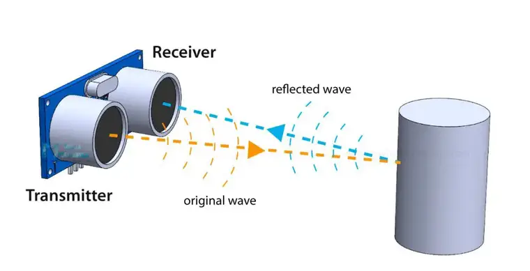

In order to generate the ultrasound we need to set the Trig pin on a High State for 10 µs. That will send out an 8 cycle ultrasonic burst which will travel at the speed of sound. The Echo pins goes high right away after that 8 cycle ultrasonic burst is sent, and it starts listening or waiting for that wave to be reflected from an object.

If there is no object or reflected pulse, the Echo pin will time-out after 38ms and get back to low state.


If we receive a reflected pulse, the Echo pin will go down sooner than those 38ms. According to the amount of time the Echo pin was HIGH, we can determine the distance the sound wave traveled, thus the distance from the sensor to the object.

For that purpose we are using the following basic formula for calculating distance:

**Distance = Speed x Time**

We actually know both the speed and the time values. The time is the amount of time the Echo pin was HIGH, and the speed is the speed of sound which is 340m/s. There’s one additional step we need to do, and that’s divide the end result by 2. and that’s because we are measuring the duration the sound wave needs to travel to the object and bounce back.

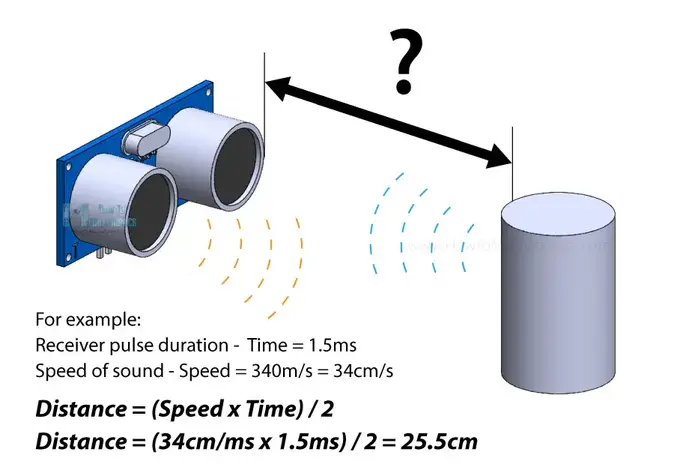

Let’s say the Echo pin was HIGH for 2ms. If we want the get the distance result in cm, we can convert the speed of sound value from 340m/s to 34cm/ms.

**Distance = (Speed x Time) / 2 = (34cm/ms x 1.5ms) / 2 = 25.5cm.**

So, if the Echo pin was HIGH for 2ms (which we measure using the **pulseIn()** function), the distance from the sensor to the object is 34cm.

### Specifications

Working Voltage DC 5V

Working Current 15mA

Working Frequency 40KHz

Max Range 4m

Min Range 2cm

Measuring Angle 15 degree

Trigger Input Signal 10µS TTL pulse

Echo Output Signal Input TTL lever signal and the range in proportion

### Pinout


VCC supplies power to the HC-SR04 ultrasonic sensor. You can connect it to the 5V output from your Arduino.

Trig (Trigger) pin is used to trigger ultrasonic sound pulses. By setting this pin to HIGH for 10µs, the sensor initiates an ultrasonic burst.

Echo pin goes high when the ultrasonic burst is transmitted and remains high until the sensor receives an echo, after which it goes low. By measuring the time the Echo pin stays high, the distance can be calculated.

GND is the ground pin. Connect it to the ground of the Arduino.

### Wiring Diagram

1\. Connect ultrasonic sensor VCC to 5V on the board

2\. Connect ultrasonic sensor Trig pin to digital pin D6 on the board

3\. Connect ultrasonic sensor Echo pin to digital pin D5 on the board

4\. Connect ultrasonic sensor GND pin to GND on the board

Wiring Diagram with Plus Board

Wiring Diagram with MEGA Plus Board

### Sample Code

```cpp

/*

keyestudio super starter kit V2.0

Project 31

HC-SR04 Ultrasonic Sensor

http//www.keyestudio.com

*/

const int trigPin = 6;

const int echoPin = 5;

long duration;

int distance;

void setup() {

pinMode(trigPin, OUTPUT);

pinMode(echoPin, INPUT);

Serial.begin(9600);

}

void loop() {

digitalWrite(trigPin, LOW);

delayMicroseconds(2);

digitalWrite(trigPin, HIGH);

delayMicroseconds(10);

digitalWrite(trigPin, LOW);

duration = pulseIn(echoPin, HIGH);

distance = duration * 0.034 / 2;

Serial.print("Distance: ");

Serial.print(distance);

Serial.println(" cm");

delay(500);

}

```

### Code Explanation

Definition of Pins and Variables

```cpp

const int trigPin = 6;

const int echoPin = 5;

long duration;

int distance;

```

In this section, two constants `trigPin` and `echoPin` are defined, representing the digital pin numbers on the Arduino board connected to the trigger (Trig) and echo (Echo) pins of the HC-SR04 sensor. Additionally, two variables `duration` and `distance` are defined to store the duration of the echo signal and the calculated distance.

Setup Function

```cpp

void setup() {

pinMode(trigPin, OUTPUT);

pinMode(echoPin, INPUT);

Serial.begin(9600);

}

```

The `setup()` function is a standard initialization function in Arduino code that sets the pin modes and initializes serial communication. `pinMode(trigPin, OUTPUT)` and `pinMode(echoPin, INPUT)` set the Trig pin to output mode and the Echo pin to input mode, respectively. `Serial.begin(9600)` starts the serial port and sets the data transmission rate to 9600 bits per second, allowing data to be output to the serial monitor on the computer.

Main Loop

```cpp

void loop() {

digitalWrite(trigPin, LOW);

delayMicroseconds(2);

digitalWrite(trigPin, HIGH);

delayMicroseconds(10);

digitalWrite(trigPin, LOW);

duration = pulseIn(echoPin, HIGH);

distance = duration * 0.034 / 2;

Serial.print("Distance: ");

Serial.print(distance);

Serial.println(" cm");

delay(500);

}

```

The `loop()` function contains the main logic of the program and is repeatedly executed. First, the Trig pin is set to a low level and held for 2 microseconds to ensure the stability of the ultrasonic signal transmission. Then, the Trig pin is set to a high level for 10 microseconds, triggering the sensor to send an ultrasonic pulse. After that, the Trig pin is set back to a low level, waiting for the Echo pin to receive the echo.

`duration = pulseIn(echoPin, HIGH);` measures the time the Echo pin remains at a high level (i.e., the time for the ultrasonic wave to travel back and forth). `distance = duration * 0.034 / 2;` calculates the distance based on the speed of sound (approximately 340 meters/second or 0.034 centimeters/microsecond). Since the sound wave needs to travel both ways, the actual distance is the time multiplied by the speed and then divided by 2.

Finally, the calculated distance is output through the serial port, and there is a delay of 500 milliseconds after each measurement.

### Project Result

After uploading code, open the serial monitor and set baud rate to 9600. The distance value will be output on the monitor in cm. When the object approaches or keeps away form the sensor, the value changes.


Through this project, you know how to measure distance by HC-SR04 ultrasonic sensor and Plus or MEGA Plus development board. This function is widely applied to obstacle avoidance, liquid level measurement and parking assistance system.

## Project 32 SC7A20 Acceleration Sensor


### Description

The SC7A20 is a three-axis acceleration sensor that features low-power and high-precision. It suitable for a variety of applications, such as mobile phones, tablets, wearables and IOT devices.

In this project, we measure triaxial acceleration by the Plus or MEGA Plus development board and the SC7A20 acceleration sensor and display the results on serial monitor. Through this project, you will learn how to connect the SC7A20 sensor and read and process sensor data.

### Hardware

1\. Plus or MEGA Plus development board x1

2\. SC7A20 Acceleration sensor x1

3\. DuPont wires

### Working Principle

The SC7A20 uses microelectromechanical system (MEMS) technology and integrates three capacitive accelerometers that are perpendicular to each other. When the sensor is subjected to acceleration, the internal mass block will shift under the force of the elastic cantilever, changing the capacitance value. By measuring the change of capacitance value, the acceleration in the corresponding direction can be converted.


A 24-bit analog-to-digital converter (ADC) is also integrated inside the sensor, which can convert changes in capacitance into a digital signal output. The acceleration data can be transmitted by I2C or SPI interface to an external microcontroller for processing and analysis .

### Specifications

Measuring range: ±2g, ±4g, ±8g and ±16g are optional

Sensitivity: 1024 LSB/g at ±2g; 512 LSB/g at ±4g; 256 LSB/g at ±8g; 128 LSB/g at ±16g.

Output data rate: 1.56Hz to 1600Hz can be selected.

Operating voltage :1.71V to 3.6V for low power applications.

Operating temperature :-40°C to +85°C

Package size: 2mm x 2mm x 1mm

Interface: Support I2C and SPI interface

### Pinout


1.  VCC: Power supply pin, usually connected to 5V or 3.3V
2.  GND: Ground pin
3.  SDA: I2C data pin, connected to the development board's SDA pin.
4.  SCL: I2C clock pin, connected to the development board's SCL pin.

### Wiring Diagram

1\. Connect VCC pin of SC7A20 to 5V on the board

2\. Connect GND pin of SC7A20 to GND on the board

3\. Connect SDA pin of SC7A20 to A4(SDA) on Plus development board or D20(SDA) on MEGA Plus development board

4\. Connect SCL pin of SC7A20 to A5(SCL) on Plus development board or D21(SCL) on MEGA Plus development board


### Sample Code

```cpp

/*

keyestudio super starter kit V2.0

Project 32

SC7A20 Acceleration Sensor

http//www.keyestudio.com

*/

#include <Wire.h>

#define SC7A20_ADDRESS 0x19

void setup() {

Wire.begin();

Serial.begin(9600);

// Initialize SC7A20 sensor

Wire.beginTransmission(SC7A20_ADDRESS);

Wire.write(0x20);

Wire.write(0x57);

Wire.endTransmission();

delay(100);

}

void loop() {

Wire.beginTransmission(SC7A20_ADDRESS);

Wire.write(0x28);

Wire.endTransmission();

Wire.requestFrom(SC7A20_ADDRESS, 6);

// read sensor values

int16_t x = (Wire.read() << 8) | Wire.read();

int16_t y = (Wire.read() << 8) | Wire.read();

int16_t z = (Wire.read() << 8) | Wire.read();

// convert the initial data into actual ones, unit: m/s^2

float acc_x = x / 16384.0 * 9.8;

float acc_y = y / 16384.0 * 9.8;

float acc_z = z / 16384.0 * 9.8;

// print the acceleration values on serial monitor

Serial.print("X: ");

Serial.print(acc_x);

Serial.print(" m/s^2\tY: ");

Serial.print(acc_y);

Serial.print(" m/s^2\tZ: ");

Serial.print(acc_z);

Serial.println(" m/s^2");

delay(100);

}

```

### Code Explanation

Introduction of Libraries and Definition of Address

```cpp

#include <Wire.h>

#define SC7A20_ADDRESS 0x19

```

This code includes the `Wire` library, which is the standard library for I2C communication on the Arduino platform. `SC7A20_ADDRESS` defines the device address of the SC7A20 sensor on the I2C bus, which is necessary for communicating with the sensor.

Initialization Function `setup()`

```cpp

void setup() {

Wire.begin(); // Start I2C communication

Serial.begin(9600); // Start serial communication with a baud rate of 9600

// Initialize SC7A20 sensor

Wire.beginTransmission(SC7A20_ADDRESS); // Begin communication with the sensor

Wire.write(0x20); // Write the register address

Wire.write(0x57); // Set the sensor's operating mode and parameters

Wire.endTransmission(); // End communication

delay(100); // Wait 100 milliseconds to ensure the settings take effect

}

```

In the `setup()` function, I2C communication is first initialized with `Wire.begin()`, followed by starting serial communication with `Serial.begin(9600)` for data output. Then, the code configures the sensor's operating mode by sending specific commands to the SC7A20's registers. `0x20` is the register address, and `0x57` is the value to be written, which depends on the specific configuration requirements of the sensor, usually including data rate, power mode, etc.

Main Loop Function `loop()`

```cpp

void loop() {

Wire.beginTransmission(SC7A20_ADDRESS);

Wire.write(0x28); // Set the starting register address for reading data

Wire.endTransmission();

Wire.requestFrom(SC7A20_ADDRESS, 6); // Request 6 bytes of data, corresponding to X, Y, Z axis data

// Read and process acceleration data

int16_t x = (Wire.read() << 8) | Wire.read(); // Read X-axis data

int16_t y = (Wire.read() << 8) | Wire.read(); // Read Y-axis data

int16_t z = (Wire.read() << 8) | Wire.read(); // Read Z-axis data

// Convert raw data to acceleration values (unit: m/s^2)

float acc_x = x / 16384.0 * 9.8;

float acc_y = y / 16384.0 * 9.8;

float acc_z = z / 16384.0 * 9.8;

// Print acceleration values on the serial monitor

Serial.print("X: ");

Serial.print(acc_x);

Serial.print(" m/s^2\tY: ");

Serial.print(acc_y);

Serial.print(" m/s^2\tZ: ");

Serial.print(acc_z);

Serial.println(" m/s^2");

delay(100); // Update data every 100 milliseconds

}

```

In the `loop()` function, the code first sets the starting address for reading data from the sensor using `Wire.beginTransmission()` and `Wire.write()`. The `Wire.requestFrom()` function requests 6 bytes of data from the sensor, representing the acceleration data of the X, Y, and Z axes. Each axis data is 16 bits, with the high byte first and the low byte second, combined into a complete 16-bit integer through shifting and bitwise OR operations. Then, these integers are converted into actual acceleration values (in units of m/s²), and finally, these data are output through the serial port.

### Project Result

After uploading code, SC7A20 detects the acceleration values on three axes in the unit of m/s^2. When you move or tilt the sensor, these values change.

****

Through this project, you have learned how to measure acceleration sensor by Plus or MEGA Plus development board and SC7A20 sensor. You can even add an OLED display to show the value, or record the values in SD card for analysis.

## Project 33 RFID Module


### Description

An RFID module integrates radio frequency identification technology that identify and track tagged objects by electromagnetic fields. Each tag contains a microchip that stores unique identifying information about the object. The module identifies the object by reading the tag information and can match it with the database to track and manage the object.

In this project, we read the unique ID by Plus or MEGA Plus development board and RC522 RFID module, and then perform the corresponding action based on the read ID.

### Hardware

1\. Plus or MEGA Plus development board x1

2\. I2C RC522 RFID module x1

3\. RFID card (key or card) x1

4\. DuPont wires

### Working Principle

An RFID or radio frequency identification system consists of two main components, a tag attached to the object to be identified, and a reader that reads the tag.

A reader consists of a radio frequency module and an antenna that generates a high frequency electromagnetic field. Whereas the tag is usually a passive device (it does not have a battery). It consists of a microchip that stores and processes information, and an antenna for receiving and transmitting a signal.


When the tag is brought close to the reader, the reader generates an electromagnetic field. This causes electrons to move through the tag’s antenna and subsequently powers the chip.

The chip then responds by sending its stored information back to the reader in the form of another radio signal. This is called a backscatter. The reader detects and interprets this backscatter and sends the data to a computer or microcontroller.

### Specifications

| Frequency Range          | 13.56 MHz ISM Band |
|--------------------------|--------------------|
| Host Interface           | SPI / I2C / UART   |
| Operating Supply Voltage | 2.5 V to 3.3 V     |
| Max. Operating Current   | 13-26mA            |
| Min. Current(Power down) | 10µA               |
| Logic Inputs             | 5V Tolerant        |
| Read Range               | 5 cm               |

### Pinout


1.  VCC: Power supply pin, usually connected to 5V or 3.3V
2.  GND: Ground pin
3.  SDA: I2C data pin, connected to the development board's SDA pin.
4.  SCL: I2C clock pin, connected to the development board's SCL pin.

### Wiring Diagram

1\. Connect VCC pin of RFID Module to 5V on the board

2\. Connect GND pin of RFID Module to GND on the board

3\. Connect SDA pin of RFID Module to A4(SDA) on the Plus board or D20(SDA) on the MEGA Plus board

4\. Connect SCL pin of RFID Module to A5(SCL) on the Plus board or D21(SCL) on the MEGA Plus board

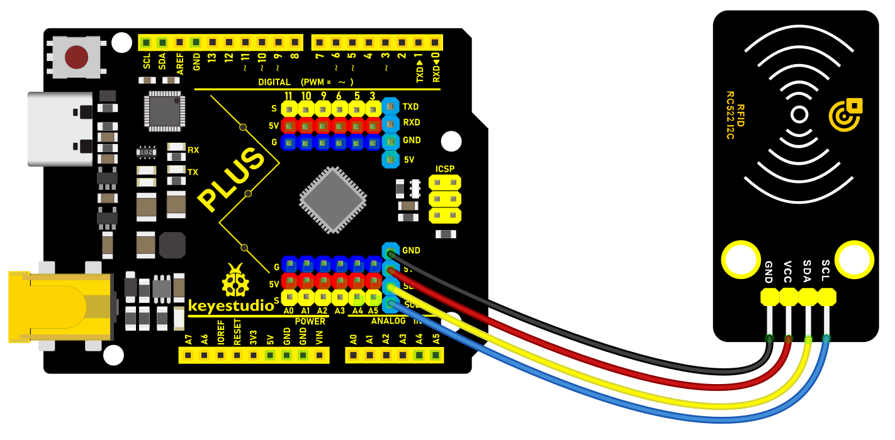Wiring Diagram with Plus Board

Wiring Diagram with MEGA Plus Board

### Install Library

The **MFRC522_I2C** library is not in the official Arduino library list, We can install it manually step by step by ourselves.

Click **Skerch > Include Library > Add .Zip Library…** in sequence.


Find the folder of the library file in the tutorial we provide, find the library file  that needs to be added manually, and install it

The two library files framed in the file must be installed.


### Sample Code

```cpp

/*

keyestudio super starter kit V2.0

Project 33

RFID Module

http//www.keyestudio.com

*/

#include <Wire.h>

#include "MFRC522_I2C.h"

MFRC522 mfrc522(0x28); // Create MFRC522 instance.

void setup() {

Serial.begin(115200); // Initialize serial communications with the PC

Wire.begin(); // Initialize I2C

mfrc522.PCD_Init(); // Init MFRC522

ShowReaderDetails(); // Show details of PCD - MFRC522 Card Reader details

Serial.println(F("Scan PICC to see UID, type, and data blocks..."));

}

void loop() {

if ( ! mfrc522.PICC_IsNewCardPresent() || ! mfrc522.PICC_ReadCardSerial() ) {

delay(50);

return;

}

Serial.print(F("Card UID:"));

for (byte i = 0; i < mfrc522.uid.size; i++) {

Serial.print(mfrc522.uid.uidByte[i] < 0x10 ? " 0" : " ");

Serial.print(mfrc522.uid.uidByte[i], HEX);

}

Serial.println();

}

void ShowReaderDetails() {

byte v = mfrc522.PCD_ReadRegister(mfrc522.VersionReg);

Serial.print(F("MFRC522 Software Version: 0x"));

Serial.print(v, HEX);

if (v == 0x91)

Serial.print(F(" = v1.0"));

else if (v == 0x92)

Serial.print(F(" = v2.0"));

else

Serial.print(F(" (unknown)"));

Serial.println("");

if ((v == 0x00) || (v == 0xFF)) {

Serial.println(F("WARNING: Communication failure, is the MFRC522 properly connected?"));

}

}

```

### Code Explanation

1\. **Library inclusion and instantiation:**

```cpp

#include <Wire.h>

#include "MFRC522_I2C.h"

MFRC522 mfrc522(0x28); // Create MFRC522 instance.

```

This includes the Wire library for I2C communication and the library for the MFRC522 module. An instance of MFRC522 is then created with its I2C address set to 0x28.

2\. **Initialization setup:**

```cpp

void setup() {

Serial.begin(115200); // Initialize serial communication

Wire.begin(); // Initialize I2C

mfrc522.PCD_Init(); // Initialize MFRC522

ShowReaderDetails(); // Show PCD details - MFRC522 reader details

Serial.println(F("Scan PICC to see UID, type, and data blocks..."));

}

```

In the setup function, serial communication and I2C communication are initialized first, followed by the initialization of the MFRC522 module. The `ShowReaderDetails` function is called to display detailed information about the reader. Finally, a prompt message is printed to the serial monitor.

3\. **Main loop:**

```cpp

void loop() {

if ( ! mfrc522.PICC_IsNewCardPresent() || ! mfrc522.PICC_ReadCardSerial() ) {

delay(50);

return;

}

Serial.print(F("Card UID:"));

for (byte i = 0; i < mfrc522.uid.size; i++) {

Serial.print(mfrc522.uid.uidByte[i] < 0x10 ? " 0" : " ");

Serial.print(mfrc522.uid.uidByte[i], HEX);

}

Serial.println();

}

```

The loop function continuously checks if a new card is detected by the reader. If a card is detected, it reads the card's UID (unique identification code) and prints it to the serial monitor. If no new card is detected, it checks again every 50 milliseconds.

4\. **Displaying reader details:**

```cpp

void ShowReaderDetails() {

byte v = mfrc522.PCD_ReadRegister(mfrc522.VersionReg);

Serial.print(F("MFRC522 Software Version: 0x"));

Serial.print(v, HEX);

if (v == 0x91)

Serial.print(F(" = v1.0"));

else if (v == 0x92)

Serial.print(F(" = v2.0"));

else

Serial.print(F(" (unknown)"));

Serial.println("");

if ((v == 0x00) || (v == 0xFF)) {

Serial.println(F("WARNING: Communication failure, is the MFRC522 properly connected?"));

}

}

```

This function reads the version information of the MFRC522 module and prints it to the serial monitor. If the version information is 0x91, it indicates version 1.0; if it is 0x92, it indicates version 2.0; otherwise, it is an unknown version. If the read version information is 0x00 or 0xFF, there may be a communication failure.

### Project Result

After uploading code, open the serial monitor and set baud rate to 115200. When you put RFID close to RC522 module, the serial monitor prints the unique ID/UID. Based on the UID read, you can perform corresponding operations, such as controlling the LED and buzzer.


Through this project, you can expand this functions by Plus or MEGA Plus development board and I2C RC522 RFID module, such as access control system and attendance management.

## Project 34 Smart Watering


### Description

In the fast-paced modern life, more and more people cultivate plants in their homes to embellish their lives. However, it is often difficult to find time to take good care of these greens in busy life and work. Therefore, we design this smart watering system to free our hands and save time.

In this project, we build a smart watering system by Keyestudio Plus/MEGA Plus development board, soil humidity sensor, water pump and relay. The system can automatically detect soil humidity. When the humidity value is below a set threshold, the relay controls pump to water plants.

### Hardware

1\. Plus or MEGA Plus development board x1

2\. soil humidity sensor x1

3\. water pump x1

4\. relay module x1

5\. DuPont wires

6\. USB cable x1

7\. Jumper wires

### Working Principle

Soil humidity sensor is inserted into plant soil for detection. The analog signal from the sensor is converted to a digital signal via ADC. The board determines whether the soil needs water based on a preset humidity threshold.

When the soil humidity is below the threshold, the relay controls the pump to work. The pump draws water into the plant soil until the humidity reaches a set threshold, and the board turns the pump off.


### Wiring Diagram

1.  Connect pin S of the soil humidity sensor to analog input pin A0 on the board
2.  Connect S of the relay to digital pin D3 on the board

3.Connect the water pump to the normally-open contacts and common contacts of the relay.

 Wiring Diagram with Plus Board

 Wiring Diagram with MEGA Plus Board

### Sample Code

```cpp

/*

keyestudio super starter kit V2.0

Project 34

Smart Watering

http//www.keyestudio.com

*/

const int soilMoisturePin = A0; // connect the sensor to analog pin A0

const int relayPin = 3; // connect the relay to digital pin 3

const int moistureThreshold = 500; // set the humidity threshold as needed

void setup() {

Serial.begin(9600);

pinMode(relayPin, OUTPUT); // set relay pin to output

}

void loop() {

int moistureValue = analogRead(soilMoisturePin); // read the soil humidity sensor value

Serial.println(moistureValue);

if (moistureValue < moistureThreshold) {

digitalWrite(relayPin, HIGH); // value is lower than the threshold: turn on pump

} else {

digitalWrite(relayPin, LOW); // value is greater than the threshold: turn off pump

}

delay(1000); // delay 1s

}

```

### Code Explanation

1\. Define Variables

```cpp

const int soilMoisturePin = A0;

const int relayPin = 3;

const int moistureThreshold = 500;

```

First, three constants are declared:

 `soilMoisturePin`: The soil moisture sensor is connected to analog pin A0 on the Arduino.

 `relayPin`: The relay is connected to digital pin 3.

 `moistureThreshold`: The moisture threshold is set to 500, which can be adjusted based on actual needs.

2\. `setup()` Function

```cpp

void setup() {

Serial.begin(9600);

pinMode(relayPin, OUTPUT);

}

```

In the `setup()` function, perform the following configurations:

 Initialize serial communication with `Serial.begin(9600)` at a baud rate of 9600, which is used to output data to the serial monitor.

 Set the relay pin to output mode using `pinMode(relayPin, OUTPUT)` so that the Arduino can control the on/off state of this pin.

3\. `loop()` Function

```cpp

void loop() {

int moistureValue = analogRead(soilMoisturePin);

Serial.println(moistureValue);

if (moistureValue < moistureThreshold) {

digitalWrite(relayPin, HIGH);

} else {

digitalWrite(relayPin, LOW);

}

delay(1000);

}

```

In the `loop()` function, the following operations are performed in a loop:

 Read the analog value from the soil moisture sensor using `analogRead(soilMoisturePin)` and store it in `moistureValue`.

 Output the read moisture value to the serial monitor with `Serial.println(moistureValue)` for debugging and monitoring.

 Compare the read moisture value with the set threshold `moistureThreshold`:

 If the moisture value is below the threshold (indicating dry soil), set the relay pin to high with `digitalWrite(relayPin, HIGH)`, turning on the water pump for irrigation.

 If the moisture value is equal to or above the threshold (indicating moist soil), set the relay pin to low with `digitalWrite(relayPin, LOW)`, turning off the water pump to stop irrigation.

 Finally, use `delay(1000)` to delay the program for 1 second (1000 milliseconds) before repeating the loop.

### Project Result

When soil humidity is below the set threshold, the board automatically turns on the pump to water the plants. When it reaches a threshold, the pump stops watering. This ensures that the plants always get the proper water without suffering from lack of water or over-watering.


Through this project, we build a watering system by Plus or MEGA Plus development boardYou can adjust the threshold and other parameters according to your needs to get the best watering performance.

## Project 35 Smart Bin


### Description

Smart bin not only has the basic functions of traditional garbage cans, but also integrates a variety of intelligent technologies, which brings a lot of convenience to our lives.

In this project, we make a smart bin by keyestudio Plus/MEGA Plus development board, ultrasonic sensor and servo. When someone is near the bin, the lid will automatically open; When people leave, the lid automatically closes

### Hardware

1\. Plus or MEGA Plus development board x1

2\. HC-SR04 ultrasonic sensor x1

3\. SG90 servo x1

4\. DuPont wires

5.Jumper wires

### Working Principle

The HC-SR04 ultrasonic sensor calculates the distance from the object by transmitting and receiving ultrasonic waves. When a person is detected, the servo controls the lid to open. When the person leaves, the lid closes.


### Wiring Diagram

1.  Connect HC-SR04 Trig pin to digital pin D6, Echo pin to digital pin D5.
2.  Connect the yellow wire(signal) of servo to digital pin D10 on the board.

 Wiring Diagram with Plus Board

 Wiring Diagram with MEGA Plus Board

### Sample Code

```cpp

/*

keyestudio super starter kit V2.0

Project 35

Smart Bin

http//www.keyestudio.com

*/

#include <Servo.h>

const int trigPin = 6; // ultrasonic sensor Trig pin

const int echoPin = 5; // ultrasonic sensor Echo pin

const int servoPin = 10; // servo pin

Servo myservo; // servo object

void setup() {

pinMode(trigPin, OUTPUT); // set Trig pin to output

pinMode(echoPin, INPUT); // set Echo pin to input

myservo.attach(servoPin); // connect servo to pin 10

myservo.write(0); // initialize servo to 0 degree

}

void loop() {

long duration, distance;

// Send a high level pulse of 10us to trigger the ultrasonic sensor

digitalWrite(trigPin, LOW);

delayMicroseconds(2);

digitalWrite(trigPin, HIGH);

delayMicroseconds(10);

digitalWrite(trigPin, LOW);

// Read the high level duration of the Echo pin

duration = pulseIn(echoPin, HIGH);

// calculate distance value in cm

distance = duration * 0.034 / 2;

if (distance < 20) { // If the distance is less than 20 cm, open the lid

myservo.write(90);

delay(3000); // open for 3s

} else { // If the distance is greater than 20 cm, close the lid

myservo.write(0);

}

delay(100); // delay 100ms

}

```

### Code Explanation

Importing Libraries and Defining Pins

```cpp

#include <Servo.h>

```

First, the code imports the Servo library using the `#include <Servo.h>` directive. This library allows Arduino to control servo motors.

```cpp

const int trigPin = 6;

const int echoPin = 5;

const int servoPin = 10;

```

Next, three integer constants `trigPin`, `echoPin`, and `servoPin` are defined to specify the pins connected to the ultrasonic sensor's Trig (trigger) and Echo pins, as well as the pin connected to the servo motor.

Initialization

```cpp

Servo myservo;

```

A Servo object `myservo` is created for controlling the servo motor later.

```cpp

void setup() {

pinMode(trigPin, OUTPUT);

pinMode(echoPin, INPUT);

myservo.attach(servoPin);

myservo.write(0);

}

```

In the `setup()` function, `trigPin` is set as an output (OUTPUT) and `echoPin` as an input (INPUT). This is because the Trig pin will be used to send signals, while the Echo pin will receive signals. Then, the servo motor is connected to the specified pin using `myservo.attach(servoPin)`. Finally, `myservo.write(0)` initializes the servo motor's position to 0 degrees.

Main Loop

```cpp

void loop() {

long duration, distance;

```

In the `loop()` function, two long integer variables `duration` and `distance` are defined to store the time measured by the ultrasonic sensor and the calculated distance.

```cpp

digitalWrite(trigPin, LOW);

delayMicroseconds(2);

digitalWrite(trigPin, HIGH);

delayMicroseconds(10);

digitalWrite(trigPin, LOW);

```

This part of the code is responsible for triggering the ultrasonic sensor. First, the Trig pin is set to LOW for 2 microseconds, then set to HIGH for 10 microseconds, and finally set back to LOW. This high-level pulse is the signal that triggers the ultrasonic sensor to send ultrasonic waves.

```cpp

duration = pulseIn(echoPin, HIGH);

```

The `pulseIn()` function measures the duration of the high-level pulse on the Echo pin, which is the round-trip time of the ultrasonic wave.

```cpp

distance = duration * 0.034 / 2;

```

Based on the speed of sound (approximately 340 m/s or 0.034 cm/microsecond), the distance (in centimeters) is calculated. Since this is the round-trip distance, it is divided by 2.

```cpp

if (distance < 20) {

myservo.write(90);

delay(3000);

} else {

myservo.write(0);

}

delay(100);

}

```

If the calculated distance is less than 20 centimeters, the servo motor rotates to 90 degrees, representing an "open" state. The system then waits for 3 seconds. After that, if the distance is greater than 20 centimeters, the servo motor returns to 0 degrees, representing a "closed" state. Finally, there is a delay of 100 milliseconds at the end of each loop iteration.

### Project Result

When someone is near the bin (less than 20 cm away), the lid will automatically open for 3 seconds.

When people leave (the distance is greater than or equal to 20 cm), the lid automatically closes to keep the environment clean.


Through this project, you can build a smart bin by Plus or MEGA Plus development board, ultrasonic sensor and servo.

## Project 36 Automatic Pet Feeder


### Description

An automatic pet feeder is an intelligent feeding device that automatically delivers food to your pet according to preset times and portions. It is perfect for the condition that the host is not at home or is busy.

In this project, we make a simple automatic pet feeder by keyestudio Plus/MEGA Plus development board, DS1307 clock module and servo.

### Hardware

1\. Plus or MEGA Plus development board x1

2\. DS1307 clock module x1

3\. SG90 servo x1

4\. Breadboard x1

5\. DuPont wires

6\. Jumper wires

### Working Principle

The DS1307 clock module provides precise time information so can be programmed to set feeding times. When the time is up, the board controls the servo to rotate to the specified Angle, which opens the outlet of the feeder container and allows the food to fall into the bowl. After finishing feeding, the servo rotates to close the outlet.


### Wiring Diagram

1\. Connect SDA pin of DS1307 to A4(SDA) on the Plus board or D20(SDA) on the MEGA Plus board.

2\. Connect SCL pin of DS1307 to A5(SCL) on the Plus board or D21(SCL) on the MEGA Plus board

3\. Connect the yellow wire(signal) of servo to the digital pin D10 on the board.


Wiring Diagram with Plus Board

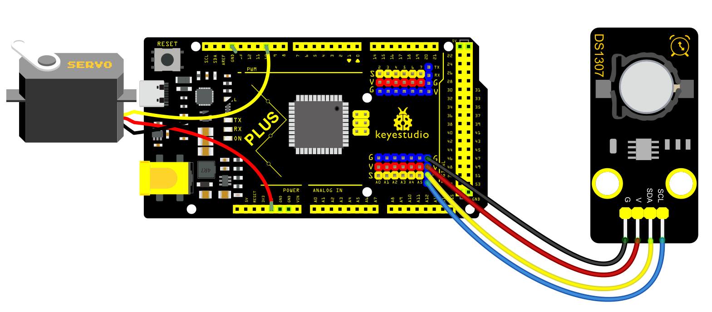 Wiring Diagram with MEGA Plus Board

### Sample Code

```cpp

/*

keyestudio super starter kit V2.0

Project 36

Automatic pet feeder

http//www.keyestudio.com

*/

#include <Wire.h>

#include <RTClib.h>

#include <Servo.h>

RTC_DS1307 rtc;

Servo servo;

const int servoPin = 10; // Digital port connected to the servo

const int feedHour = 8; // Set feeding time (hour)

const int feedMinute = 30; // Set feeding time (minute)

void setup() {

Wire.begin();

rtc.begin();

if (!rtc.isrunning()) {

Serial.println("RTC is not running!");

// The following line sets the RTC to the date & time this sketch was compiled

// rtc.adjust(DateTime(F(__DATE__), F(__TIME__)));

// This line is only needed for the first run

}

servo.attach(servoPin);

servo.write(0); // Initialize servo position

Serial.begin(9600);

}

void loop() {

DateTime now = rtc.now(); // Get current time

// Check if the set feeding time has been reached

if (now.hour() == feedHour && now.minute() == feedMinute) {

feedPet();

delay(60000); // Wait for one minute after feeding to avoid repeated feeding

}

}

void feedPet() {

Serial.println("Feeding time, starting to feed...");

servo.write(90); // Rotate servo to the open position

delay(5000); // Keep open for a period of time

servo.write(0); // Close the servo to stop feeding

Serial.println("Feeding completed.");

}

```

### Code Explanation

**Importing Libraries**

```cpp

#include <Wire.h>

#include <RTClib.h>

#include <Servo.h>

```

The code begins by importing three libraries:

 `Wire.h`: Used for I2C communication, primarily to communicate with the RTC module.

 `RTClib.h`: This is a library for handling the RTC module, making it convenient to perform date and time operations.

 `Servo.h`: Used to control the servo motor.

**Defining Global Variables and Objects**

```cpp

RTC_DS1307 rtc;

Servo servo;

const int servoPin = 10; // Digital port connected to the servo

const int feedHour = 8; // Set feeding time (hour)

const int feedMinute = 30; // Set feeding time (minute)

```

Here, an RTC module object `rtc` and a servo object `servo` are defined. Additionally, digital port 10 is defined as the port connected to the servo motor, and the feeding time is set to 8:30 AM.

**Setup Function**

```cpp

void setup() {

Wire.begin();

rtc.begin();

if (!rtc.isrunning()) {

Serial.println("RTC is not running!");

}

servo.attach(servoPin);

servo.write(0); // Initialize servo position

Serial.begin(9600);

}

```

In the `setup()` function, I2C communication and the RTC module are initialized first. It checks if the RTC is running, and if not, it outputs a prompt message through the serial port. Then, the servo motor is connected to the defined pin, and the servo position is initialized to 0 degrees (closed position). Finally, serial communication is initialized for debugging and outputting information.

**Main Loop**

```cpp

void loop() {

DateTime now = rtc.now(); // Get current time

if (now.hour() == feedHour && now.minute() == feedMinute) {

feedPet();

delay(60000); // Wait for one minute after feeding to avoid repeated feeding

}

}

```

In the `loop()` function, the current time is obtained first. If the current time matches the set feeding time, the `feedPet()` function is called to feed the pet. After feeding, the program pauses for one minute to avoid repeated feeding.

**Feeding Function**

```cpp

void feedPet() {

Serial.println("Feeding time, starting to feed...");

servo.write(90); // Rotate servo to the open position

delay(5000); // Keep open for a period of time

servo.write(0); // Close the servo to stop feeding

Serial.println("Feeding completed.");

}

```

In the `feedPet()` function, it first outputs a message through the serial port indicating that feeding has started. Then, the servo motor is rotated to 90 degrees to open the feeding port. It remains open for 5 seconds to allow sufficient time for the food to fall. Afterward, the servo motor is rotated back to 0 degrees to close the feeding port, and a message is output indicating that feeding is completed.

### Project Result

The automatic pet feeder will automatically turn on the feeder at 8:00 and 18:00 each day to release food into the pet's bowl. You can check the current time on serial monitor.


Through the project, we build an automatic pet feeder by keyestudio Plus/MEGA Plus development board, DS1307 clock module and servo. Depending on your needs, you can adjust feeding times and amounts to provide better care for your pet.

## Project 37 Smart Home


### Description

Smart home adopts artificial intelligence technology to provide people with a more comfortable, convenient and safe living experience. It covers many aspects from lighting, security, home appliance control to environmental monitoring, so we can manage and control the home environment through intelligent devices and systems.

In this project, we create a smart home system by the Keyestudio development board, infrared remote control module, relay and stepper motor. You can control various household appliances, such as lights, fans and curtains, with an infrared remote control.

### Hardware

1\. Plus or MEGA Plus development board x1

2\. IR receiver x1

3\. Relay module x1

4\. Stepper motor x1

5\. Stepper motor driver x1

6\. IR remote control x1

7\. DuPont wires

8\. Jumper wires

9\. Breadboard x1

### Working Principle:

When you press the button on the remote control, the infrared receiver receives the corresponding infrared signals. These signals will be decoded to trigger corresponding actions. For example, press the "Light" button to turn on or off the connected light via the relay; press the "Curtain" button to open or close the curtain through stepper motor.


### Wiring Diagram

1.  Connect digital pin D8, D9, D10, D11 on the board to pins IN1, IN2, IN3, IN4 of the stepper motor via DuPont wires.
2.  Connect pin S of the relay to digital pin D3 on the board.
3.  Connect LED pins to the normally-open contacts and common contacts of the relay.
4.  Connect OUT pin of IR receiver to the digital pin D2 on the board.

 Wiring Diagram with Plus Board

 Wiring Diagram with MEGA Plus Board

### Sample Code

```cpp

/*

keyestudio super starter kit V2.0

Project 37

Smart Home

http//www.keyestudio.com

*/

#include <IRremote.h>

#include <Stepper.h>

#define IR_RECEIVE_PIN 2

#define RELAY_PIN 3

#define STEPS_PER_REV 2048

IRrecv irrecv(IR_RECEIVE_PIN);

decode_results results;

Stepper stepper(STEPS_PER_REV, 8, 10, 9, 11);

void setup() {

irrecv.enableIRIn(); // initialize ir receiver

pinMode(RELAY_PIN, OUTPUT); // set relay pin to output

stepper.setSpeed(10); // set the stepper motor speed

}

void loop() {

if (irrecv.decode(&results)) {

switch (results.value) {

case 0xFF6897: // light button

digitalWrite(RELAY_PIN, !digitalRead(RELAY_PIN)); // change the relay state

break;

case 0xFF9867: // open curtain button

stepper.step(STEPS_PER_REV); // stepper motor rotates to open the curtain

break;

case 0xFFB04F: // close curtain button

stepper.step(-STEPS_PER_REV); // stepper motor reverses to close the curtain

break;

}

irrecv.resume(); // receive next ir receiver

}

}

```

### Code Explanation

The code includes references to two libraries:

```cpp

#include <IRremote.h>

#include <Stepper.h>

```

The `IRremote.h` library is used to implement functionality related to infrared remote control, enabling the Arduino to receive and decode signals from an infrared remote. The `Stepper.h` library is used to control a stepper motor, allowing it to rotate with precise angles, which is very useful in automated control systems, such as automatic curtain control.

Next, the code defines some constants and objects:

```cpp

#define IR_RECEIVE_PIN 2

#define RELAY_PIN 3

#define STEPS_PER_REV 2048

IRrecv irrecv(IR_RECEIVE_PIN);

decode_results results;

Stepper stepper(STEPS_PER_REV, 8, 10, 9, 11);

```

 `IR_RECEIVE_PIN` defines the pin number (pin 2) where the infrared receiver is connected to the Arduino.

 `RELAY_PIN` defines the pin number (pin 3) where the relay is connected.

 `STEPS_PER_REV` represents the number of steps required for the stepper motor to complete one full revolution (2048 steps).

An `IRrecv` object is created to handle the reception of infrared signals, and a `decode_results` object is used to store the decoded results. The `Stepper` object is configured with the parameters of the stepper motor, including the number of steps per revolution and the four pins used to control the motor.

In the `setup()` function, some basic initialization settings are made:

```cpp

void setup() {

irrecv.enableIRIn(); // Initialize the infrared receiver

pinMode(RELAY_PIN, OUTPUT); // Set the relay pin as an output

stepper.setSpeed(10); // Set the speed of the stepper motor

}

```

Here, `irrecv.enableIRIn()` starts the infrared receiver module, `pinMode(RELAY_PIN, OUTPUT)` sets the relay pin as an output, and `stepper.setSpeed(10)` sets the rotation speed of the stepper motor.

The `loop()` function is the core of the code. It continuously checks if an infrared signal has been received and performs corresponding actions based on the different signals:

```cpp

void loop() {

if (irrecv.decode(&results)) {

switch (results.value) {

case 0xFF6897: // "Turn on light" button

digitalWrite(RELAY_PIN, !digitalRead(RELAY_PIN)); // Toggle the relay state

break;

case 0xFF9867: // "Open curtain" button

stepper.step(STEPS_PER_REV); // Rotate the stepper motor to open the curtain

break;

case 0xFFB04F: // "Close curtain" button

stepper.step(-STEPS_PER_REV); // Rotate the stepper motor in reverse to close the curtain

break;

}

irrecv.resume(); // Continue receiving the next infrared signal

}

}

```

In this code, `irrecv.decode(&results)` checks if an infrared signal has been received and decodes it. The decoded results are stored in the `results` object. Depending on the different signal values, actions such as toggling the relay or controlling the rotation of the stepper motor are executed. After each operation, `irrecv.resume()` is called to prepare for receiving the next signal.

### Project Result

With this smart home system, you can easily control lights and curtains (stepper motor) using an infrared remote. Based on the remote key codes read from previous projects, pressing the "1" key on the remote will toggle the lights on or off. Pressing the "2" key will automatically open the curtains (stepper motor rotates forward), and pressing the "3" key will automatically close the curtains (stepper motor rotates backward). This simple and intuitive method makes it more convenient to manage your home devices, enhancing your living comfort.


Through this project, you can create a smart home system by the Keyestudio development board, infrared remote control module, relay and stepper motor. You may have a try to control various household appliances and even combine IOT.

## Project 38 Weather Station


### Description

Weather station is a place for observing and recording weather conditions. It always pay attention to cloud changes, wind direction and speed, precipitation and other meteorological elements, providing important weather information.

It exposes the weather trends, forecasts the weather conditions in the next few days, and also provides important references for travel, agricultural production as well as transportation. In addition, data from weather stations can also be used for disaster warning, helping us to take preventive measures in advance and reduce losses caused by duts.isasters.

In this project, we build a simple meteorological station by Arduino development board, temperature and humidity sensor and a photoresistor, which can monitor temperature, humidity and brightness in real time, and then display these values on LCD.

### Hardware

\* Plus or MEGA Plus development board x1

\* 1602 LCD display

\* Photoresistor

\* AHT20 temperature and humidity sensor

\* Jumper wires

\* Breadboard

### Working Principle

\* Photoresistor: its resistance will change according to light intensity. The stronger the light is, the lower the resistance will be. So we can determine the light intensity through its resistance value.

\* AHT20 temperature and humidity sensor: It is a digital sensor that outputs digital signals without ADC. We can acquire the ambient temperature and humidity values from its outputs.

\* Arduino development board: It reads the signals of the photoresistor and AHT20 sensor, and then process these data to display.


### Wiring Diagram

1.  Connect the signal of Photoresistor to the analog pin A0 on the board.
2.  Connect SDA pin of AHT20 to A4(SDA) on the Plus board or D20(SDA) on the MEGA Plus board.

3\. Connect SCL pin of AHT20 to A5(SCL) on the Plus board or D21(SCL) on the MEGA Plus board

4\. For 1602 LCD module, connect VSS to GND, VDD to 5V, V0 to the middle pin of the 10K potentiometer. The two ends of the potentiometer are connected to 5V and GND respectively. Connect RS of LCD to pin D12 on the board, RW to GND, E to board pin D11, D4 to board pin D5, D5 to board pin D4, D6 to board pin D3, D7 to board pin D2, A to 5V and K to GND.

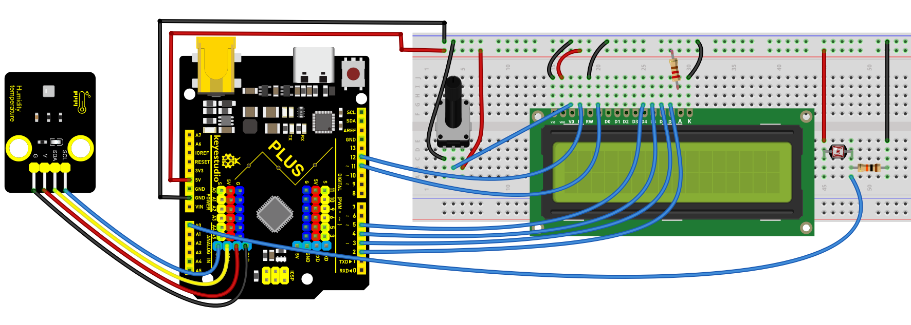

### Sample Code

```cpp

/*

keyestudio super starter kit V2.0

Project 38

Weather station

http//www.keyestudio.com

*/

#include <LiquidCrystal.h>

#include <AHT20.h>

// Initialize LCD display

LiquidCrystal lcd(12, 11, 5, 4, 3, 2);

// Initialize AHT20 sensor

AHT20 aht20;

void setup() {

// Set the number of columns and rows for the LCD

lcd.begin(16, 2);

// Initialize AHT20 sensor

if (!aht20.begin()) {

lcd.print("AHT20 not found");

while (1);

}

// Display startup message

lcd.print("Weather Station");

delay(2000);

lcd.clear();

}

void loop() {

// Read temperature and humidity

float temperature = aht20.getTemperature(); // read temperature sensor value

float humidity = aht20.getHumidity(); // read the humidity value

// Read light intensity

int lightLevel = analogRead(A0);

lightLevel = map(lightLevel, 0, 1023, 0, 100);

// Display temperature and humidity

lcd.setCursor(0, 0);

lcd.print("Temp: ");

lcd.print(temperature);

lcd.print(" C");

lcd.setCursor(0, 1);

lcd.print("Humidity: ");

lcd.print(humidity);

lcd.print("%");

// Display light intensity

lcd.setCursor(8, 1);

lcd.print("Light: ");

lcd.print(lightLevel);

lcd.print("%");

// Update frequency

delay(2000);

}

```

### Code Explanation

First, the code includes references to two library files:

```cpp

#include <LiquidCrystal.h>

#include <AHT20.h>

```

 `LiquidCrystal.h`: This library is used to control the LCD screen connected to the Arduino.

 `AHT20.h`: This library provides functions and methods for operating the AHT20 temperature and humidity sensor.

Next, the code initializes instances of the LCD screen and AHT20 sensor:

```cpp

LiquidCrystal lcd(12, 11, 5, 4, 3, 2);

AHT20 aht20;

```

 `LiquidCrystal lcd(12, 11, 5, 4, 3, 2);`: This line of code declares an object named `lcd` of type `LiquidCrystal` and sets the pin numbers connected to the Arduino. These numbers represent how the LCD screen is connected to the Arduino.

 `AHT20 aht20;`: Declares an object named `aht20` of type `AHT20` to control and read the AHT20 sensor.

In the `setup()` function, the following operations are performed:

```cpp

void setup() {

lcd.begin(16, 2);

if (!aht20.begin()) {

lcd.print("AHT20 not found");

while (1);

}

lcd.print("Weather Station");

delay(2000);

lcd.clear();

}

```

 `lcd.begin(16, 2);`: Sets the number of columns and rows of the LCD screen, which is 16 columns and 2 rows here.

 `if (!aht20.begin())`: Attempts to initialize the AHT20 sensor. If the sensor does not respond correctly, an error message is displayed on the LCD, and the program is halted with `while(1);`.

 `lcd.print("Weather Station");`: Displays "Weather Station" on the LCD as a startup message.

 `delay(2000);`: Delays for 2000 milliseconds (2 seconds), then clears the screen with `lcd.clear();`.

The `loop()` function is the core of the program, responsible for periodically reading data and updating the display content:

```cpp

void loop() {

float temperature = aht20.getTemperature();

float humidity = aht20.getHumidity();

int lightLevel = analogRead(A0);

lightLevel = map(lightLevel, 0, 1023, 0, 100);

lcd.setCursor(0, 0);

lcd.print("Temp: ");

lcd.print(temperature);

lcd.print(" C");

lcd.setCursor(0, 1);

lcd.print("Humidity: ");

lcd.print(humidity);

lcd.print("%");

lcd.setCursor(8, 1);

lcd.print("Light: ");

lcd.print(lightLevel);

lcd.print("%");

delay(2000);

}

```

 `float temperature = aht20.getTemperature();` and `float humidity = aht20.getHumidity();`: Reads the current temperature and humidity values from the AHT20 sensor.

 `int lightLevel = analogRead(A0);` and `lightLevel = map(lightLevel, 0, 1023, 0, 100);`: Reads the light intensity from analog input A0 and maps it from a range of 0-1023 to a range of 0-100.

 `lcd.setCursor` and `lcd.print`: Sets the cursor position on the LCD screen and prints the temperature, humidity, and light intensity.

### Project Result

Upload the code and the LCD will display ambient light brightness, temperature and humidity.


## Project 39 Vending Machine


### Description

A vending machine is like a small shop, offering people all kinds of goods and serving 24 hours a day. From drinks, snacks to daily necessities, and even mobile phone top-up and ticket purchase, vending machines are everywhere, and it brings great convenience to our lives.

In this project, we build a simple vending machine by keyestudio Plus/MEGA Plus development board. For the machine, we can select products via buttons, and LCD displays product information and prices, and servo controls the delivery.

Through this project, you can have a clear understand of Arduino programming and learn how to use buttons, servo and LCD display.

### Hardware

1\. Plus or MEGA Plus development board x1

2\. button x3

3\. servo x1

4\. LCD display (16x2) x1

5\. Breadboard x1

6\. DuPont wires

7\. Jumper wires

### Working Principle

When different buttons are pressed, the Arduino development board will detect the status of each button to select the corresponding product. The LCD displays the name and price of the selected item. After confirming the purchase, the servo rotates to a specific Angle to send the product out. The selling process is completed.


### Wiring Diagram

1.  Connect the yellow wire(signal) of servo to the digital pin D10 on the board.
2.  Connect the S pins of buttons to digital pins D6, D7, D8,on the board.
3.  For 1602 LCD module, connect VSS to GND, VDD to 5V, V0 to the middle pin of the 10K potentiometer. The two ends of the potentiometer are connected to 5V and GND respectively. Connect RS of LCD to pin D12 on the board, RW to GND, E to board pin D11, D4 to board pin D5, D5 to board pin D4, D6 to board pin D3, D7 to board pin D2, A to 5V and K to GND.


Wiring Diagram with Plus Board

 Wiring Diagram with MEGA Plus Board

### Sample Code

```cpp

/*

keyestudio super starter kit V2.0

Project 39

Vending machine

http//www.keyestudio.com

*/

#include <LiquidCrystal.h>

#include <Servo.h>

// Initialize LCD1602

LiquidCrystal lcd(12, 11, 5, 4, 3, 2);

// Initialize servo motor

Servo myservo;

// Define button pins

const int button1Pin = 6;

const int button2Pin = 7;

const int button3Pin = 8;

// Item selection variable

int selectedItem = 0;

void setup() {

// Set button pin modes

pinMode(button1Pin, INPUT);

pinMode(button2Pin, INPUT);

pinMode(button3Pin, INPUT);

// Initialize LCD

lcd.begin(16, 2);

lcd.print("Select Item:");

// Initialize servo motor

myservo.attach(10);

myservo.write(0); // Initial position

}

void loop() {

// Read button states

int button1State = digitalRead(button1Pin);

int button2State = digitalRead(button2Pin);

int button3State = digitalRead(button3Pin);

// Detect button 1 (select previous item)

if (button1State == HIGH) {

selectedItem--;

if (selectedItem < 0) {

selectedItem = 2; // Assume there are 3 items

}

updateLCD();

delay(200); // Debounce delay

}

// Detect button 2 (select next item)

if (button2State == HIGH) {

selectedItem++;

if (selectedItem > 2) {

selectedItem = 0;

}

updateLCD();

delay(200); // Debounce delay

}

// Detect button 3 (confirm purchase)

if (button3State == HIGH) {

dispenseItem();

delay(200); // Debounce delay

}

}

void updateLCD() {

lcd.clear();

lcd.print("Select Item:");

lcd.setCursor(0, 1);

lcd.print("Item ");

lcd.print(selectedItem + 1); // Display item number

}

void dispenseItem() {

lcd.clear();

lcd.print("Dispensing...");

myservo.write(90); // Rotate servo to release item

delay(1000); // Wait for item to be released

myservo.write(0); // Reset servo

lcd.clear();

lcd.print("Select Item:");

}

```

### Code Explanation

Importing Library Files

```cpp

#include <LiquidCrystal.h>

#include <Servo.h>

```

These two lines of code import the libraries necessary for controlling the LCD1602 liquid crystal display and the servo motor.

LCD1602 Initialization

```cpp

LiquidCrystal lcd(12, 11, 5, 4, 3, 2);

```

The `LiquidCrystal` object is created and initialized for the LCD1602 display, using digital pins 12, 11, 5, 4, 3, and 2 on the Arduino.

Servo Motor Initialization

```cpp

Servo myservo;

```

Creating a `Servo` object to control the servo motor.

Defining Button Pins and Selected Item Variable

```cpp

const int button1Pin = 6;

const int button2Pin = 7;

const int button3Pin = 8;

int selectedItem = 0;

```

Three button pins (pin 6, pin 7, pin 8) are defined along with a variable `selectedItem` to store the currently selected item.

Setup Function

```cpp

void setup() {

pinMode(button1Pin, INPUT);

pinMode(button2Pin, INPUT);

pinMode(button3Pin, INPUT);

lcd.begin(16, 2);

lcd.print("Select Item:");

myservo.attach(10);

myservo.write(0);

}

```

In the `setup()` function, the button pins are set to input mode, the LCD display is initialized, and "Select Item:" is printed on the first line. The servo motor is then attached to pin 10, and its initial position is set to 0 degrees.

Main Loop

```cpp

void loop() {

int button1State = digitalRead(button1Pin);

int button2State = digitalRead(button2Pin);

int button3State = digitalRead(button3Pin);

if (button1State == HIGH) {

selectedItem--;

if (selectedItem < 0) {

selectedItem = 2;

}

updateLCD();

delay(200);

}

if (button2State == HIGH) {

selectedItem++;

if (selectedItem > 2) {

selectedItem = 0;

}

updateLCD();

delay(200);

}

if (button3State == HIGH) {

dispenseItem();

delay(200);

}

}

```

In the `loop()` function, the state of each button is constantly read. If button 1 is pressed, the previous item is selected; if button 2 is pressed, the next item is selected. If button 3 is pressed, the `dispenseItem()` function is called to dispense the currently selected item. After each button press, the LCD display is updated, and there is a 200-millisecond debounce delay.

Updating LCD Display

```cpp

void updateLCD() {

lcd.clear();

lcd.print("Select Item:");

lcd.setCursor(0, 1);

lcd.print("Item ");

lcd.print(selectedItem + 1);

}

```

The `updateLCD()` function clears the current display on the LCD and reprints "Select Item:" along with the currently selected item's number.

**Distribution of Items**

```cpp

void dispenseItem() {

lcd.clear();

lcd.print("Dispensing...");

myservo.write(90);

delay(1000);

myservo.write(0);

lcd.clear();

lcd.print("Select Item:");

}

```

The `dispenseItem()` function displays the message "Dispensing..." and then rotates the servo motor to 90 degrees to distribute the item. After waiting for a second, the servo motor is returned to its initial position, and the message "Select Item:" is displayed again.

### Project Result

On the LCD1602 display, you can clearly see the prompt "Select Item:" along with the number of the currently selected item.


When Button 1 and Button 2 are pressed, the LCD1602 screen promptly updates to reflect the newly selected item number. Pressing Button 3 causes the servo motor to rotate 90 degrees, simulating the dispensing of an item (after which it delays for one second before returning to its initial position). During this process, the LCD1602 shows the message "Dispensing...". After dispensing, the screen returns to the selection interface.

## Project 40 Parking Management


### Description

Parking management is an indispensable part of modern city life, which involves parking, charging and security. An efficient parking management system can alleviate traffic congestion, improve parking efficiency, and ensure the safety of vehicles and personnel.

In this project, we implement a simple parking management system by the Keyestudio Plus/MEGA Plus development board, ultrasonic sensor, servo and LCD display. This system detects the presence of vehicles to open or close the gate, and displays the status of parking Spaces on an LCD.

### Hardware

1\. Plus or MEGA Plus development board x1

2\. HC-SR04 ultrasonic sensor x1

3\. SG90 servo x1

4\. LCD 1602 display x1

5\. Breadboard x1

6\. DuPont wires

7\. Jumper wires

### Working Principle

Ultrasonic sensor detects the presence of vehicles. When the vehicle enters the parking lot, the sensor detect it and send a signal to the development board. After receiving the signal, the board will control the servo to rotate to the specified Angle to simulate the opening of the gate. At the same time, the LCD shows the status of the parking space, such as "parking space occupied". When the vehicle leaves, the ultrasonic sensor detects it and the servo rotates the initial Angle to close the gate. On LCD, the parking status will be updated to "parking free".


### Wiring Diagram

1.  Connect the Trig pin of HC-SR04 to digital pin D6, Echo pin to digital pin D5.
2.  Connect the yellow wire(signal) of servo to the digital pin D10 on the board.
3.  For 1602 LCD module, VSS to GND，VDD to 5V, V0 to the middle pin of the 10K potentiometer. The two ends of the potentiometer are connected to 5V and GND respectively. Connect RS of LCD to pin D12 on the board, RW to GND, E to board pin D11, D4 to board pin D5, D5 to board pin D4, D6 to board pin D3, D7 to board pin D2, A to 5V and K to GND.


Wiring Diagram with Plus Board


Wiring Diagram with MEGA Plus Board

### Sample Code

```cpp

/*

keyestudio super starter kit V2.0

Project 40

Parking Management

http//www.keyestudio.com

*/

#include <Servo.h>

#include <LiquidCrystal.h>

const int trigPin = 8;

const int echoPin = 7;

const int servoPin = 10;

const int rs = 12, en = 11, d4 = 5, d5 = 4, d6 = 3, d7 = 2;

Servo myServo;

LiquidCrystal lcd(rs, en, d4, d5, d6, d7);

void setup() {

pinMode(trigPin, OUTPUT);

pinMode(echoPin, INPUT);

myServo.attach(servoPin);

lcd.begin(16, 2);

}

void loop() {

long duration, distance;

digitalWrite(trigPin, LOW);

delayMicroseconds(2);

digitalWrite(trigPin, HIGH);

delayMicroseconds(10);

digitalWrite(trigPin, LOW);

duration = pulseIn(echoPin, HIGH);

distance = (duration / 2) / 29.1;

if (distance < 10) {

myServo.write(90);

lcd.setCursor(0, 0);

lcd.print("Parking Space");

lcd.setCursor(0, 1);

lcd.print("Occupied");

} else {

myServo.write(0);

lcd.setCursor(0, 0);

lcd.print("Parking Space");

lcd.setCursor(0, 1);

lcd.print("Available");

}

delay(500);

lcd.clear();

}

```

### Code Explanation

First, let's start by including the necessary libraries to control the servo motor and LCD in the Arduino IDE. You can do this by adding the following lines of code:

```cpp

#include <Servo.h>

#include <LiquidCrystal.h>

```

These libraries are essential for managing the servo motor and operating the LCD, respectively.

Next, we need to define the pins for the ultrasonic sensor, servo motor, and LCD that are connected to the Arduino. For example:

```cpp

int trigPin = 8; // Trigger pin for the ultrasonic sensor

int echoPin = 7; // Echo pin for the ultrasonic sensor

int servoPin = 10; // Control pin for the servo motor

```

For connecting the LCD, the number of pins required can vary depending on the type of LCD used. Assuming a common 1602 LCD, the connection would look like this:

```cpp

LiquidCrystal lcd(12, 11, 5, 4, 3, 2);

```

In the `setup()` function, we'll configure the pin modes, connect the servo motor, and initialize the LCD display. This includes setting the pin modes for the ultrasonic sensor and activating the servo motor and LCD:

```cpp

void setup() {

pinMode(trigPin, OUTPUT);

pinMode(echoPin, INPUT);

Servo myServo;

myServo.attach(servoPin);

lcd.begin(16, 2);

}

```

During the main `loop()`, the system first measures the distance using the ultrasonic sensor. This involves sending a short pulse through `trigPin` and then measuring the time it takes for `echoPin` to receive the echo:

```cpp

void loop() {

digitalWrite(trigPin, LOW);

delayMicroseconds(2);

digitalWrite(trigPin, HIGH);

delayMicroseconds(10);

digitalWrite(trigPin, LOW);

long duration = pulseIn(echoPin, HIGH);

int distance = duration * 0.034 / 2;

```

Based on the measured distance, the system decides how to operate the servo motor and what information to display on the LCD. If the distance is less than 10 centimeters, indicating a vehicle is present, the servo motor rotates 90 degrees to open the door, and the LCD displays "Parking Space Occupied":

```cpp

if (distance < 10) {

myServo.write(90);

lcd.setCursor(0, 0);

lcd.print("Parking Space");

lcd.setCursor(0, 1);

lcd.print("Occupied");

} else {

myServo.write(0);

lcd.setCursor(0, 0);

lcd.print("Parking Space");

lcd.setCursor(0, 1);

lcd.print("Available");

}

delay(500);

lcd.clear();

}

```

This setup efficiently manages parking space availability and provides clear, real-time updates on an LCD screen.

### Project Result

When a vehicle enters the parking lot, the servo rotates to 90 degrees to open the gate, and the LCD displays "Parking Space Occupied".

When it leaves, the servo rotates to 0 degrees to close the gate, and the LCD displays "Parking Space Available".


Through this simple parking management system, it is possible to realize the detection and control of vehicles, and display parking status.
